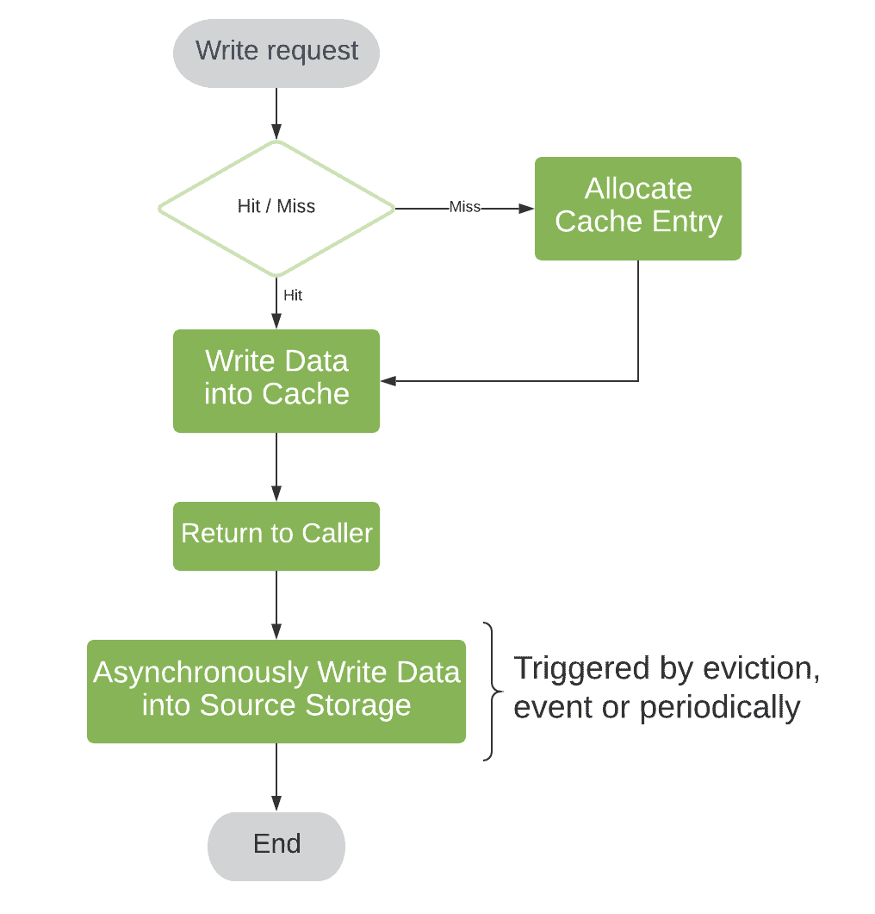

# Caching

Caching is storing frequently accessed data in temporary storage.

Two important things for caching are:
- Cache Policy 
  - Write Policy:  How to sync for writes among cache and DB
  - Eviction/Replacement Policy, What to kick out. (LRU, LFU, ..)

## Why Caching?
- Caching improves page load times and can reduce the load on your servers and databases. 
  
- Databases often benefit from a uniform distribution of reads and writes across its partitions. Popular items can skew the distribution, causing bottlenecks. Putting a cache in front of a database can help absorb uneven loads and spikes in traffic.

    
Benefits

  - Reduce network calls
  - Avoid repeated communication
  - Reduce DB load

  

## How Caching works?
The application is responsible for reading and writing from storage. The cache does not interact with storage directly. The application does the following:

  - Look for entry in cache, resulting in a cache miss
  - Load entry from the database
  - Add entry to cache
  - Return entry

## What are drawbacks of caching?

- In case Cache doesn't store data accessed by user (poor hit rate)
- Need to maintain consistency between caches and the source of truth such as the database through cache invalidation (Eventual Consistency)
- Potential Thrashing - 

## Placement for Cache

- In memory Cache
- Global Cache
- DB cache
- Distributed cache 

## Write Policy

A write policy is triggered when there is a write operation in the cache. 

A write request means some entry is added, updated or deleted in the cache. But because a cache is a source of truth each of the write requests will impact the entire system.

### Write Back Policy

If the key-value pair that is to be updated is present in the cache then it is updated. However, the key-value pair is not immediately updated in the database. 

- Efficient
- Eventual Consistency

> **Problem**: As long as the cache is alive, users will get consistent data. However, if the cache is not alive, the data will be stale. (Not Persistent)

To Avoid this problem, we use:

1.  

    
Timeout based persistence

    
    ## Description
    Cached data is written back to the main memory or database after a specific time interval (like TTL), regardless of whether the data was modified during that period.

    ## Usage
    - Useful in systems where data freshness is important but write operations can be delayed.
    - Reduces write operations by batching them at regular intervals.
    - Common in scenarios like session storage or analytics data caching where exact real-time sync is not critical.
    

2. 

    
Event based write back

    ## Description
    Data is written back to the main memory/database when a specific event occurs, such as application shutdown, user logout, or cache size threshold being reached.

    ## Usage
    - Efficient for use-cases like temporary caching during user sessions, where persistence is needed only after a session ends.
    - Reduces unnecessary writes during active use.

    

    
3. 

    
Replacement Write Back

    
    ## Description
    Cached data is written back to main memory only when the cache block is evicted/replaced, and only if it has been modified (marked dirty)

    ## Usage
    - Most commonly used in hardware-level CPU caches.
    - Reduces write traffic to memory, as only evicted and modified blocks are written back.
    - Efficient in systems with limited bandwidth or high memory write latency.
    

    
     
    <i>Sample for Write back Policy</i>

  

  
Disadvantages

      
  ### Data Loss on Cache Failure
   
  Since modified data is not immediately written to main memory, a cache crash or power failure can result in loss of unsaved changes.
   
  ### Complexity in Data Coherency
  Maintaining consistency between the cache and main memory becomes more complex, especially in multi-core or distributed systems where multiple caches might hold different versions of the same data.

  Look for other policies (Write-aside/ write-through)

  ### Increased Latency on Eviction
   When a dirty block is evicted, the system must write it back to main memory, potentially delaying the fetch of new data.
   
  
