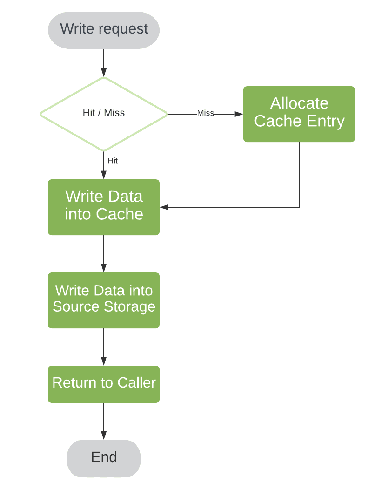
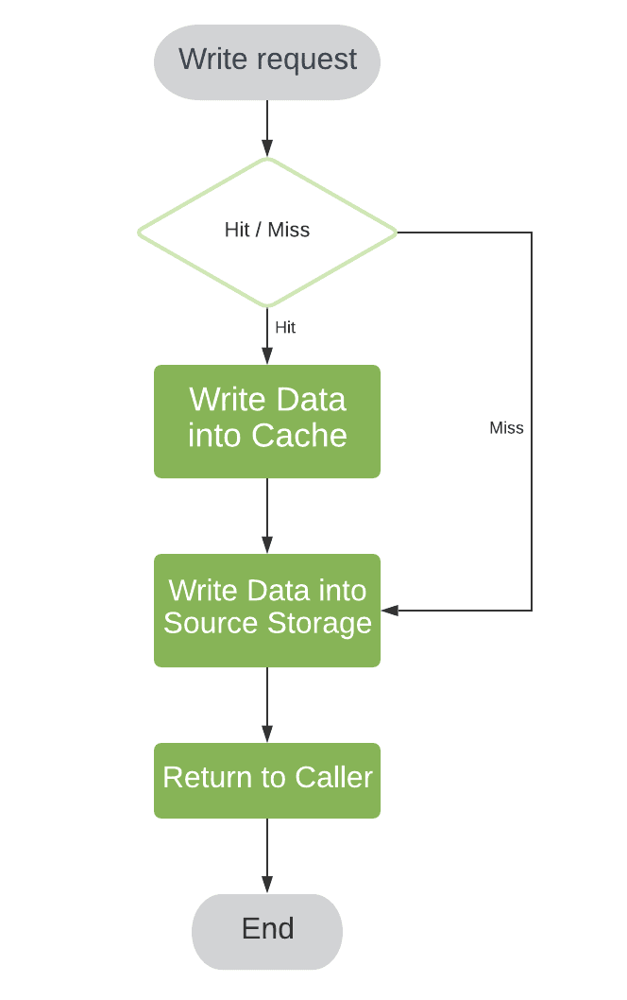

# Caching

- [Caching](#caching)
  - [Introduction](#introduction)
  - [Why Caching is important?](#why-caching-is-important)
  - [How Caching works?](#how-caching-works)
  - [What are drawbacks of caching?](#what-are-drawbacks-of-caching)
  - [Placement for Cache in a Distributed System](#placement-for-cache-in-a-distributed-system)
  - [Types of caches](#types-of-caches)
    - [Local Cache](#local-cache)
    - [Global Cache](#global-cache)
  - [Write Policy](#write-policy)
    - [Cache Aside](#cache-aside)
    - [Write Back Policy (Write Behind)](#write-back-policy-write-behind)
    - [Write Through Policy](#write-through-policy)
    - [Write Around Policy](#write-around-policy)
    - [Comparison For Write Policies](#comparison-for-write-policies)
    - [Example Use Cases](#example-use-cases)
  - [Replacement Policy](#replacement-policy)

## Introduction 

Caching is storing frequently accessed data in temporary storage.

The purpose of the cache is to improve both latency (time interval to perform a single operation) and throughput (operation processing rates).

Two important things for caching are:
- Cache Policy 
  - Write Policy:  How to sync for writes among cache and DB
  - Eviction/Replacement Policy, What to kick out. (LRU, LFU, ..)

## Why Caching is important?
- Caching improves page load times and can reduce the load on your servers and databases. 
  
- Databases often benefit from a uniform distribution of reads and writes across its partitions. Popular items can skew the distribution, causing bottlenecks. Putting a cache in front of a database can help absorb uneven loads and spikes in traffic.

    
Benefits

  - Reduce network calls
  - Avoid repeated communication
  - Reduce DB load

  

## How Caching works?
The application is responsible for reading and writing from storage. The cache does not interact with storage directly. The application does the following:

  - Look for entry in cache, resulting in a cache miss
  - Load entry from the database
  - Add entry to cache
  - Return entry

## What are drawbacks of caching?

- In case Cache doesn't store data accessed by user (poor hit rate)
- Need to maintain consistency between caches and the source of truth such as the database through cache invalidation (Eventual Consistency)
- Potential Thrashing - 

## Placement for Cache in a Distributed System

- In memory Cache
- Global Cache
- DB cache
- Distributed cache 

## Types of caches
### Local Cache
  - A local cache uses memory inside the service itself.
  Since the data is present in the memory, it is much faster to get the data (because we don't need to make any network calls).
  - The issue with a local cache is that it can cause a fanout. For example, we have three boxes and each one uses a local cache to store data. If we want to update the profile data of a user, we need to send requests to all the boxes. This is a fan out.
  - To avoid fanouts we can shard the data and distribute load across the boxes using a load balancing algorithm (like consistent hashing). But what if one of the nodes fails? To avoid this we can replicate the data to multiple nodes. However, this can lead to data inconsistency.
  So using a local cache reduces data consistency while increasing response time.

### Global Cache
- Instead of each node having its data copy, we have a central data copy, which is a single node storing all the key-value pairs in its memory.
- This improves the data consistency but reduces the response time (because we have to make network calls).

## Write Policy

A write policy is triggered when there is a write operation in the cache. 

A write request means some entry is added, updated or deleted in the cache. But because a cache is a source of truth each of the write requests will impact the entire system.
### Cache Aside
Cache-aside (also known as Lazy Loading) is a caching pattern commonly used in applications where the application code controls when to load data into the cache.

1. Read request comes in.
2. Check if data is in the cache:
  - If yes → return it 
  - If no → fetch from the database, then:
    - Store it in the cache 
    - Return it to the user
3. For writes/updates, you:
   - Update the database
   - Invalidate or update the cache

### Write Back Policy (Write Behind)

If the key-value pair that is to be updated is present in the cache then it is updated. However, the key-value pair is not immediately updated in the database. 

    
     
    <i><a href="https://www.baeldung.com/cs/cache-write-policy">Write back Policy</a></i>

Problem

> **Problem**: As long as the cache is alive, users will get consistent data. However, if the cache is not alive, the data will be stale. (Not Persistent)

To Avoid this problem, we use:

1.  

    
Timeout based persistence

    
    ## Description
    Cached data is written back to the main memory or database after a specific time interval (like TTL), regardless of whether the data was modified during that period.

    ## Usage
    - Useful in systems where data freshness is important but write operations can be delayed.
    - Reduces write operations by batching them at regular intervals.
    - Common in scenarios like session storage or analytics data caching where exact real-time sync is not critical.
    

2. 

    
Event based write back

    ## Description
    Data is written back to the main memory/database when a specific event occurs, such as application shutdown, user logout, or cache size threshold being reached.

    ## Usage
    - Efficient for use-cases like temporary caching during user sessions, where persistence is needed only after a session ends.
    - Reduces unnecessary writes during active use.

    

    
3. 

    
Replacement Write Back

    
    ## Description
    Cached data is written back to main memory only when the cache block is evicted/replaced, and only if it has been modified (marked dirty)

    ## Usage
    - Most commonly used in hardware-level CPU caches.
    - Reduces write traffic to memory, as only evicted and modified blocks are written back.
    - Efficient in systems with limited bandwidth or high memory write latency.
    

Benefit

- Eventual Consistency
- Efficient

Disadvantages

  
-  Data Loss on Cache Failure

    Since modified data is not immediately written to main memory, a cache crash or power failure can result in loss of unsaved changes.

- Complexity in Data Coherency
  
    Maintaining consistency between the cache and main memory becomes more complex, especially in multi-core or distributed systems where multiple caches might hold different versions of the same data.

    Look for other policies (Write-aside/ write-through)

- Increased Latency on Eviction
  
    When a dirty block is evicted, the system must write it back to main memory, potentially delaying the fetch of new data.

### Write Through Policy

In this policy, when there is a write request, we evict the key that is being updated, while simultaneously updating the database. The next time there is a read request, that is when the cache polls the database for the entry, persists the entry and sends the response to the user.

- A write goes to the cache.
- Simultaneously, the same data is written to the main memory.
- This ensures data consistency between the cache and memory.

    
     
    <i><a href="https://www.baeldung.com/cs/cache-write-policy">Write Through Policy</a></i>

Problem

> Problem: 
>   Intially: X = 10
>   Write Request: X = 20
>
> A read request on X, but write is not updated yet. The read request returns X = 10 . So it can cause inconsistency.

To avoid such problems, we can lock the data which is to be written and only unlock the data after the update operation is completed. 

<!-- BENEFITS OF WRITE THROUGH -->

Benefits

- Read Efficient: Write-through is a slow overall operation due to the write operation, but subsequent reads of just written data are fast. Users are generally more tolerant of latency when updating data than reading data.
   
- Consistent: Data in the cache is not stale.
  
- Persistent: No risk of losing updates if the cache is lost (e.g., during a crash).

<!-- DISADVANTAGES OF WRITE THROUGH -->

Disadvantages

- When a new node is created due to failure or scaling, the new node will not cache entries until the entry is updated in the database. Cache-aside in conjunction with write through can mitigate this issue.

- Most data written might never be read, which can be minimized with a TTL.

### Write Around Policy

Write-Around is a caching strategy where write operations bypass the cache and go directly to the main memory/storage. The cache is updated only on a read miss, not on write.

> If we do not expect a read operation shortly after, the cache would become polluted with the entries we’re not using. To avoid cache pollution, we may bypass cache entry allocation in case of a cache miss:

- Write → Goes only to memory/storage (not to cache).
- Cache remains unchanged after a write.
- On a read:
  - If data is in cache → return it 
  - If not (miss) → fetch from memory, store in cache, return it

    
     
    <i><a href="https://www.baeldung.com/cs/cache-write-policy">Write Around Policy</a></i>

Benefits

  - Reduces cache pollution (avoids caching rarely-read data)
  - Keeps cache filled with frequently-read data
  - Good for write-heavy systems
  - Eventual Consistency
  - High Persistence
  

  ### Comparison For Write Policies
| Feature                  | Write-Through                          | Write-Back                                | Write-Around                             |
|--------------------------|----------------------------------------|--------------------------------------------|------------------------------------------|
| **Write Location**       | Cache ✅ + Memory ✅                    | Cache ✅ only (Memory updated later)        | Memory ✅ only (Cache bypassed)           |
| **Read After Write**     | Fast ✅ (data in cache)                | Fast ✅ (data in cache)                     | Slow ❌ (data not in cache yet)           |
| **Write Latency**        | Slower ❌ (writes go to 2 places)      | Fast ✅ (writes hit cache only)             | Fast ✅                                   |
| **Cache Pollution**      | Possible ❌ (caches all writes)        | Possible ❌                                 | Avoided ✅ (writes don't pollute cache)   |
| **Data Consistency**     | High ✅ (always in sync)               | Lower ❌ (risk if cache lost before sync)   | High ✅ (memory is always up to date)     |
| **Recovery Complexity**  | Low ✅                                 | High ❌ (needs dirty block tracking)        | Low ✅                                     |
| **Use Case**             | Strong consistency needed             | High write performance, low consistency     | Write-once or infrequently read data     |

### Example Use Cases

| Scenario                                | Recommended Strategy       |
|-----------------------------------------|----------------------------|
| Financial transactions, logs            | Write-Through              |
| Gaming state or temporary calculations  | Write-Back                 |
| Logging, rarely read audit trails       | Write-Around               |

## Replacement Policy

Cache replacement policies are strategies used to decide which data to remove from the cache when the cache is full and new data needs to be added.

 The goal is to maximize hit rate (how often requested data is found in cache).

 - Common Replacement Policies
   - **LRU (Least Recently Used)** - Removes the least recently accessed item	- General purpose; works well in most cases
   - **LFU (Least Frequently Used)** - Removes the item used least often - Good when some data is "hotter" than others
   - **FIFO (First In, First Out)** - Removes the oldest inserted item
   - **MRU (Most Recently Used)** - Removes the most recently used item
   - **ARC (Adaptive Replacement Cache)** - Balances between LRU and LFU - Smart choice when workload patterns vary

Memcached used Segmented LRU (LRU+LFU).