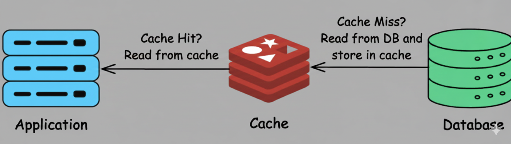
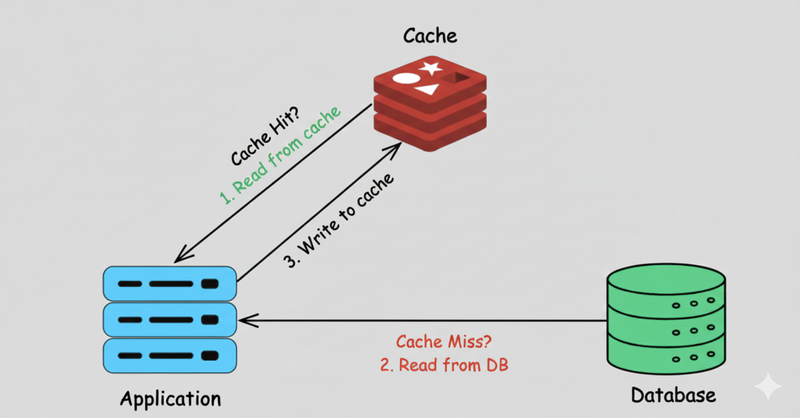
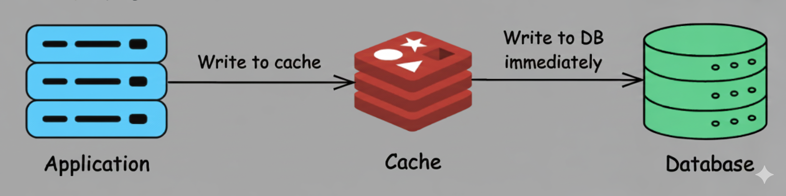
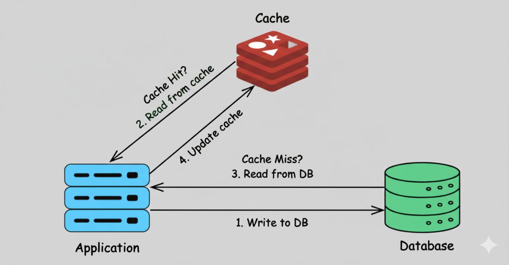
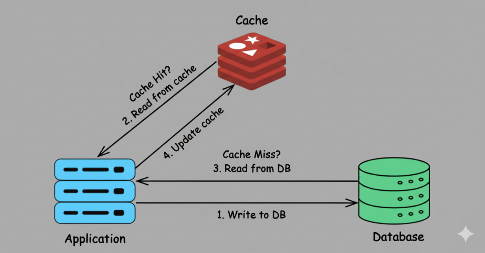
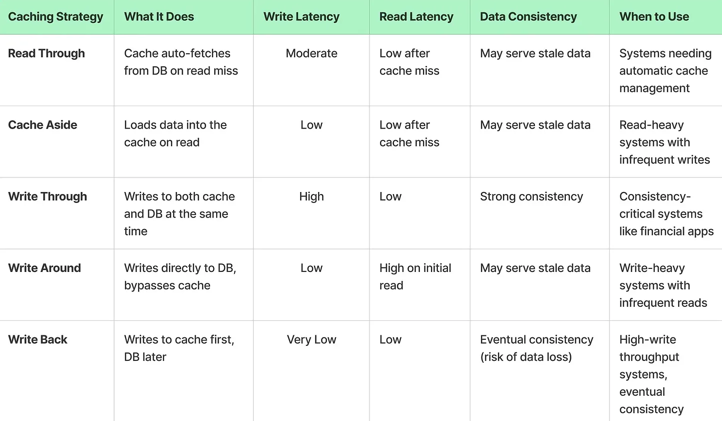

# Caching

- [Caching](#caching)
  - [Introduction](#introduction)
  - [Why Caching is important?](#why-caching-is-important)
  - [How Caching works?](#how-caching-works)
  - [What are drawbacks of caching?](#what-are-drawbacks-of-caching)
  - [Placement for Cache in a Distributed System](#placement-for-cache-in-a-distributed-system)
  - [Types of caches](#types-of-caches)
    - [In-Memory Cache](#in-memory-cache)
    - [Distributed Cache](#distributed-cache)
    - [Client-Side Cache](#client-side-cache)
    - [Database Cache](#database-cache)
    - [Content Delivery Network (CDN)](#content-delivery-network-cdn)
  - [Caching Strategies](#caching-strategies)
    - [Read Through](#read-through)
    - [Cache Aside](#cache-aside-1)
    - [Write Through](#write-through)
    - [Write Around](#write-around)
    - [Write Back](#write-back)
  - [Cache Eviction Policies](#cache-eviction-policies)
  - [Challenges and Considerations](#challenges-and-considerations)

## Introduction 

Caching is storing frequently accessed data in temporary storage.

The purpose of the cache is to improve both latency (time interval to perform a single operation) and throughput (operation processing rates).

Two important things for caching are:
- Cache Policy 
  - Write Policy:  How to sync for writes among cache and DB
  - Eviction/Replacement Policy, What to kick out. (LRU, LFU, ..)

## Why Caching is important?
- Caching improves page load times and can reduce the load on your servers and databases. 
  
- Databases often benefit from a uniform distribution of reads and writes across its partitions. Popular items can skew the distribution, causing bottlenecks. Putting a cache in front of a database can help absorb uneven loads and spikes in traffic.

    
Benefits

  - Reduce network calls
  - Avoid repeated communication
  - Reduce DB load

## How Caching works?
The application is responsible for reading and writing from storage. The cache does not interact with storage directly. The application does the following:

  - Look for entry in cache, resulting in a cache miss
  - Load entry from the database
  - Add entry to cache
  - Return entry

## What are drawbacks of caching?

- In case Cache doesn't store data accessed by user (poor hit rate)
- Need to maintain consistency between caches and the source of truth such as the database through cache invalidation (Eventual Consistency)
- Potential Thrashing - 

## Placement for Cache in a Distributed System

- In memory Cache
- Global Cache
- DB cache
- Distributed cache 

---

## Types of caches
### In-Memory Cache
- In-memory caches store data in the main memory (RAM) for extremely fast access.
- These caches are typically used for session management, storing frequently accessed objects, and as a front for databases.
> Examples: Redis and Memcached.

### Distributed Cache
- A distributed cache spans multiple servers and is designed to handle large-scale systems.
- It ensures that cached data is available across different nodes in a distributed system.
> Examples: Redis Cluster and Amazon ElastiCache.

### Client-Side Cache
- Client-side caching involves storing data on the client device, typically in the form of cookies, local storage, or application-specific caches.

- This is commonly used in web browsers to cache static assets like images, scripts, and stylesheets.

### Database Cache
- Database caching involves storing frequently queried database results in a cache.
- This reduces the number of queries made to the database, improving performance and scalability.

### Content Delivery Network (CDN)
- CDN is used to store copies of content on servers distributed across different geographical locations.
- This reduces latency by serving content from a server closer to the user.

---

## Caching Strategies

- `Read-Through Cache`: The application first checks the cache for data. If it's not there (a cache miss), it retrieves the data from the database and updates the cache.
- `Write-Through Cache`: Data is written to both the cache and the database simultaneously, ensuring consistency but potentially impacting write performance.
- `Write-Back Cache`: Data is written to the cache first and later synchronized with the database, improving write performance but risking data loss.
- `Cache-Aside (Lazy Loading)`: The application is responsible for reading and writing from both the cache and the database.

### Read Through

- In the Read Through strategy, the cache acts as an intermediary between the application and the database.
- When the application requests data, it first looks in the cache.
- If data is available (cache hit), it’s returned to the application.
- If the data is not available (cache miss), the cache itself is responsible for fetching the data from the database, storing it, and returning it to the application.

- This approach simplifies application logic because the application does not need to handle the logic for fetching and updating the cache.
- The cache itself handles both reading from the database and storing the requested data automatically. This minimizes unnecessary data in the cache and ensures that frequently accessed data is readily available.
- For cache hits, Read Through provides low-latency data access.
- But for cache misses, there is a potential delay while the cache queries the database and stores the data. This can result in higher latency during initial reads.
- To prevent the cache from serving stale data, a time-to-live (TTL) can be added to cached entries. TTL automatically expires the data after a specified duration, allowing it to be reloaded from the database when needed.

> Read Through caching is best suited for read-heavy applications where data is accessed frequently but updated less often, such as content delivery systems (CDNs), social media feeds, or user profiles.

### Cache Aside

- Cache Aside, also known as "Lazy Loading", is a strategy where the application code handles the interaction between the cache and the database. The data is loaded into the cache only when needed.
- The application first checks the cache for data. If the data exists in cache (cache hit), it’s returned to the application.
- If the data isn't found in cache (cache miss), the application retrieves it from the database (or the primary data store), then loads it into the cache for subsequent requests.
- The cache acts as a "sidecar" to the database, and it's the responsibility of the application to manage when and how data is written to the cache.
- To avoid stale data, we can set a time-to-live (TTL) for cached data. Once the TTL expires, the data is automatically removed from the cache.

> Cache Aside is perfect for systems where the read-to-write ratio is high, and data updates are infrequent. For example, in an e-commerce website, product data (like prices, descriptions, or stock status) is often read much more frequently than it's updated.

### Write Through

- In the Write Through strategy, every write operation is executed on both the cache and the database at the same time.
- This is a synchronous process, meaning both the cache and the database are updated as part of the same operation, ensuring that there is no delay in data propagation.

- This approach ensures that the cache and the database remain synchronized and the read requests from the cache will always return the latest data, avoiding the risk of serving stale data.
- In a Write Through caching strategy, cache expiration policies (such as TTL) are generally not necessary. However, if you are concerned about cache memory usage, you can implement a TTL policy to remove infrequently accessed data after a certain time period.
- The biggest advantage of Write Through is that it ensures strong data consistency between the cache and the database.
- Since the cache always contains the latest data, read operations benefit from low latency because data can be directly retrieved from the cache.
- However, write latency can be higher due to the overhead of writing to both the cache and the database.

> Write Through is ideal for consistency-critical systems, such as financial applications or online transaction processing systems, where the cache and database must always have the latest data.

### Write Around

- Write Around is a caching strategy where data is written directly to the database, bypassing the cache.
- The cache is only updated when the data is requested later during a read operation, at which point the Cache Aside strategy is used to load the data into the cache.

- This approach ensures that only frequently accessed data resides in the cache, preventing it from being polluted by data that may not be accessed again soon.
- It keeps the cache clean by avoiding unnecessary data that might not be requested after being written.
- Writes are relatively faster because they only target the database and don’t incur the overhead of writing to the cache.
- TTL can be used to ensure that data does not remain in the cache indefinitely. Once the TTL expires, the data is removed from the cache, forcing the system to retrieve it from the database again if needed.

> Write Around caching is best used in write-heavy systems where data is frequently written or updated, but not immediately or frequently read such as logging systems.

### Write Back

- In the Write Back strategy, data is first written to the cache and then asynchronously written to the database at a later time.
- This strategy focuses on minimizing write latency by deferring database writes.
- This deferred writing means that the cache acts as the primary storage during write operations, while the database is updated periodically in the background.

- The key advantage of Write Back is that it significantly reduces write latency, as writes are completed quickly in the cache, and the database updates are delayed or batched.
- However, with this approach, there is a risk of data loss if the cache fails before the data has been written to the database.
- This can be mitigated by using persistent caching solutions like Redis with AOF (Append Only File), which logs every write operation to disk, ensuring data durability even if the cache crashes.
- Write Back doesn't require invalidation of cache entries, as the cache itself is the source of truth during the write process.

> Write Back caching is ideal for write-heavy scenarios where write operations need to be fast and frequent, but immediate consistency with the database is not critical, such as logging systems and social media feeds.
### Comparison For Write Policies

| Feature                 | Write-Through                    | Write-Back                               | Write-Around                           |
|-------------------------|----------------------------------|------------------------------------------|----------------------------------------|
| **Write Location**      | Cache ✅ + Memory ✅               | Cache ✅ only (Memory updated later)      | Memory ✅ only (Cache bypassed)         |
| **Read After Write**    | Fast ✅ (data in cache)           | Fast ✅ (data in cache)                   | Slow ❌ (data not in cache yet)         |
| **Write Latency**       | Slower ❌ (writes go to 2 places) | Fast ✅ (writes hit cache only)           | Fast ✅                                 |
| **Cache Pollution**     | Possible ❌ (caches all writes)   | Possible ❌                               | Avoided ✅ (writes don't pollute cache) |
| **Data Consistency**    | High ✅ (always in sync)          | Lower ❌ (risk if cache lost before sync) | High ✅ (memory is always up to date)   |
| **Recovery Complexity** | Low ✅                            | High ❌ (needs dirty block tracking)      | Low ✅                                  |
| **Use Case**            | Strong consistency needed        | High write performance, low consistency  | Write-once or infrequently read data   |

### Example Use Cases

| Scenario                                | Recommended Strategy       |
|-----------------------------------------|----------------------------|
| Financial transactions, logs            | Write-Through              |
| Gaming state or temporary calculations  | Write-Back                 |
| Logging, rarely read audit trails       | Write-Around               |

## Cache Eviction Policies

Cache replacement policies are strategies used to decide which data to remove from the cache when the cache is full and new data needs to be added.

 The goal is to maximize hit rate (how often requested data is found in cache).

 - Common Replacement Policies
   - **LRU (Least Recently Used)** - LRU evicts the least recently accessed data when the cache is full. It assumes that recently used data will likely be used again soon.
   - **LFU (Least Frequently Used)** - LFU evicts data that has been accessed the least number of times, under the assumption that rarely accessed data is less likely to be needed.
   - **FIFO (First In, First Out)** - FIFO evicts the oldest data in the cache first, regardless of how often or recently it has been accessed.
   - **Time-to-Live (TTL)** - TTL is a time-based eviction policy where data is removed from the cache after a specified duration, regardless of usage.
   - **MRU (Most Recently Used)** - Removes the most recently used item
   - **ARC (Adaptive Replacement Cache)** - Balances between LRU and LFU - Smart choice when workload patterns vary

Memcached used Segmented LRU (LRU+LFU).

---
## Challenges and Considerations

1. **Cache Coherence**: Ensuring that data in the cache remains consistent with the source of truth (e.g., the database).
2. **Cache Invalidation**: Determining when and how to update or remove stale data from the cache. 
3. **Cold Start**: Handling scenarios when the cache is empty, such as after a system restart. 
4. **Cache Eviction Policies**: Deciding which items to remove when the cache reaches capacity (e.g., Least Recently Used, Least Frequently Used). 
5. **Cache Penetration**: Preventing malicious attempts to repeatedly query for non-existent data, potentially overwhelming the backend. 
6. **Cache Stampede**: Managing situations where many concurrent requests attempt to rebuild the cache simultaneously.

---

[Back to Concepts](../Readme.md#concepts)