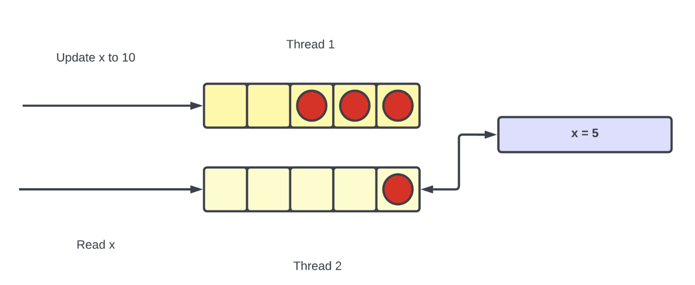

# Consistency 

In distributed systems, consistency means how up-to-date a piece of data is.


- [Consistency](#consistency)
  - [Why is consistency important?](#why-is-consistency-important)
- [Consistency Levels](#consistency-levels)
  - [Linearizable Consistency](#linearizable-consistency)
    - [Definition](#definition)
    - [Example](#example)
    - [Benefits](#benefits)
    - [Drawbacks](#drawbacks)
    - [Implementation](#implementation)
  - [Eventual Consistency](#eventual-consistency)
      - [Definition](#definition-1)
    - [Use Case](#use-case)
    - [Example](#example-1)
    - [Benefits](#benefits-1)
    - [Drawbacks](#drawbacks-1)
    - [Implementation](#implementation-1)
  - [Causal Consistency](#causal-consistency)
    - [Definition](#definition-2)
    - [Use Case](#use-case-1)
    - [Example](#example-2)
    - [Benefits](#benefits-2)
    - [Drawbacks](#drawbacks-2)
    - [Aggregation Limitation Example](#aggregation-limitation-example)
    - [Implementation](#implementation-2)
  - [Quorum](#quorum)
    - [Definition](#definition-3)
    - [Use Case](#use-case-2)
    - [Example](#example-3)
    - [Benefits](#benefits-3)
    - [Drawbacks](#drawbacks-3)
    - [Implementation](#implementation-3)
  - [Data Consistency Levels Tradeoffs](#data-consistency-levels-tradeoffs)
- [Transactions](#transactions)
- [Isolation Levels](#isolation-levels)
  - [Read Uncommitted](#read-uncommitted)
    - [Use case](#use-case-3)
    - [Example](#example-4)
    - [Benefits](#benefits-4)
    - [Drawbacks](#drawbacks-4)
  - [Read Committed](#read-committed)
    - [Use Case](#use-case-4)
    - [Example](#example-5)
    - [Benefits](#benefits-5)
    - [Drawbacks](#drawbacks-5)
  - [Repeatable Reads](#repeatable-reads)
    - [Use Case](#use-case-5)
    - [Optimistic Concurrency Control](#optimistic-concurrency-control)
    - [Benefits](#benefits-6)
    - [Drawback](#drawback)
  - [Serializable](#serializable)
    - [Example](#example-6)
    - [Benefits](#benefits-7)
    - [Drawback](#drawback-1)
- [Summary](#summary)
  - [Tradeoff](#tradeoff)

## Why is consistency important? 

- A highly consistent system reflects all updates to data, while an inconsistent system provides stale data. 
- Consistency is important because highly consistent systems are easier to reason about and provide a better user experience.


# Consistency Levels
## Linearizable Consistency

### Definition
- Linearizable consistency is the strongest consistency model in distributed systems. 
- It ensures that every read operation reflects the result of the latest completed write operation.
- This means any read will see all changes made by previous write operations, regardless of which node in the system processed the request.

### Example

Suppose `x = 10` initially. Now:

```
write x = 13
write x = 17
read x → returns 17
write x = 1
read x → returns 1
```

A linearizable system guarantees the following:
- The read after `write x = 17` will **not return 13** or **10**, because `17` is the most recent write.
- The read after `write x = 1` will return `1`.


### Benefits  
- Predictable and intuitive behavior — what you write last is what you read next.
- Strongest consistency guarantee: simplifies debugging and system correctness.
- Ideal for use cases like financial transactions, leader elections, inventory counts, etc.

### Drawbacks  
- **High latency**: Requires coordination between all replicas to confirm latest writes.
- **Low availability**: If even one replica is unreachable, the system may delay or reject requests.
- **Scalability limitations**: Coordination and ordering overhead grows with more nodes.

### Implementation  
- **Single-threaded server**: Simplest way to achieve linearizability — all reads and writes pass through a single ordered thread.
- **Consensus protocols**: Use Paxos or Raft to maintain a globally agreed-upon order of operations.
- **Replicated state machines**: All replicas apply operations in the same order.
- **Quorum-based systems**: Ensure majority of nodes agree on the value before confirming read/write (e.g., read/write quorums).

## Eventual Consistency

#### Definition  
- Eventual consistency is a **weaker consistency model** used in distributed systems. 
- It allows the system to return **stale (outdated) data** temporarily, with the guarantee that, if no new updates are made to the data, **all replicas will eventually become consistent** and reflect the latest value.

- During the inconsistency window, different nodes may return different values for the same data, but the system will **converge** to the latest state over time.

### Use Case  
Used in systems where `high availability`, `scalability`, and `low latency` are more important than immediate consistency — especially in scenarios where **temporary staleness is acceptable**.

Examples include social media feeds, product recommendation engines, or shopping cart updates.

### Example  
Suppose a system initially has `x = 5`. Now:
```
write x = 10 # initiated
read x → returns 5 # processed before write takes effect
(read returns stale data)
...time passes...
read x → returns 10 # all replicas eventually updated
```


Here, the read is served `before` the write has fully propagated to all replicas, so stale data (`x = 5`) is returned. Later, the system catches up, and all subsequent reads return the correct data (`x = 10`).

### Benefits  
- **Highly available**: Can serve reads even during network partitions.
- **Low latency**: Faster response since reads can be served from any replica.
- **Scalable**: Suitable for large-scale distributed systems.

### Drawbacks  
- Clients may observe stale data temporarily.
- Not suitable for scenarios requiring strong consistency (e.g., financial apps).
- Developers must handle convergence and possible read-after-write inconsistencies.

### Implementation  
- **Asynchronous replication**: Writes propagate in the background across replicas.
- **Concurrent processing**: Reads and writes processed in parallel using multi-threaded or multi-node setups.
- **Conflict resolution mechanisms**: For resolving divergent states (e.g., last-write-wins, vector clocks, CRDTs).
- Used by systems like **Amazon DynamoDB**, **Cassandra**, **Riak**, and **Couchbase**.


## Causal Consistency

### Definition  
- Causal consistency is a **middle-ground consistency model** where operations that are **causally related** must be seen by all processes in the same order. 
- However, operations that are **not causally related** can be seen in different orders on different nodes.

- In simpler terms, if one operation potentially influences another (e.g., a read depending on a previous write), then all nodes must process them in that causal order. 
- If there’s no causal link, then the order doesn't matter.

### Use Case  
- Causal consistency is used in distributed systems that need to maintain **data correctness across related operations** without the performance cost of strict consistency models like linearizability.

- It is especially useful in collaborative applications, chat apps, and systems that require **partial ordering** of events.

### Example  
Consider the following operations:

```
1. update x = 20
2. update y = 10
3. read x
4. update x = 2
5. read y
```

- `read x` must reflect the result of `update x = 20` because they are causally related.
- `update y` is independent of `x`, so it can be executed in any order relative to operations on `x`.

Hence:
- Operations (1, 3, 4) are executed on one thread/server.
- Operations (2, 5) are executed on another thread/server.

This preserves **causal ordering** for related operations, but allows **parallelism** for unrelated ones.

### Benefits  
- **Stronger than eventual consistency**: related updates maintain order.
- **Better performance than linearizable consistency**: avoids global coordination and waiting for unrelated writes.
- **Supports availability and partition tolerance** in distributed systems.

### Drawbacks  
- **Fails for aggregation queries** involving multiple keys or IDs.
- **Complex to reason about** when operations span multiple unrelated entities.
- **Partial ordering** is harder to implement and debug than total or no ordering.


### Aggregation Limitation Example

Consider a table:

| uid | value |
|-----|--------|
| 1   | 20     |
| 2   | 10     |
| 3   | 30     |

Now the operations:

```
i. read sum -> returns 60
ii. update uid 1 = 10
iii. read sum -> expected: 50
iv. update uid 1 = 5
```

Depending on the order of execution:
- If reads (i, iii) happen before updates, sum is 60 → 60 (wrong).
- If reads happen after all updates, sum is 45 → 45 (wrong).
- Only one specific ordering will give the correct result (60 → 50).

This inconsistency happens because **causal consistency tracks per-key dependencies**, but **aggregation involves multiple keys**, leading to incorrect results.

### Implementation  
- **Track causal dependencies**: using vector clocks, version vectors, or Lamport timestamps.
- **Group related operations** on the same key or context together to preserve their order.
- Systems like **Cassandra (with tuning)**, **COPS**, **Bayou**, and **Orleans** offer causal consistency features.
- **Client-based tracking**: Clients may carry dependency metadata to help servers maintain order.
 

 ## Quorum

### Definition  
- Quorum consistency is a consistency model used in distributed systems where **multiple replicas** of data exist, and **read/write operations require agreement (or a "quorum")** from a subset of those replicas. 
- The system uses a voting or consensus-like mechanism to determine the correct value, typically by querying a minimum number of replicas.

- Quorum systems are typically **eventually consistent**, but can be tuned to provide **strong consistency** using the formula: `R + W > N`
Where:
  - **R** = Minimum number of replicas to read from  
  - **W** = Number of replicas to write to  
  - **N** = Total number of replicas  
  
> If `R + W ≤ N`, system becomes **eventually consistent**.

### Use Case  
- Used in distributed databases where you want a trade-off between **availability**, **fault tolerance**, and **consistency**. 
- Quorum is particularly useful in systems that need to survive **node failures** while maintaining **some level of consistency**.


### Example  
Consider 3 replicas:
```
Replica 1: x = 20
Replica 2: x = 40 (after update)
Replica 3: x = 20
```
- A read request comes in after Replica 2 crashes.
- System reads from Replica 1 and 3 → returns x = 20 (stale data).
- Once Replica 2 comes back online, the correct value (x = 40) is available.
- System becomes consistent **eventually**.

If the system uses quorum rules like `R + W > N`, for example:
- `N = 5`, `W = 2`, then `R` should be `≥ 4` for strong consistency.
- If only 3 nodes respond during a read, system throws an **error** or delays until quorum is met.


### Benefits  
- **Fault-tolerant**: Works even if some replicas are down.
- **Configurable consistency**: Balance between performance, availability, and consistency.
- **Scalable**: Suitable for large distributed systems.

### Drawbacks  
- **High cost**: Requires maintaining multiple replicas.
- **Split-brain risk**: An even number of replicas may cause inconsistent decisions (tie votes).
- **Latency**: Higher read/write latency due to quorum requirement.
- **Stale reads**: If quorum isn't correctly configured, may return outdated data.

### Implementation  
- **Replica-based design**: Each data item is stored on multiple nodes.
- **Read quorum (R)**: System must get responses from `R` replicas to process a read.
- **Write quorum (W)**: System writes the update to `W` replicas before confirming success.
- Quorum ensures strong consistency when `R + W > N`.
- Used in systems like **Apache Cassandra**, **Amazon DynamoDB**, **Riak**, and **MongoDB (with read/write concern settings)**.


## Data Consistency Levels Tradeoffs

| **Level**              | **Consistency**                                                  | **Efficiency**                                                  |
|------------------------|------------------------------------------------------------------|-----------------------------------------------------------------|
| **Linearizable**       | Highest                                                          | Lowest                                                          |
| **Eventual Consistency** | Lowest                                                           | Highest                                                         |
| **Causal Consistency** | Higher than eventual consistency but lower than linearizable     | Higher than linearizable but lower than eventual consistency    |
| **Quorum**             | Configurable                                                     | Configurable                                                    |

---

# Transactions 
- Transactions can be defined as a collection of queries that perform one unit of work.
-  They are atomic which means either all queries in a transaction are executed or none of it is executed.
   - `BEGIN` transaction marks the starting of transactions
   - `COMMIT` transaction marks the end of the transaction and persists the changes to the database
   - `ROLLBACK` transaction marks the end of the transaction and undoes all the changes to the database

If two transactions are running concurrently and queries in one transaction do not affect the other transaction then the two transactions are said to be isolated from each other.
# Isolation Levels

## Read Uncommitted

Read Uncommitted is the lowest level of isolation in database transactions where one transaction is allowed to read data that another transaction has written but not yet committed.

### Use case

Used when performance is more critical than accuracy, such as in read-heavy systems with relaxed consistency requirements, or during exploratory data analysis where data freshness matters more than correctness.


### Example

Suppose a database has `x = 20`.

| Transaction T1 | Transaction T2 |
| -------------- | -------------- |
| BEGIN          | BEGIN          |
| Write x = 10   | Read x => 10   |
| ROLLBACK | COMMIT |

Here, T2 reads `x = 10`, but T1 rolls back, reverting `x` back to `20`. T2 has read a value (`10`) that never existed permanently — this is called a **dirty read**.

### Benefits
- Fastest transaction execution.
- Least locking and blocking overhead.
- Ideal for systems prioritizing speed over strict data accuracy.

### Drawbacks
- **Dirty Reads**: Data read may be rolled back.
- No guarantee of data accuracy.
- Should not be used where data correctness is critical.

## Read Committed

At this isolation level, a transaction can only read data that has been committed by other transactions. This eliminates dirty reads.

### Use Case

- Applications where `dirty reads `must be avoided, but occasional `non-repeatable reads `are acceptable.

- Systems prioritizing performance and concurrency over strict consistency.

### Example

Initial state: `x = 10`

| T1           | T2               | Explanation                                          |
| ------------ | ---------------- | ---------------------------------------------------- |
| BEGIN        | BEGIN            | Transactions begin                                   |
| Write x = 20 | Read x → gets 10 | T1 updates x to 20, T2 reads old value               |
| COMMIT       | Some other query | T1 commits                                           |
|              | Read x → gets 20 | Now T2 reads the updated value (non-repeatable read) |


In the same transaction (T2), reading x twice returned two different values, hence a `non-repeatable read`.

### Benefits
- Prevents dirty reads
- Faster and more concurrent than higher isolation levels

### Drawbacks

- Non-repeatable reads can occur:
  - When a transaction reads the same row twice and gets different values due to updates from other committed transactions.

## Repeatable Reads

- Ensures that if a row is read once in a transaction, subsequent reads will return the same value, even if other transactions commit updates to that row.


### Use Case

- Each transaction works on a snapshot of the data (Snapshot Isolation).

- Row-level locks or MVCC (Multi-Version Concurrency Control) are used.
  
- Other transactions' updates are not visible until the current transaction ends.

- Phantom reads (new rows being added) can still occur unless further isolation is used (e.g., Serializable).


### Optimistic Concurrency Control
- If two concurrent transactions try to update the same row, only one will succeed; the other rolls back.

- This technique is conflict detection-based, assuming conflicts are rare

### Benefits

- prevents dirty reads
- prevents non-repeatable reads

### Drawback

- Allows phantom reads


## Serializable

- Highest level of isolation in databases.

- Ensures that transactions are executed serially or behave as if they were executed one after the other.

- No other transaction can interfere—ensures complete isolation.

- Avoids phantom reads (inserts/deletes by other transactions are not visible).

- Uses locking or predicate-based locking to prevent other transactions from affecting the result.

- Provides full serializability of concurrent transactions.

- We use casual ordering

### Example

| ID | Value |
| -- | ----- |
| 1  | 20    |
| 2  | 10    |


Transactions

| T1          | T2                      | Explanation                               |
| ----------- | ----------------------- | ----------------------------------------- |
| Sum         | --                      | T1 reads total = 30                       |
| --          | Insert (ID=3, Value=30) | T2 inserts a new row                      |
| --          | COMMIT                  | T2 commits                                |
| Sum (again) | --                      | T1 reads total = 60 (phantom read occurs) |

Serializable prevents this by blocking the insert or forcing the transactions to execute serially.

It prevents either by `strict two-phase locking` (S2PL) or `timestamp-based ordering`.


### Benefits

Prevents:

- Dirty reads 
- Non-repeatable reads 
- Phantom reads 


### Drawback

Least efficient/performance-heavy due to locking and blocking.


# Summary

| **Isolation Level**  | **Implementation**             | **Explanation**                                                                                                                                   |
| -------------------- | ------------------------------ | ------------------------------------------------------------------------------------------------------------------------------------------------- |
| **Read Uncommitted** | Single Data Entry              | A single copy of data exists; updates overwrite existing values directly, allowing dirty reads.                                                   |
| **Read Committed**   | Local Copy of Changed Values   | The original value stays in the database; updated values are kept locally until commit, preventing dirty reads but allowing non-repeatable reads. |
| **Repeatable Read** (Most Used)  | Versioning of Unchanged Values | For each key, versions are stored so unmodified values can be read consistently across a transaction. Prevents non-repeatable reads.              |
| **Serializable**     | Queued Locks                   | Transactions involving the same data are ordered using locks or causal ordering to ensure strict serializability and prevent phantom reads.       |

## Tradeoff
- For Efficiency
  > Read Uncommitted > Read Committed > Repeatable Read > Serializable
- For Isolation
  > Read Uncommitted < Read Committed < Repeatable Read < Serializable