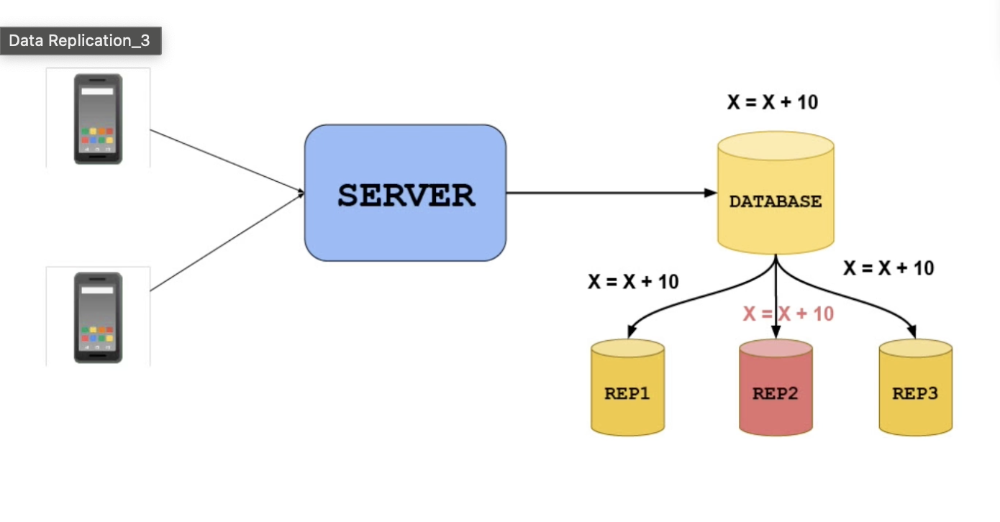

# Data Replication and Migration

- [Data Replication and Migration](#data-replication-and-migration)
  - [Database Replication](#database-replication)
    - [Pros](#pros)
    - [Cons](#cons)
  - [How does Primary-Replica Architecture work?](#how-does-primary-replica-architecture-work)
    - [WAL - Write Ahead Log](#wal---write-ahead-log)
    - [CDC - Change Data Capture](#cdc---change-data-capture)
  - [Challenges](#challenges)
    - [Split brain Problem](#split-brain-problem)
    - [Write Amplification](#write-amplification)
  - [Database](#database)
    - [Migration Approaches](#migration-approaches)
      - [Naive](#naive)
      - [Optimised](#optimised)

## Database Replication

Clients connect to a server that hosts a database.
- The database is prone to failures due to various reasons (e.g., hardware issues, crashes).
- To ensure availability and reliability, a replica (backup) of the original database is created.

- Write requests are sent only to the primary database to maintain data consistency and then copied over to replica as well.
- Read requests can be handled by both the primary and the replica databases.
- This replication strategy is especially beneficial for read-intensive applications, where write operations are relatively infrequent.
- It helps in load balancing and improves read performance.

### Pros

- fault Tolerance
- Improved read speed
- Simple to implement

### Cons

- potential `consistency` issues if there are in-flight messages
- slightly `slower write speeds` due to the added complexity

## How does Primary-Replica Architecture work?

 Initially, both databases are in the same state, and complex operations are copied onto both of them. 
 
 When a new write operation occurs on the primary, it is sent to the replica for synchronization.

### WAL - Write Ahead Log 

- The replica processes the write operation and ensures consistency by applying all previous operations in a sequential manner. 

- This process is described as a  `write ahead log` where operations are sequentially executed and can be rolled back, similar to transaction logs.

- `Benefits` of this approach include the efficient transfer of only the necessary operations

- But there are also potential `drawbacks`. 
  - If the replica cannot catch up with the primary, consistency issues can arise. 
  - Timestamps and contextual values can also lead to confusion when the replica and primary show different data values.

- The solution for addressing these issues is introduced as `change data capture (CDC)`

### CDC - Change Data Capture

- CDC involves sending events that indicate data changes and allow subscribers to process these events and make necessary transformations.
   
- This is particularly useful when you have different types of databases, some optimized for writes and others for reads. 
  
- CDC can transform data and has built-in libraries for connecting to various databases, simplifying data replication.

## Challenges

### Split brain Problem

- Having two primary databases can be problematic, leading to inconsistencies and difficulties in reconciliation. 

- This situation is referred to as `split brain. `

-  Manual reconciliation and techniques like "last writer wins" are mentioned, but they come with their own risks and complexities.
   
- To avoid split brain scenarios, having an `odd number of primary nodes `to ensure a majority consensus in case of network partitions. The use of an even number of nodes can lead to reconciliation issues and require manual intervention.

### Write Amplification

- It is a phenomenon where more data is written to storage than the original amount of data intended to be written.

- Puts load on the Primary DB bandwidth

- Using a consensus mechanism like Paxos or Raft to ensure that the entire cluster agrees on a value during data replication is recommended. This ensures strong consistency across the system.

    
     
    <i>Write Amplification</i>

## Database

Because of the following reasons, One might need to migrate the database.
-  Infrastructure Upgrade
-  Cloud Adoption
-  Database/System Migration
-  Application Modernization

### Migration Approaches

#### Naive

1. Stop the existing DB.
2. This fails all incoming requests to the DB (You should probably have some email communication setup beforehand to notify users of a planned outage).
3. Take a Data Dump of the current DB into your shiny new DB.
4. When the process completes, point the existing servers to the new DB. This will take a deployment or a server restart.

> Problem: Downtime

#### Optimised

This is going to be more complex engineering, but worth it the savings in downtime.
1. Set up a change data capture solution (Similar to a SQL trigger). - this tracks any changes (INSERT/UPDATE/DELETE) happening in the current (old) database.
2. Take a database copy of all older records.
3. Setup a view or proxy to serve existing clients through the old database.
4. Set the clients to point to the proxy.
5. Now point the proxy to the new database.
6. Point clients to the new database directly (this requires a deployment or server restart).
7. Delete the proxy.