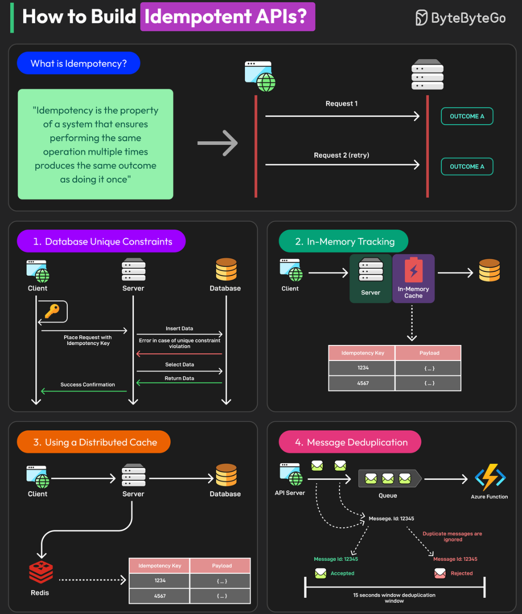

# Idempotency in Distributed Systems

> Idempotency means performing the same operation multiple times results in the same final state as performing it once, even under retries, failures, or duplicates.

## Pain Points

- Distributed systems cannot guarantee exactly-once execution
- At-least-once delivery is common (MQs, Kafka consumers)
- Failures occur between processing and acknowledgment
- Clients often retry blindly on timeout
  
Without idempotency → correctness breaks

## Problems Solved by Idempotency
- Duplicate requests due to:
  - Network retries
  - Client timeouts
  - Message queue redelivery
- Prevents double side effects:
  - Double payments
  - Duplicate orders
  - Repeated emails/notifications

## High Level Architecture

### Flow
1. Client generates Idempotency Key
2. Request sent with key
3. Server checks idempotency store
4. If key exists → return stored response
5. If not → process request
6. Persist result + key atomically

## Idempotency in APIs

- Typically applied to:
  - POST (non-idempotent by default)
- Implemented via:
  - Idempotency-Key header
- Key scoped to:
  - User + operation
- Same key with different payload → reject

## Idempotency in Message Queues

- Messages may be delivered multiple times
- Consumer must:
  - Deduplicate via message ID
  - Or design logic to be idempotent
- Use deduplication tables or caches

## Trade-offs
| Pros                          | Cons                     |
|-------------------------------|--------------------------|
| Strong correctness guarantees | Extra storage & lookups  |
| Safe retries                  | Cleanup complexity (TTL) |
| Failure-tolerant systems      | Needs careful key design |
|                               | Slight latency overhead  |

