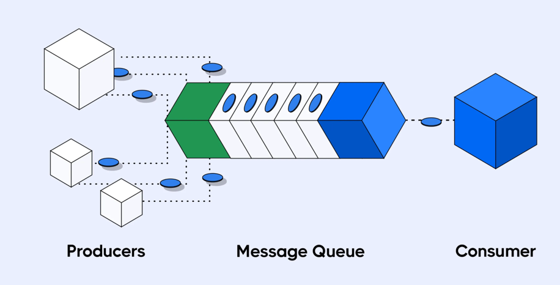

# Message Queues

> A Message Queue is an asynchronous communication mechanism where producers send messages to a queue and consumers process them independently, enabling decoupled and resilient systems.

## Pain points

- Synchronous calls cause:
  - High latency
  - Cascading failures
- Traffic spikes overwhelm downstream services
- Tight coupling blocks independent scaling
- Need for retries and failure handling

## Problems Message Queues Solve

- Decouples producers and consumers
- Smooths traffic spikes via buffering
- Enables asynchronous processing
- Improves reliability and fault isolation

## Use Cases

- Background job processing (emails, notifications)
- Order processing pipelines
- Payment retries

## High Level Architecture

### Core Components

- `Producer` – Publishes messages
- `Queue` – Buffer holding messages
- `Consumer` – Processes messages
- `Broker` – Manages queues & delivery
- `Acknowledgement (Ack)` – Confirms processing
- `Dead Letter Queue (DLQ)` – Stores failed messages

### Flow
- `Producer` sends message to `Queue`
- `Queue` persists message
- `Consumer` polls or subscribes
- `Consumer` processes message
- Message is acknowledged and removed

> Key idea: Work is buffered and processed asynchronously.

## Trade-offs
| Pros                   | Cons                                    |
|------------------------|-----------------------------------------|
| Loose coupling         | Limited message replay                  |
| Better fault tolerance | Ordering guarantees can be weak         |
| Load leveling          | Debugging async flows is harder         |
| Simple mental model    | Throughput lower than log-based systems |
| Easy retries           |                                         | 

## Popular Implementations
- RabbitMQ – Routing, exchanges, low latency
- Amazon SQS – Fully managed, simple scaling
- ActiveMQ – JMS-based enterprise use

## Edge Cases
1. **Poison Messages Blocking Consumers**
   - A poison message is a malformed or logically invalid message that always fails processing, no matter how many times it is retried.
   - Happens due to: 
     - Corrupt payload (schema mismatch, missing fields)
     - Invalid business state (order already cancelled, user deleted)
   - Problem:
     - Consumer keeps retrying the same message
     - Queue head is blocked
     - Throughput drops to zero
   - Design Solutions
     - Retry limit (max retry count)
     - Exponential backoff to avoid tight retry loops
     - Dead Letter Queue (DLQ) after N failures

2. **Duplicate Message Processing**
    - The same message is processed more than once by a consumer.
    - Happens due to:
      - Consumer crashes after processing but before ack
      - Network timeout → broker resends message
    - Problem:
      - Double charges
      - Duplicate emails/notifications
    - Design Solutions
      - Idempotent consumers (track processed message IDs)
      - Upserts instead of inserts

3. **Message Ordering Violations**
   - Messages are processed out of order relative to how they were produced.
   - Happens due to:
     - Multiple consumers in parallel
     - Retries reorder messages
     - Partition-less or unordered queues
   - Problem:
     - State corruption (UPDATE before CREATE)
     - Business logic errors
   - Design Solutions
     - Partition by key (orderId, userId)
     - Single consumer per key
     - FIFO queues (with reduced throughput)
     - Sequence numbers + reordering logic

4. **DLQ (Dead Letter Queue) Growth Monitoring**
   - A Dead Letter Queue stores messages that failed permanently after retries.
   - Why It’s Important
     - DLQ growth = silent data loss
     - Often ignored until customers complain
   - Failure Modes
     - DLQ fills up unnoticed
     - Same bug keeps producing bad messages
     - No alerting or reprocessing strategy
   - Design Solutions
     - Monitor DLQ size & rate
     - Alerts on abnormal growth
     - Build reprocessing pipelines
     - Store failure reason & stack trace

> Use a message queue when you need asynchronous task processing, retries, and buffering, but do not need event replay.
> 
> Queues are for tasks, not event history.