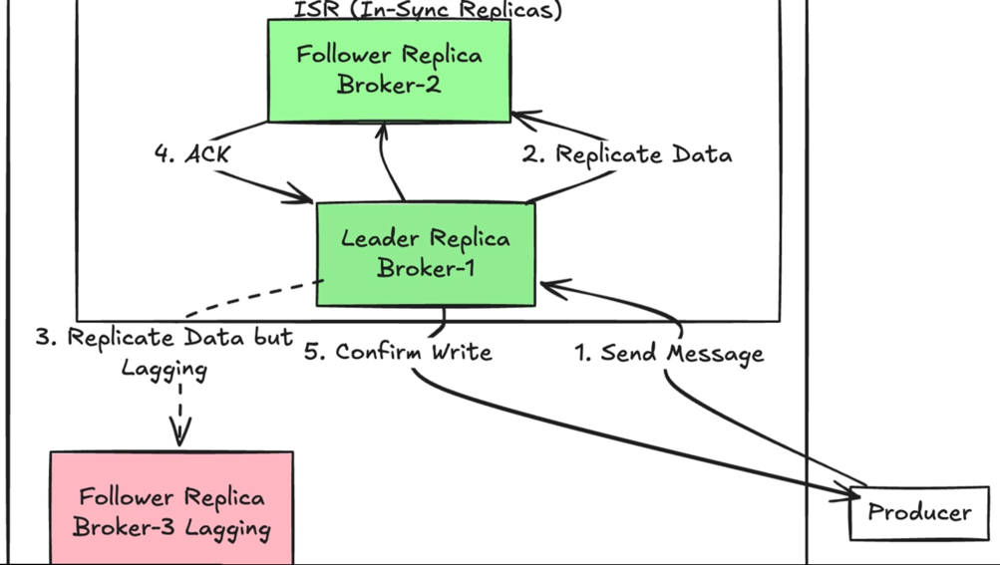

# Kafka

> A distributed, durable, and scalable event-streaming platform used to publish, store, and consume streams of records in real time.

## Pain Points Addressed by Kafka
- Synchronous APIs cause high latency and cascading failures.
- Direct service-to-service communication leads to tight coupling
- Traditional message queues struggle with scale, durability, replay
- Systems need event replay for debugging, analytics, and recovery

## Problems Kafka Solves

- Reliable **asynchronous** communication between services
- Handling high-throughput data streams **without tight coupling**
- Decoupling **producers** and **consumers** in large systems

## Use cases

- Event-driven microservices
- Activity logs, audit logs
- Data ingestion 
- Replayable event streams

## High Level Architecture

### Core Components

- `Producer` – Publishes messages
- `Topic` – Logical stream of messages
- `Partition` – Ordered, append-only log
- `Broker` – Kafka server storing partitions
- `Consumer` – Reads messages
- `Consumer Group` – Parallel consumption
- `Offset` – Consumer read position
- `ZooKeeper` / `KRaft` – Metadata & cluster coordination

### Flow
1. `Producer` publishes events to a `Topic`
2. `Topic` is split into `Partitions` (ordered logs)
3. `Partitions` are distributed across `Brokers`
4. `Events` are persisted on disk and replicated
5. `Consumers` read events using offsets
6. `Events` are retained for a configured retention period, not consumption basis

> Key idea: Kafka is a pull-based, log-centric system, not a queue.

## Trade-offs

| Pros                           | Cons                                       |
|--------------------------------|--------------------------------------------|
| Extremely high throughput      | Operational complexity                     |
| Horizontal scalability         | Eventual consistency by default            | 
| Durable storage with replay    | Message ordering only within a partition   | 
| Decoupled architecture         | Not ideal for low-latency request/response | 
| Fault tolerant via replication |                                            |

## Scalability 

- Write scaling → Add partitions
- Read scaling → Add consumers in a group
- Broker scaling → Add brokers horizontally
- Near-linear throughput scaling with partitions

> Caution: Too many partitions → metadata + rebalance overhead

## Consistency / Availability Impact

- **Ordering**: Guaranteed per partition only
- **Availability**:
  - Replication + leader election
  - [ISR (in-sync replicas)](#isr-in-sync-replicas) control durability

- CAP view
  - Prioritizes Availability + Partition tolerance
  - Consistency is configurable (acks, ISR, min.insync.replicas)

## Design Variations
- Kafka vs RabbitMQ
  - `Kafka`: throughput, replay, streaming
  - `RabbitMQ`: low latency, routing, queues
- Kafka vs SQS
  - `Kafka`: self-managed, high control
  - `SQS`: fully managed, limited replay

## Real-World Examples
- **Netflix** – event pipelines & monitoring
- **Uber** – real-time analytics
- **LinkedIn** – activity streams (Kafka originated here)
- **Fintech** – transaction events & audit logs

## Glossary

### ISR (in-sync replicas)
- ISR (In-Sync Replicas) is the mechanism that directly controls write durability and fault tolerance.
- set of replicas that are fully caught up with the leader
- Includes:
  - Leader replica
  - Follower replicas that:
    - Are alive
    - Have replicated all recent messages within a configured lag

Replicas that fall behind are removed from ISR.

- **Durability is enforced via acks + ISR size**:
  - `acks=all`
    - Producer waits until all ISR replicas have written the message
    - Message is considered committed only after ISR confirms
    - Strong durability
  - `acks=1`
    - Only leader writes
    - Followers may lag
    - Lower durability
- **Minimum ISR (min.insync.replicas)**
  - This setting defines how many ISR replicas must acknowledge a write.
  - Example:
    - `Replication factor = 3`
    - `min.insync.replicas = 2`
  - Guarantee:
    - At least 2 replicas must persist the data
    - If ISR shrinks below 2 → writes are rejected
    - Prevents accepting writes that would be lost on leader failure
  - This is the key durability safety valve.

> ISR controls durability by defining which replicas must persist data before Kafka considers a write safe and committed.