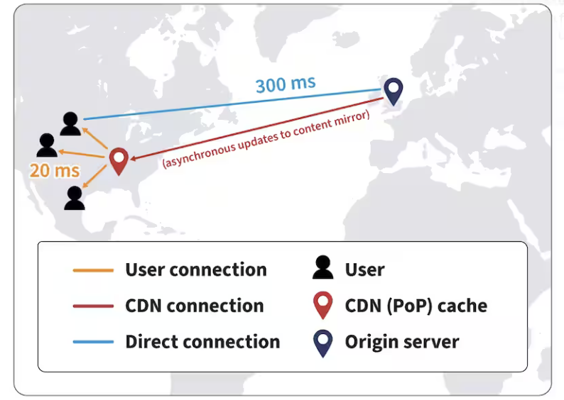

# Networks

- [Networks](#networks)
  - [Introduction](#introduction)
  - [Where Network is used?](#where-network-is-used)
  - [OSI Model](#osi-model)
    - [Physical Layer](#physical-layer)
    - [Data Link Layer](#data-link-layer)
    - [Network Layer](#network-layer)
    - [Transport Layer](#transport-layer)
    - [Session/Behavioral layer](#sessionbehavioral-layer)
    - [Presentation Layer](#presentation-layer)
    - [Application Layer](#application-layer)
    - [Layer Breakdown](#layer-breakdown)
  - [IP Address](#ip-address)
  - [MAC address](#mac-address)
  - [ISP - Internet Service Provider](#isp---internet-service-provider)
  - [DNS - Domain Name System](#dns---domain-name-system)
    - [What is DNS?](#what-is-dns)
    - [Working of DNS](#working-of-dns)
  - [CDN - Content Delivery Network](#cdn---content-delivery-network)
    - [How CDN works?](#how-cdn-works)
    - [Functions of CDN](#functions-of-cdn)
    - [Benefis of CDN](#benefis-of-cdn)
  - [HTTP](#http)
  - [Internet Protocols](#internet-protocols)
    - [TCP/IP](#tcpip)
    - [UDP](#udp)
    - [TCP vs UDP](#tcp-vs-udp)
  - [Glossary](#glossary)
    - [DDoS - distributed denial-of-service](#ddos---distributed-denial-of-service)
    - [NIC - Network Interface Card](#nic---network-interface-card)
    - [NAT - Network Address Translation](#nat---network-address-translation)
    - [Websocket](#websocket)
    - [XMPP](#xmpp)

## Introduction 

Network refers to how components of a system communicate with each other—whether they are on the same machine, on different servers, or even across the globe.

It involves:
- Data transmission over the internet or intranet
- Protocols (e.g., HTTP, TCP, gRPC)
- Latency, throughput, bandwidth
- Load balancing, failover, timeouts, retries
- Security (encryption, firewalls, authentication)

## Where Network is used?

| Layer               | Example                                   |
|---------------------|-------------------------------------------|
| Client ↔ Backend    | HTTP API calls from browser/mobile app    |
| Service ↔ Service   | Microservice-to-microservice communication |
| App ↔ DB/Cache      | TCP connections to PostgreSQL/Redis       |
| App ↔ Message Queue | Kafka, RabbitMQ messaging                 |
| CDN ↔ Client        | Static file delivery via Cloudflare, etc. |

## OSI Model

Model Image

    

    
     
    <i>OSI Model</i>

### Physical Layer
- The physical layer consists of the basic networking hardware transmission technologies of a network. 
- It is a fundamental layer underlying the logical data structures of the higher level functions in a network.

### Data Link Layer

- This layer is the protocol layer that transfers data between adjacent network nodes in a wide area network (WAN) or between nodes on the same local area network (LAN) segment.
- Examples of data link protocols are Ethernet for local area networks (multi-node), the Point-to-Point Protocol (PPP), HDLC and ADCCP for point-to-point (dual-node) connections. 
- In the Internet Protocol Suite (TCP/IP), the data link layer functionality is contained within the link layer, the lowest layer of the descriptive model.
- MAC addresses
  
### Network Layer

- The network layer is responsible for packet forwarding including routing through intermediate routers, since it knows the address of neighboring network nodes, and it also manages quality of service (QoS), and recognizes and forwards local host domain messages to the Transport layer (layer 4)
- IP Addresses

### Transport Layer

- The protocols of the layer provide host-to-host communication services for applications.
- It provides services such as connection-oriented data stream support, reliability, flow control, and multiplexing.
- The best-known transport protocol of TCP/IP is the Transmission Control Protocol (TCP), and lent its name to the title of the entire suite. It is used for connection-oriented transmissions, whereas the connectionless User Datagram Protocol (UDP) is used for simpler messaging transmissions. 

### Session/Behavioral layer

- The session layer provides the mechanism for opening, closing and managing a session between end-user application processes, i.e., a semi-permanent dialogue.
- Communication sessions consist of requests and responses that occur between applications. 

### Presentation Layer

- The presentation layer is responsible for the delivery and formatting of information to the application layer for further processing or display. 
- It relieves the application layer of concern regarding syntactical differences in data representation within the end-user systems.

### Application Layer

- An application layer is an abstraction layer that specifies the shared protocols and interface methods used by hosts in a communications network. 
- The application layer abstraction is used in both of the standard models of computer networking; the Internet Protocol Suite (TCP/IP) and the Open Systems Interconnection model (OSI model).

### Layer Breakdown

| Layer                | Description |
|----------------------|-------------|
| **Physical Layer**   | Represents the **hardware and physical infrastructure**—servers, routers, switches, data centers, cables, etc. Analogous to Layer 1 (Physical Layer) in the OSI model. |
| **Routing Layer**    | Deals with **communication, routing, and network path selection**—how data moves between components and services. Roughly maps to Layer 2-4 (Data Link, Network, Transport Layer) of OSI. |
| **Behavioural Layer**| Represents the **application logic, system behavior, user interaction**, and business flows. This is the highest level of abstraction and sits above traditional networking models. Essentialy Session Layer of OSI Model|

---

## IP Address

- An IP address is a unique address that identifies a device on the internet or a local network. 
  
- IP stands for "Internet Protocol," which is the set of rules governing the format of data sent via the internet or local network.
  
- In essence, IP addresses are the identifier that allows information to be sent between devices on a network: they contain location information and make devices accessible for communication.
  
- IP addresses are expressed as a set of four numbers — an example address might be 192.158.1.38. Each number in the set can range from 0 to 255. So, the full IP addressing range goes from 0.0.0.0 to 255.255.255.255.

## MAC address

- A MAC address, which stands for Media Access Control Address, is a physical address that works at the Data Link Layer.

- MAC Addresses are unique 48-bit hardware numbers of a computer that are embedded into a network card (known as a Network Interface Card) during manufacturing.

- The data link layer is divided into two sublayers:
    - Logical Link Control (LLC) Sublayer
    - Media Access Control (MAC) Sublayer

## ISP - Internet Service Provider

- An Internet Service Provider (ISP) is an organization that provides internet access to individuals, businesses and other organizations. 

- They connect us to the internet, either through wired connections (like fiber or cable) or wireless methods (like Wi-Fi or mobile data).

## DNS - Domain Name System

### What is DNS?

> DNS, or the Domain Name System, translates human readable domain names (for example, `www.amazon.com`) to machine readable IP addresses (for example, `192.0.2.44`).

Basics of DNS

- All computers on the Internet, from your smart phone or laptop to the servers that serve content for massive retail websites, find and communicate with one another by using numbers. 
- These numbers are known as `IP addresses`. When you open a web browser and go to a website, you don't have to remember and enter a long number. Instead, you can enter a domain name like `example.com` and still end up in the right place.
- The Internet’s DNS system works much like a `phone book `by managing the mapping between names and numbers. 

### Working of DNS

Detailed Working of DNS

1. A user enters a domain name (e.g., `www.example.com`) in their browser.
2. The browser checks its `DNS cache` to see if it already knows the IP address for that domain. If found, it uses that and skips the next steps.
3. If not cached, the request goes to a recursive D`NS resolver` (usually provided by the user’s ISP or a public resolver like Google DNS 8.8.8.8).
4. The resolver contacts a root DNS server, which doesn’t know the exact IP but points to the `TLD (Top Level Domain)` DNS server (like .com or .org).
5. The `resolver` asks the` TLD server` (e.g., for .com) for the DNS server responsible for `example.com`.
6. The resolver then queries the `authoritative DNS server `for example.com, which contains the actual` DNS records` (like A, AAAA, CNAME, etc.).
7. The authoritative server returns the IP address of the web server hosting your app (usually via an `A record` for IPv4 or `AAAA record` for IPv6)
8. Now that the browser has the IP address, it sends an `HTTP/HTTPS request` to your web application server.
9. Your web server (like one hosted on AWS, Heroku, or your own VPS) processes the request and sends back the website or web app content.
    

    

        
         
        <i>DNS working</i>
    

## CDN - Content Delivery Network

A content delivery network (CDN) is a group of geographically distributed servers that speed up the delivery of web content by bringing it closer to where users are. (cache for static content).

- CDNs rely on a process called “caching” that temporarily stores copies of files in data centers across the globe, allowing you to access internet content from a server near you. 

- Because getting content everytime for multiple users from the destination requires high bandwidth.

### How CDN works? 
A content delivery network relies on three types of servers.

- **Origin servers**:
  -  Origin servers contain the original versions of content and they function as the source of truth. 
  -  Whenever content needs to be updated, changes are made on the origin server. 
  -  An origin server may be `owned and managed by a content provider` or it may be hosted on the infrastructure of a third-party cloud provider like Amazon’s AWS S3 or Google Cloud Storage.
  
- **Edge servers**: 
  - Edge servers are located in multiple geographical locations around the world, also called `points of presence` (PoPs).
  -  The edge servers within these PoPs cache content that is copied from origin servers, and they are responsible for delivering that content to nearby users. 
  -  When a user requests access to content on an origin server, they are redirected to a cached copy of the content on an edge server that’s geographically close to them. When cached content is out of date, the edge server requests updated content from the origin server. 
  -  CDN edge servers are `owned or managed by the CDN hosting provider`.
  
- **DNS servers**: 
  - Domain Name System (DNS) servers keep track of and supply IP addresses for origin and edge servers. 
  - When a client sends a request to an origin server, DNS servers respond with the name of a paired edge server from which the content can be served faster.

    
     
    <i><a href="https://www.akamai.com/glossary/what-is-a-cdn">CDN working</a></i>

### Functions of CDN

- Reduce latency
  - Larger and more widely distributed CDNs are able to deliver website content more quickly and reliably by putting the content as close to the end user as possible.
- Balance loads.
  - Load balancing enables content providers to handle increases in demand and large traffic spikes while still providing high-quality user experiences and avoiding downtime.

### Benefis of CDN

- `Boost performance`: With CDNs, content providers can deliver fast, quality web experiences to all their end users; no matter what location, browser, device, or network they’re connecting from.
- `Ensure availability`: Availability means that content remains accessible to end users even during periods of excessive user traffic when many people are accessing content at the same time or if there are server outages in some parts of the internet. 
- `Enhance security`: CDNs can also improve website security with increased protection against malicious actors and threats like [distributed denial-of-service (DDoS)]() attacks

## HTTP

- HTTP is a protocol for fetching resources such as HTML documents. 
- It is the foundation of any data exchange on the Web and it is a client-server protocol, which means requests are initiated by the recipient, usually the Web browser.
- Clients and servers communicate by exchanging individual messages (as opposed to a stream of data). 
- The messages sent by the client are called requests and the messages sent by the server as an answer are called responses.
  

    
     
    <i><a href="https://developer.mozilla.org/en-US/docs/Web/HTTP/Guides/Overview">Web Overview</a></i>

## Internet Protocols
### TCP/IP
- The `Transmission Control Protocol (TCP)` is a transport protocol that is used on top of IP to ensure reliable transmission of packets.
- TCP includes mechanisms to solve many of the problems that arise from packet-based messaging, such as lost packets, out of order packets, duplicate packets, and corrupted packets.
- Since TCP is the protocol used most commonly on top of IP, the Internet protocol stack is sometimes referred to as TCP/IP.
- Used for 

    

        
         
        <i><a href="https://www.khanacademy.org/computing/computers-and-internet/xcae6f4a7ff015e7d:the-internet/xcae6f4a7ff015e7d:transporting-packets/a/transmission-control-protocol--tcp">TCP Model</a></i>
    

### UDP 

- The `User Datagram Protocol (UDP)` is a lightweight data transport protocol that works on top of IP.
  
- UDP provides a mechanism to detect corrupt data in packets, but it does not attempt to solve other problems that arise with packets, such as lost or out of order packets. That's why UDP is sometimes known as the Unreliable Data Protocol.
  
- UDP is simple but fast, at least in comparison to other protocols that work over IP. It's often used for `time-sensitive applications` (such as real-time video streaming) where speed is more important than accuracy.

### TCP vs UDP

| Feature                     | TCP                                                                 | UDP                                                             |
|-----------------------------|----------------------------------------------------------------------|------------------------------------------------------------------|
| Connection Type          | Connection-oriented (establishes a connection before data transfer) | Connectionless (no connection setup)                            |
| Reliability              | Reliable – ensures data is delivered correctly and in order         | Unreliable – no guarantee of delivery, order, or error checking |
| Data Transmission        | Data is sent as a stream of bytes (continuous flow)                 | Data is sent as discrete packets (datagrams)                    |
| Error Checking & Recovery| Error detection, acknowledgment, and retransmission                 | Basic error checking (checksum), no retransmission              |
| Speed                    | Slower due to overhead                                              | Faster – minimal overhead                                       |
| Use Cases                | Web browsing (HTTP/HTTPS), email (SMTP), file transfer (FTP)       | Streaming (video/audio), online gaming, VoIP, DNS               |

        
         
        <i>TCP vs UDP</i>
    

## Glossary

### DDoS - distributed denial-of-service 

- In a distributed denial-of-service (DDoS) attack, a type of cyberattack, an attacker overwhelms a website, server, or network resource with malicious traffic. As a result, the target crashes or is unable to operate, denying service to legitimate users and preventing legitimate traffic from arriving at its destination.

- The purpose of DDoS attacks is to severely slow down or stop legitimate traffic from reaching its intended destination. For example, this could mean stopping a user from accessing a website, buying a product or service, watching a video, or interacting on social media.

### NIC - Network Interface Card

- Hardware Device which allows the device to connect to the network.

- It enables data transmission and reception between the computer and other network devices.

### NAT - Network Address Translation

- It is a process in which one or more `local IP addresses` are `translated` into one or more `Global IP addresses` and vice versa to provide Internet access to the local hosts.

- Used in routers. Router can have a public address, while all the devices in the same local network can have private IP addresses assigned by router.

- NAT translated IP addresses to and fro requests (private -> public or vice versa) for internet access.

- NAT saves from IP address exhaustion, as limited amount of IPv4 public IP address (2^32) are available

- Future ->  IPv6 (128 bit addresses instead of IPv4 - 32bit addresses)

### Websocket

- The WebSocket API makes it possible to open a two-way interactive communication session between the user's browser and a server. 
- With this API, you can send messages to a server and receive responses without having to poll the server for a reply.

### XMPP

- `Extensible Messaging and Presence Protocol` (XMPP) is an open XML technology for real-time communication, which powers a wide range of applications including instant messaging, presence and collaboration.