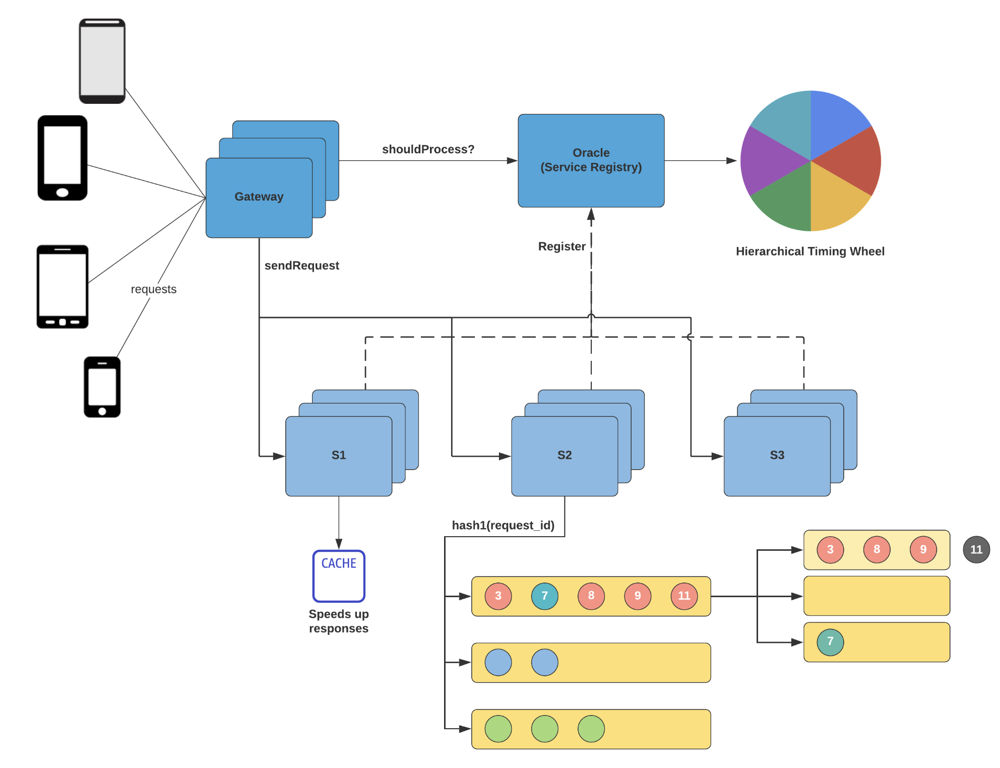

# Rate Limiting 

- [Rate Limiting](#rate-limiting)
  - [Why Rate Limiting?](#why-rate-limiting)
  - [Cascading Failure Example](#cascading-failure-example)
  - [Timer Wheel Approach for Rate Limiting](#timer-wheel-approach-for-rate-limiting)
  - [Hierarchical Timer Wheel](#hierarchical-timer-wheel)
    - [How It Works](#how-it-works)
  - [Partitioning and Real-life Optimisations](#partitioning-and-real-life-optimisations)
  - [Architecture](#architecture)
    - [1. Client Interaction](#1-client-interaction)
    - [2. Gateway](#2-gateway)
    - [3. Oracle (Service Registry)](#3-oracle-service-registry)
    - [4. Service Servers (S1, S2, S3)](#4-service-servers-s1-s2-s3)
    - [5. Cache Layer](#5-cache-layer)
    - [6. Request Sharding](#6-request-sharding)
    - [Key Concepts](#key-concepts)
  - [Capacity Estimation](#capacity-estimation)

## Why Rate Limiting?

- **Prevent Overload:**  
  - Controls high request rates to avoid prolonged response times and poor user experience.
- **Avoid Crashes:**  
  - Limits requests to prevent issues like Out of Memory exceptions.
- **Stop Cascading Failures:**  
  - Prevents one service's failure from overloading others, thereby avoiding a full system crash.

## Cascading Failure Example

Imagine two servers, **A** and **B**, each with a maximum capacity of 500 requests:

| **Server** | **Max Capacity** | **Current Load** | **Incoming Requests** | **Outcome**                            |
|------------|------------------|------------------|-----------------------|----------------------------------------|
| A          | 500              | 400              | Rerouted from B       | May crash if overloaded                |
| B          | 500              | 300              | 600                   | Crashes due to exceeding capacity      |

- **Explanation:**  
  - Server B receives 600 requests which exceed its capacity and crashes.  
  - The load is then shifted to Server A, which cannot handle the extra load, leading to a cascading failure.

## Timer Wheel Approach for Rate Limiting

The Timer Wheel organizes incoming requests into time slots (buckets) to control the processing rate.

| **Aspect**                | **Details**                                                                                                                                                                                     |
|---------------------------|-------------------------------------------------------------------------------------------------------------------------------------------------------------------------------------------------|
| **Concept**               | Organizes incoming requests into time slots (or buckets) based on their arrival time to control the rate of processing.                                                                          |
| **Wheel Size**            | Equals the timeout value for an incoming request (i.e., the number of buckets equals the timeout duration).                                                                                      |
| **Bucket Numbering**      | Buckets are numbered sequentially from `0` to `Timeout - 1`.                                                                                                                                    |
| **Request Allocation**    | Each request is assigned to a bucket using the formula: `Time % Number of Buckets`.                                                                                                              |
| **Bucket Capacity**       | Each bucket can store a limited number of requests to manage the request rate.                                                                                                                   |
| **Processing Mechanism**  | The system pulls requests from the Timer Wheel one by one, ensuring controlled and rate-limited processing.                                                                                      |
| **Cleanup Strategy**      | Before inserting a new request into a bucket, any unprocessed requests in that bucket are removed to optimize system resources.                                                                   |
| **Resource Optimization** | If too many buckets exist, the time gap between requests can be excessively large, wasting resources. This can be mitigated using a **Hierarchical Timer Wheel** to organize buckets more efficiently. |

## Hierarchical Timer Wheel

A Hierarchical Timer Wheel is an extension of the basic Timer Wheel designed to efficiently manage timing for a large range of delays without using excessive resources.

### How It Works

- **Multiple Levels (Hierarchical Structure):**  
  - Unlike a single-level Timer Wheel that has one set of buckets for all timeouts, a hierarchical model uses multiple levels of buckets.
  - Each level handles a different granularity of time intervals. For example:
    - **Level 1:** Handles short delays with a fine-grained set of buckets.
    - **Level 2:** Manages longer delays with coarser time intervals.
    - And so on...

- **Bucket Allocation and Cascading:**  
  - When a request is added, it is placed in the appropriate bucket at the lowest level that can accommodate its timeout.
  - As time passes, if the request’s timeout is not reached, it may "cascade" to a higher-level bucket until the correct timing is achieved.
  - This cascade helps avoid having too many buckets at a single level, which may lead to inefficient resource usage.

## Partitioning and Real-life Optimisations

To be done

## Architecture

        
         
        <i>Architecture Diagram for Rate Limiting</i>
    

### 1. Client Interaction
- Multiple **client devices** (phones) initiate requests to the system.

### 2. Gateway
- Central entry point for all client requests.
- Responsibilities:
  - Acts as a **load balancer**.
  - Sends a `shouldProcess?` query to the **Oracle (Service Registry)** to check if the request should proceed.

### 3. Oracle (Service Registry)
- Maintains a registry of all available service instances (S1, S2, S3).
- Decides whether a request should be processed.
- Uses **Hierarchical Timing Wheel** for:
  - Scheduling
  - Time-based validation (e.g., throttling, retries)

### 4. Service Servers (S1, S2, S3)
- Requests are processed by multiple server groups (S1, S2, S3).
- Gateway sends approved requests to the appropriate server group.
- Server selection is based on:
  - Load
  - `hash1(request_id)` (hashing-based routing)

### 5. Cache Layer
- Each service group has access to a **CACHE**.
- Purpose:
  - Store frequently accessed data
  - **Speed up responses**

### 6. Request Sharding
- Requests are **sharded** based on `request_id` using a hash function.
- Sharding allows:
  - Load distribution
  - Parallel processing
- Example:
  - Request IDs like `3, 7, 8, 9, 11` are directed to different queues or buckets.

---

### Key Concepts

- **Load Balancing**: Handled by Gateway.
- **Service Discovery**: Done via Oracle.
- **Request Scheduling**: Managed with Hierarchical Timing Wheel.
- **Caching**: Improves response times.
- **Sharding/Hashing**: Distributes workload.
- **Microservices Architecture**: Services run in parallel groups (S1, S2, S3).

## Capacity Estimation

To be done
