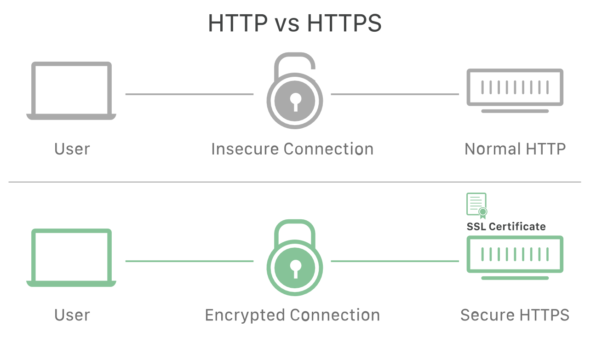

# Security in Distributed Systems

In distributed systems, security refers to the measures and mechanisms used to protect data, communication, and resources across multiple interconnected nodes in the system.

- [Security in Distributed Systems](#security-in-distributed-systems)
  - [Verification](#verification)
    - [Captcha](#captcha)
    - [SSL/TLS](#ssltls)
    - [Encryption Algorithms](#encryption-algorithms)
  - [Digital rights Management](#digital-rights-management)
  - [Authentication](#authentication)
    - [Token Based Auth](#token-based-auth)
    - [SSO - Single Sign On](#sso---single-sign-on)
    - [OAuth - Open Authentication](#oauth---open-authentication)

## Verification

### Captcha

- `CAPTCHA (Completely Automated Public Turing test to tell Computers and Humans Apart)` is a type of security measure known as challenge-response authentication. 

- CAPTCHA helps protect you from spam and password decryption by asking you to complete a simple test that proves you are human and not a computer trying to break into a password protected account.

- `Problem`: With AI and machine learning, bots can now solve most CAPTCHA challenges better than humans.
For example, some AI models can solve Google reCAPTCHA with 95%+ accuracy.

### SSL/TLS

- SSL - Secure Sockets Layer
  - It is an encryption-based Internet security protocol.

  - A website that implements SSL/TLS has "HTTPS" in its URL instead of "HTTP."

  - In order to provide a high degree of privacy, SSL encrypts data that is transmitted across the web. This means that anyone who tries to intercept this data will only see a garbled mix of characters that is nearly impossible to decrypt.

  - SSL is outdated and insecure, no longer used in modern secure communications.

  

    

        
         
        <i><a href="https://www.cloudflare.com/en-in/learning/ssl/what-is-ssl/">SSL/TLS</a></i>
    

- TLS - Transport Layer Security
  
  -  designed to provide secure communication over a computer network, such as HTTPS on the web.
  
  -  TLS is the successor to SSL.
  
  - It provides privacy, integrity, and authentication between communicating applications.
  
  - It's used in HTTPS, email, messaging apps, and more.
  
  - The current version is TLS 1.3 (as of 2025), which is faster and more secure.   

  - TLS is the updated and secure version, and when people say "SSL certificates," they almost always mean TLS certificates nowaday
### Encryption Algorithms
  - ECC
  - RSA
  - Diffie-Hellman

## Digital rights Management

Digital Rights Management (DRM) is a set of technologies and strategies used to control how digital content is used, distributed, and accessed, in order to protect intellectual property rights.

Example - Using `Fairplay Screening (FPS)` content providers, encoding vendors, and delivery networks can encrypt content, securely exchange keys, and protect playback on Apple platforms.

## Authentication

Below are the common authentication mechanisms, 
- these authentication mechanisms involve the generation and use of tokens but differ in terms of where the token generation and authentication process takes place (server-side or external service).

### Token Based Auth
- A common method of authentication.
- The user sends username & password to the server.
- If valid, the server generates a token — a signed piece of text.

More Details about Token based Auth

    > How do Tokens work?

    - The token proves who the user is and what they're allowed to do.
    - Sent with each request — no need to resend username/password.
    - The server uses a private key to sign the token and a public key to verify it.
    - Simple but not extremely secure.

---
    > Concepts

    - `Private Key`: Secret, kept only on the server.
    - `Public Key`: Shared; can be used to verify the token.
    - Tokens are signed → ensures they can't be tampered with.
---
    > Limitations

    - Vulnerable to replay attacks and token theft.
    - If someone steals a token, they can impersonate the user.
    - Storing tokens in insecure places (like localStorage) is risky.
---

    > Best practices for tokens
    - Use timestamps or version numbers in tokens to limit validity.
    - Logging out = invalidate the token.
    - Token permissions can be quickly checked by the server.

---

### SSO - Single Sign On
- The authentication process is delegated to an `external service`, such as Google or Uber.
-  The user's credentials are checked by the external service, which then sends a token to the server. 
-  The server can decrypt the token and verify the user's permissions. 
-  SSO is useful for companies that want to have control over their users within their system, even if external services handle authentication.
-  Ensure tokens have a set expiration period and support renewal to maintain security.

### OAuth - Open Authentication

> OAuth is an authorization framework that allows users to grant limited access to their resources on one service to another service without sharing their passwords.
> 
- Originally designed for authorization, but commonly used for authentication too.

- Integrates external services like Google or GitHub with your server.
- The user is prompted to grant permissions to the server.
- Permissions allow access to specific user information (e.g., name, profile photo).

- OAuth tokens are generated after permissions are granted.
- Widely adopted

- Plan a fallback scenario - scenarios when the external service is unavailable.