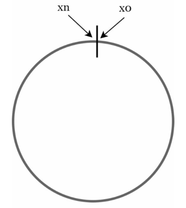
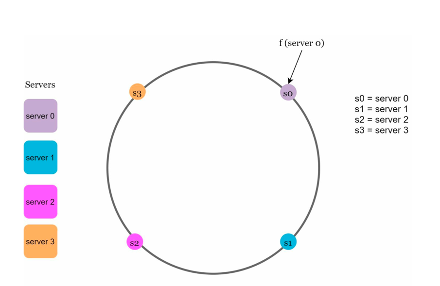
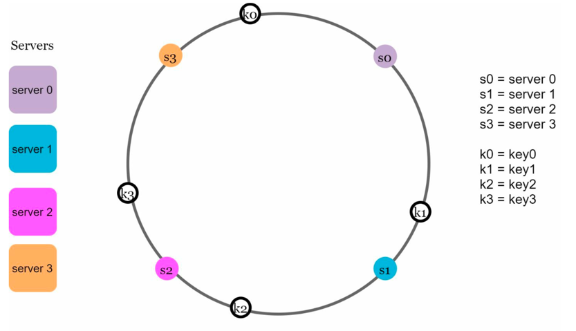
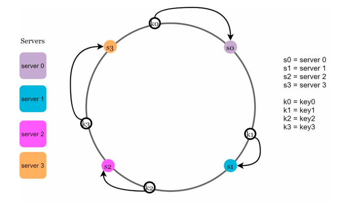
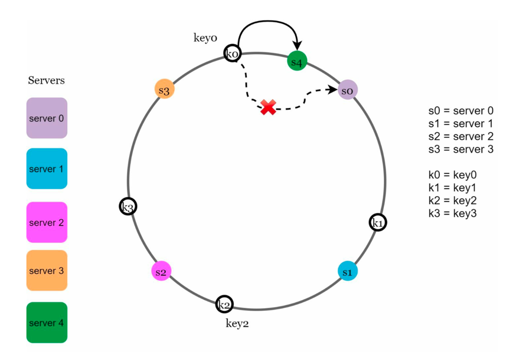
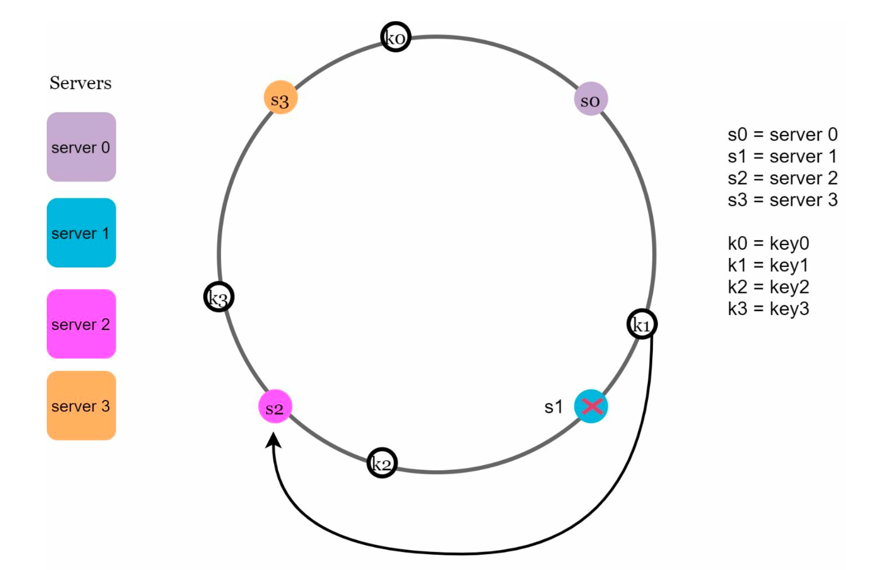
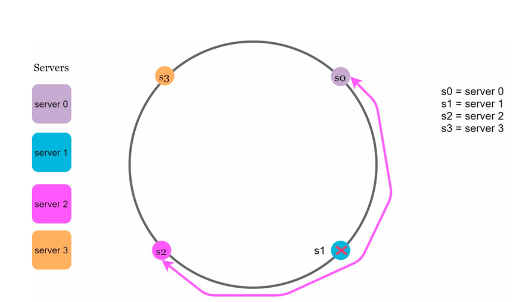
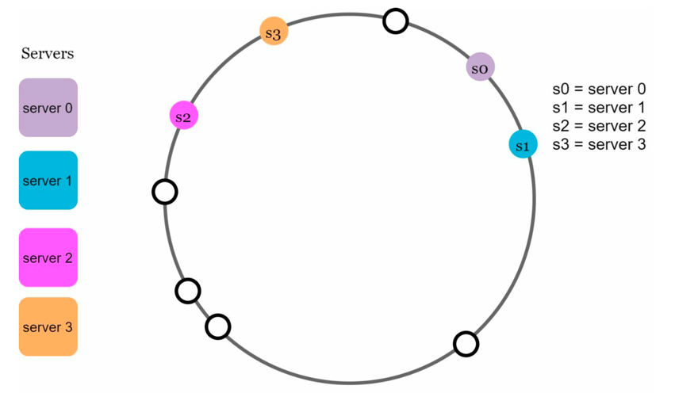
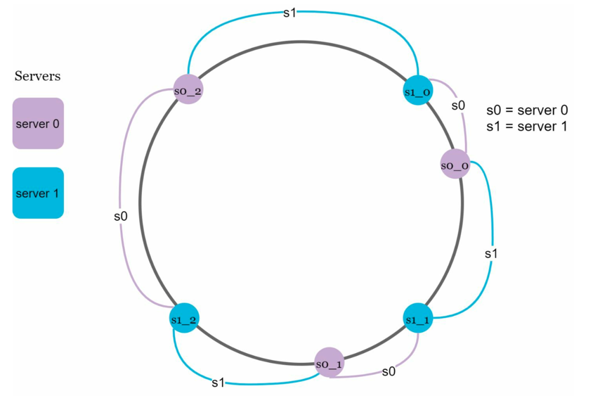

# Consistent Hashing

In distributed systems, data/items must be distributed across multiple servers/nodes. 
## Naive Approach

- Use a modulo hash function to map each item to a specific server/node. 
- For example, 
  - if you have `N` servers, you could use `serverIndex = hash(item) % N` to determine which server should store the item, where `N` is the size of server pool.
- This approach works well when the size of the pool is fixed and data distribution is even.

## Problem

- Problem arises when nodes are added or removed (total number of nodes change [`N`]).
- But with above approach almost all keys will be remapped to different nodes in case of change in `N`. This can lead to significant data movement and is not scalable.
- This leads to cache misses, high rehashing cost, and load imbalance.

> We need a hashing mechanism that minimizes re-distribution of keys when nodes change.

## Consistent Hashing

- A hashing technique that ensures:
  - Only a small fraction of keys need to be remapped when nodes join/leave. 
  - Keys are distributed more evenly across servers.

> A special kind of hashing such that when when a hash table is resized and consistent hashing is used, only K/n keys need to be remapped on average, where K is the number of keys and n is the number of slots.

### Key Idea about the technique

| Step                                                                                                                                                 | Depiction                                                          | 
|------------------------------------------------------------------------------------------------------------------------------------------------------|--------------------------------------------------------------------|
| **Hash Ring**: Represent the hash space as a **hash ring** (0 to 2³² – 1).                                                                           |          | 
| **Hash servers**: Using hash function `f`, we amp servers based on server IP or name onto the ring. Below image shows 4 servers mapped on hash ring. |     | 
| **Hash Keys**: Both keys and nodes (servers) are placed on the ring using same hash function.                                                        |           |
| Each key is assigned to the next node (server) clockwise on the ring.                                                                                |  | 

--- 
## Handling Node Changes

### 1. Adding a Node (server)

- Adding a new server involves:
  - Hashing the new server to find its position on the ring.
  - The new server takes over responsibility for keys that fall between it and its predecessor on the ring.
- Only the keys that map to the new server need to be moved, minimizing disruption.
- In below figure, after a new `server 4` is added, only `key0` needs to be remapped.

  

### 2. Removing a Node (server)

- When a server is removed, its keys are reassigned to the next server clockwise on the ring.
- Again, only the keys that were assigned to the removed server need to be moved.
- In below figure, after `server 1` is removed, only `key1` needs to be remapped.

  

---

## Issues with Basic Consistent Hashing
1. **Hot Spots Key Problem**: Certain keys may be accessed more frequently than others, leading to hot spots on specific servers.
   - In below figure, when `s1` is removed, `s2`'s load increases significantly as it takes over all keys from `s1`.
   - 
2. **Load Imbalance**: If servers are not evenly distributed on the ring, some servers may end up with significantly more keys than others, leading to load imbalance.
   - In below figure, `s2` has a much larger range of keys compared to `s1` or `s3`, leading to uneven load distribution.
   - 

## Solutions for Enhanced Load Balancing

### Virtual Nodes

- Each physical server is assigned multiple positions on the ring → improves key distribution.
- When a server is added/removed, only a fraction of its virtual nodes are affected, further reducing key remapping.
- The key storing server is determined in the same way as before, by moving clockwise to the next server node.
- 

### Benefits of Virtual Nodes
- As the number of virtual nodes increases, the distribution of keys becomes more balanced.
- This is because the standard deviation gets smaller with more virtual nodes, leading to
  balanced data distribution. 
- Standard deviation measures how data are spread out. 
- The standard deviation will be smaller when we increase the
  number of virtual nodes. 
- However, more spaces are needed to store data about virtual nodes.
- This is a tradeoff, and we can tune the number of virtual nodes to fit our system requirements.

> `Weighting`: Allow different servers to have different capacity by assigning more virtual nodes, helps in better load distribution.

## Finding affected keys to be remapped

1. When a server is added:
   - The affected range starts from the new server's position and goes anticlockwise until a server is found.
   - All keys in this range need to be remapped to the new server.
2. When a server is removed:
   - The affected range starts from the removed server's position and goes anticlockwise until a server is found.
   - All keys in this range need to be remapped to the next server clockwise.

## Design Flow

1. Client sends key-based request.
2. Key hashed → find position on hash ring.
3. Lookup algorithm finds nearest node clockwise. 
4. Route request to that server.

## For Consistent Hashing Implementation
- Use gossip protocols/Zookeeper/etcd to keep node membership updated. 
- **Replication**: Store key in multiple clockwise nodes for fault tolerance. 
- **Scaling**: Adding/removing nodes causes minimal reshuffling.

## Example Use Cases
- Distributed Caches (Memcached, Redis Cluster). 
- Distributed Databases (Cassandra, DynamoDB, Riak). 
- Content Delivery Networks (CDNs) for cache routing. 
- Sharded Key-Value Stores. 
- Load Balancers with consistent request-to-server mapping.

## Real World Examples
- Amazon DynamoDB uses consistent hashing for data distribution and replication.[Reference](https://www.allthingsdistributed.com/files/amazon-dynamo-sosp2007.pdf)
- Apache Cassandra uses consistent hashing to distribute data across nodes in a cluster.[Reference](https://www.cs.cornell.edu/Projects/ladis2009/papers/lakshman-ladis2009.pdf)
- Maglev, Google's software load balancer, uses consistent hashing for request distribution.[Reference](https://static.googleusercontent.com/media/research.google.com/en//pubs/archive/44824.pdf)

## Gist

> Consistent hashing solves the problem of massive rehashing when nodes change by mapping both nodes and keys onto a hash ring. Only a small fraction of keys get remapped when nodes join/leave. Using virtual nodes ensures even distribution. It is widely used in distributed caches, databases, and CDNs.