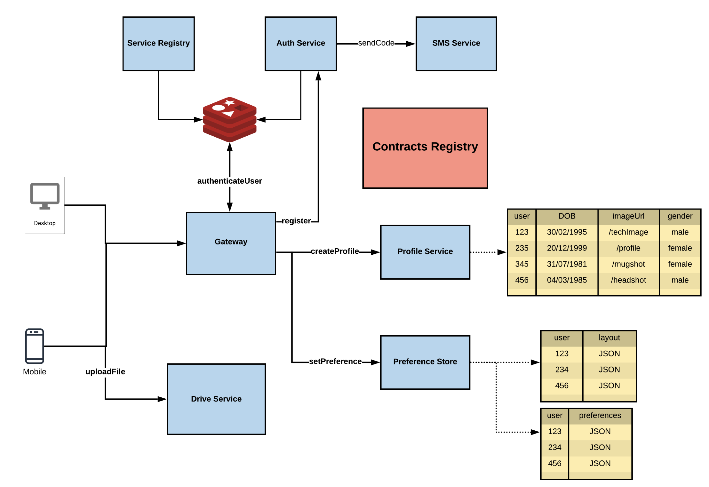

# API Contracts & Versioning

## What are API Contracts?

- `API Contracts` define the **structure and format** of JSON data exchanged between services.
- The JSON is **converted into an object** based on the structure defined in the contract.
- These contracts ensure all services speak the **same language**, enabling interoperability.

##  Contract Ownership and Usage

- The **Service** defines and maintains its contract.
- The **Gateway** uses the contract to construct/parse request/response objects.
- The **contract is not gateway-specific** – it is **common to all services** interacting with the API.

---

## Where Are Contracts Stored?

- Contracts can be stored in a `Contract Registry` (not in Service Registry to avoid overloading).
- **Why not Service Registry?**  
  Adding contract responsibilities to the Service Registry makes it **heavy** and **less modular**.

---

## Push vs Pull for Contract Updates

- **Push-based updates** (e.g., service pushes updates to all consumers) are fragile:
  - Risk of **downtime** and **inconsistencies**.
- **Pull-based updates** (e.g., gateway fetches latest contracts) are more robust:
  - **Safer**, **version-controlled**, and less tightly coupled.

---

## Contract Best Practices

- Contracts should be:
  - `Language agnostic`
  - `Backward compatible` – new versions should not break existing functionality.
- Use **Versioning**:
  - e.g., `v1`, `v2`, etc., to maintain multiple versions concurrently without breaking old clients.

---

## User Preference Store

- Stores user-specific data like:
  - UI layout preferences → `{ userId: layoutJSON }`
  - Email handling preferences:
    - Default folder for received emails
    - Spam handling logic
    - Custom filters

## Architecture so far..

