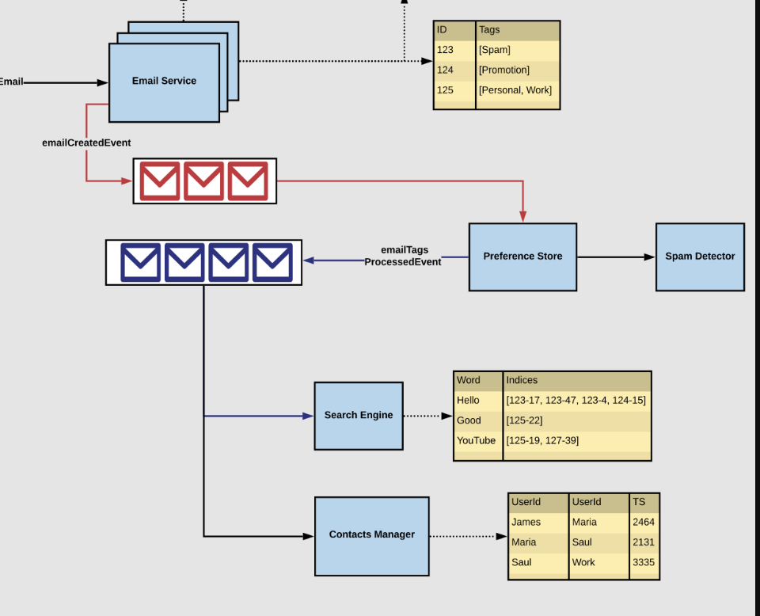

# Contacts and Groups




## Refined Queue Consumers

### A. Search Engine
- Consumes from the **Refined Queue**.
- Indexes important words with mappings:
  ```json
  {
    "Hello": ["123-17", "123-47", "124-15"],
    "Good": ["125-22"],
    "YouTube": ["125-19", "127-39"]
  }
  ```
- Enables fast full-text and tag-based search.

### B. Contacts Manager
- Parses sender/receiver fields and builds contact graph:
  ```text
  James → Maria (TS: 2464)
  Maria → Saul (TS: 2131)
  Saul → Work (TS: 3335)
  ```

### C. Groups Manager
- Maintains group to user ID mappings:
  ```json
  {
    "workTeam": ["James", "Maria", "Saul"],
    "friends": ["Divya", "Terry", "Rachit"]
  }
  ```
- Enables:
  - Group-based sending
  - Group tagging
  - Auto-suggestions


## External Email Integration

To support email communication across different platforms (e.g., Gmail ↔ Yahoo):

### A. SMTP (Simple Mail Transfer Protocol)
- Used for **sending** emails externally.
- Email Service connects to an SMTP server to deliver the message.

### B. IMAP (Internet Message Access Protocol)
- Used for **receiving** external emails.
- IMAP Adapter syncs inbox folders and metadata from external accounts.
