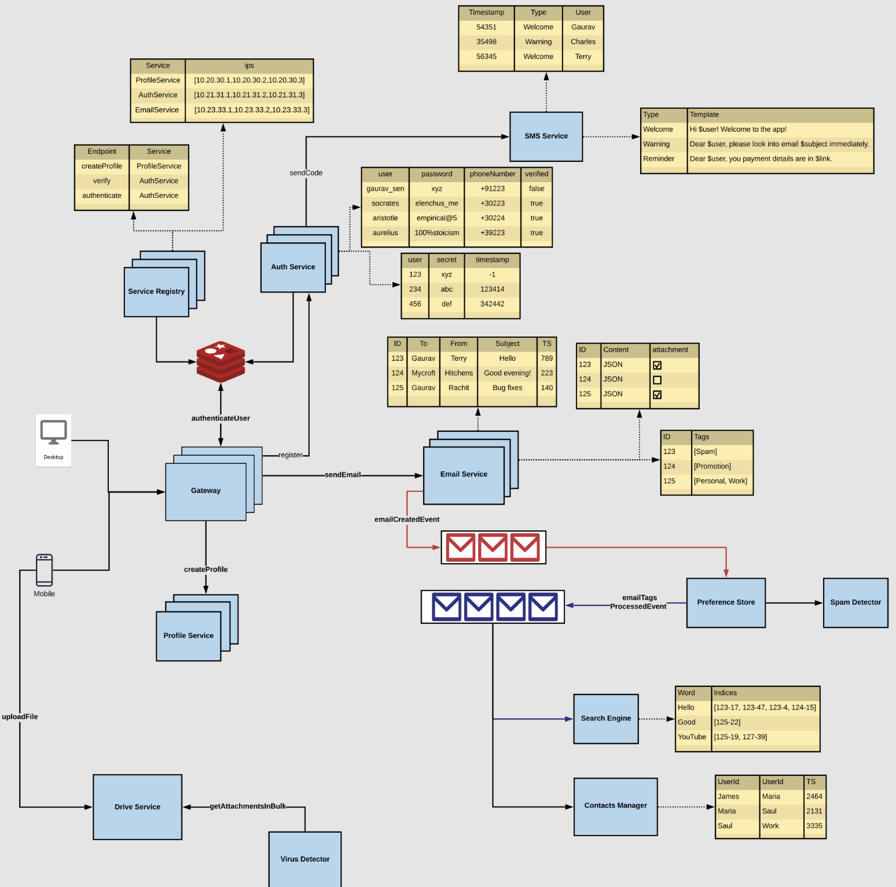

# Final Architecture

This system is designed using a modular microservices architecture to handle user registration, email operations, tagging, and more.

## Core Services & Components

### 1. **Gateway**
- Entry point for all user requests (via Desktop or Mobile).
- Routes:
  - `createProfile` → Profile Service
  - `authenticateUser` → Auth Service

---

### 2. **Auth Service**
- Authenticates users using a secret or password.
- Verifies phone numbers via **SMS Service**.
- Registers services in **Service Registry**.

---

### 3. **Service Registry**
- Maintains a list of all services with their IPs.
- Enables service discovery.

---

### 4. **Profile Service**
- Creates and manages user profiles.

---

### 5. **Email Service**
- Sends emails.
- Stores metadata (To, From, Subject, Timestamp, Attachments).
- Emits `emailCreatedEvent`.

---

### 6. **Drive Service**
- Handles file uploads.
- Works with **Virus Detector** to ensure file safety.
- Exposes `getAttachmentsInBulk`.

---

### 7. **Virus Detector**
- Scans attachments for malware before sending.

---

### 8. **SMS Service**
- Sends messages like:
  - Welcome
  - Reminder
- Uses predefined templates and user data.
- Also sends otp messages for 2FA.

---

### 9. **Spam Detector**
- Analyzes content of emails.
- Tags emails as `[Spam]`, `[Promotion]`, etc.

---

### 10. **Preference Store**
- Stores processed email tags.
- Used for personalization and filtering.

---

### 11. **Search Engine**
- Indexes email content.
- Supports fast keyword-based search.
- Maintains index for words like "Hello", "YouTube", etc.

---

### 12. **Contacts Manager**
- Stores and retrieves user contact details.
- Associates user IDs and tags.

---

## 🔄 Data Flow Summary

1. User → Gateway → Auth/Profile Services
2. Auth Service → SMS Service (for verification)
3. Email Service → Sends email → Triggers `emailCreatedEvent`
4. Email metadata:
   - Checked by Spam Detector
   - Indexed by Search Engine
   - Stored in Preference Store
5. File attachments → Drive Service → Virus Detector

