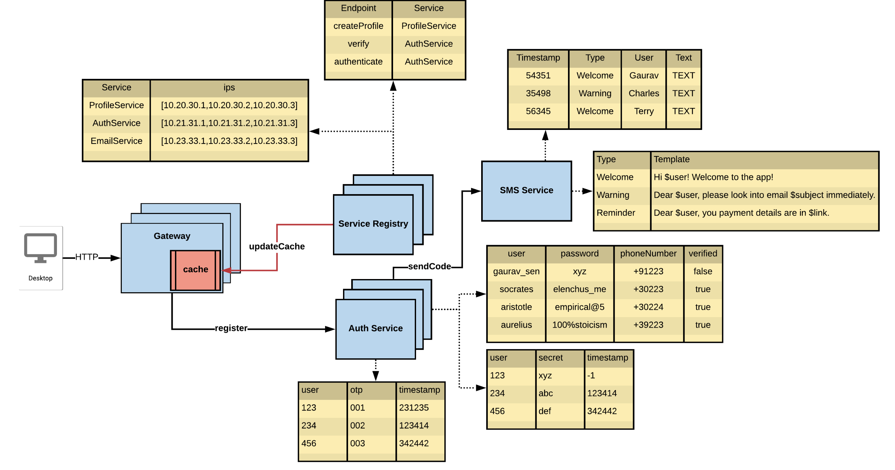

# Service Registration and Proxies

Below are the required components for Auth and user access.

## Desktop to Gateway: 
- Uses HTTP. 
- Requires DNS resolution to locate the Gateway.
- Desktop -> DNS (www.xyz.com)
- DNS gives IP address for gateway.

## Gateway ( Proxy ):

- Has an internal cache for service info.
- Registers services via register.
- Updates its cache from Service Registry via updateCache.

## Service Registry:

- Stores service mappings (e.g., createProfile → ProfileService).

- Contains IPs of services: ProfileService, AuthService, EmailService.
- Using a server side service discovery. Refer [here](#service-discovery)

## Auth Service:

- Handles user authentication and OTP verification.

- Sends OTP via sendCode to SMS Service.

- Stores OTPs with timestamps.

## ProfileService

- Handles profile creation via createProfile endpoint.

- Listed with IPs in the Service Registry.

## SMS Service:

- Sends templated messages (Welcome, Warning, Reminder).

- Uses message templates to format messages.

- Stores messages sent (timestamp, type, user, text).

## Service Discovery

Refer [this](https://www.f5.com/company/blog/nginx/service-discovery-in-a-microservices-architecture) article for better understanding

| Aspect                        | **Client-Side Service Discovery**                             | **Server-Side Service Discovery**                             |
|------------------------------|----------------------------------------------------------------|----------------------------------------------------------------|
| **Who discovers the service?** | **Client (e.g., Gateway)** directly queries the Service Registry | **Server (e.g., Load Balancer or Gateway)** queries the Service Registry on behalf of the client |
| **Service Registry Awareness** | Client must know how to interact with the Service Registry     | Clients are unaware; discovery is abstracted away             |
| **Routing Logic**             | **Handled by the client** (e.g., choosing service instance)     | **Handled by the server** (e.g., Load Balancer picks service) |
| **Example Tooling**           | Netflix Eureka (client queries registry)                      | AWS Elastic Load Balancer, NGINX with Consul                 |
| **Pros**                      | Fine-grained control, lower server load                       | Centralized logic, simpler client                            |
| **Cons**                      | Client complexity, tight coupling to registry                 | Possible bottleneck at server, slightly higher latency       |

---

## Example from Architecture Diagram

- **Client-Side Discovery**:  
  The **Gateway** fetches and caches service IPs and routes requests — acts as a **client-side proxy**.

- **Server-Side Discovery**:  
  If a **Load Balancer** was placed in front of services and handled service lookup — it would be **server-side discovery**.

