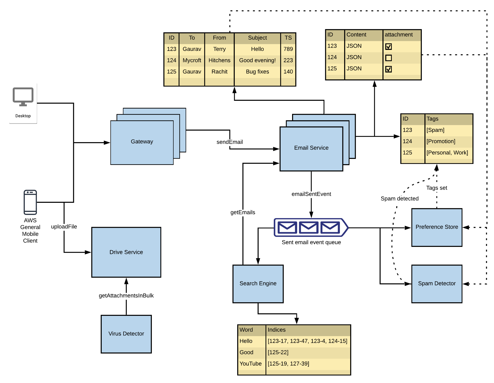

# Sending, Tagging and Searching emails

## Sending Emails

### Flow:
1. **User (Desktop / Mobile)** initiates an email send request via the **Gateway**.
2. Gateway forwards the `sendEmail` request to the **Email Service**.
3. **Email Service** performs:
   - Storing **email metadata** (`ID`, `To`, `From`, `Subject`, `Timestamp`)
   - Storing **email content** (`Content`, `Attachments`)
4. If attachments exist:
   - Files are uploaded through the **Drive Service**
   - **Virus Detector** scans them before storage
5. After processing, an `emailSentEvent` is pushed into the **Sent Email Event Queue**.

## Tagging Emails

### Automatic Tagging:
- Triggered by the `emailSentEvent` from **Email Service**
- **Spam Detector**:
  - Scans email content
  - Sets tags like `[Spam]`, `[Promotion]`, `[Work]`, etc.
- Tags are stored in the **Preference Store** mapped to Email ID
  - The `Preference Store` is a central service/database that stores user-specific settings and preferences in JSON format.

### Manual Tagging:
- Users can manually tag emails via UI
- Tags are then updated in the **Preference Store**

## Searching Emails

### Flow:
1. User triggers `getEmails` via the **Gateway**
2. Request goes to the **Search Engine**
3. **Search Engine**:
   - Maintains an **inverted index**: maps words to email ID + position
   - Retrieves relevant Email IDs for the query
4. **Email Service** fetches metadata and content for these IDs
5. Attachments (if needed) are fetched using `getAttachmentsInBulk` from the **Drive Service**

---

| Function         | Flow                                                             |
|------------------|------------------------------------------------------------------|
| **Send Email**   | Gateway → Email Service → Drive Service + Event Queue           |
| **Auto Tagging** | emailSentEvent → Spam Detector → Tags → Preference Store        |
| **Manual Tagging** | User UI → Gateway → Preference Store                          |
| **Search Email** | Gateway → Search Engine → Email Service + Drive (if attachments)|
