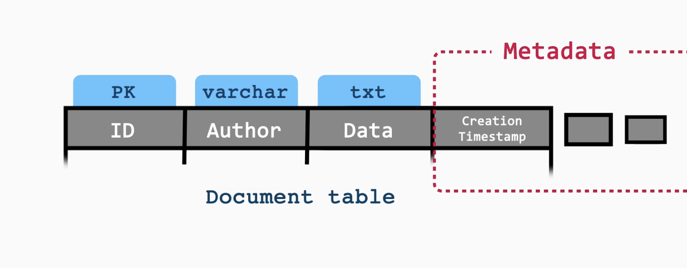
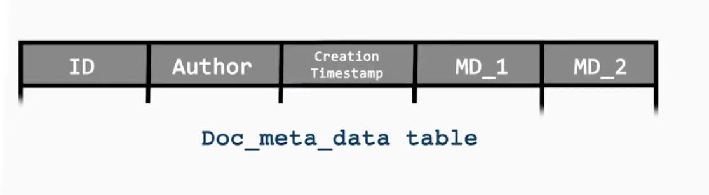
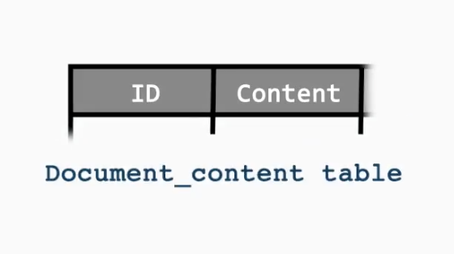
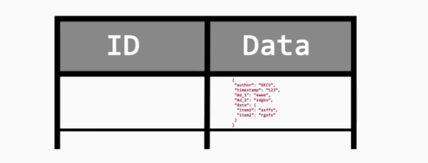

# Google Docs - Collaborative Editor Design

## Requirements
1. Storing, retrieving, and editing documents

2. Sharing permissions: READ, EDIT, LINK-SHARING

3. Notifications on email

4. Version History

5. Spell Checking*

6. Comments Support

7. Offline and Collaborative Editing

## Document Schema

We can essentially store document info as below. But the data column will be very big and is not queries as often as the other metadata. 

### How would we store the metadata of the document?

### 1. Splitting the metadata
A RDBMS should be used to store document metadata - for faster access.

A SQL database is used for storing content/data of the document.

> Problems:
> - There are going to be alot of alter queries, since metadata keeps changing.
>  - JOINs are required.
> 
> Thus this way of storing will be expensive and inefficient.

### 2. Storing as json

This way we can store the data and metadata of the document as a json.

## Storing Document Content

### How large can a document be?

- A document can be up to 1.02 million characters(according to google docs specs). But we can define a document limit of 1 million chars.
- Also keeping in mind images and other media, they donot contribute to the char limit. But a limit can be added (like 100MB).

### How do we store a document of any size?

- `Chunking`: This allows large documents to scale and makes real-time collaboration efficient. 
To manage document content efficiently, we should use a tree-based structure rather than a linked list:

  - `Rope Data Structure`: A balanced binary tree where each leaf node stores a text chunk. This allows efficient random access, insertion, and deletion in O(log n) time.

  - Advantages over LinkedList: Supports both forward and backward traversal, avoids propagation issues during edits, and scales well for documents with millions of characters.

  - Real-world systems (e.g., collaborative editors) use similar tree or piece-table structures to handle concurrent editing and large-scale content management.

### What type of database is suitable for this?

- NoSQL DB (e.g., MongoDB, Cassandra, DynamoDB)
- Good if you want flexible schema + high write throughput.
-  Used in systems where eventual consistency is acceptable for some parts

## Version History

- Keeping the original document in the storage as is, we would maintain a seperate table for storing the versions of the document. (version-id -> content)
### Versioning Strategy

- Delta-based saving (per edit or per batch):
  - Store small diffs (deltas) for each user edit (e.g., insert/delete ops).

  - These are lightweight and make real-time collaboration efficient.
  - Deltas also allow the undo feature to be used.
  
- Full snapshot versions (checkpointing):
  - Store a full snapshot of the document after every N edits or T time interval.
  - Example:
    - Every 100 edits or every 30 minutes, whichever comes first (Cron Job)
  - Snapshots make it faster to restore or go back in history.
  - We have to keep in mind not to cause `Thundering herd problem`.
  
- We should have a hybrid model of storing both.
  - Efficient: Storing deltas keeps storage small.
  - Recoverable: Snapshots prevent the need to replay millions of deltas.
  - Scalable: Works even for massive docs with thousands of updates per hour.
  
> We store every edit as a delta (insert/delete op), and periodically checkpoint the document as a full snapshot every 100-500 edits or every 5-10 minutes to balance storage efficiency and recovery speed.

#### Thundering Herds in Crons

- Thundering Herd happens when many cron jobs (or tasks) all start at the same time (e.g., at 00:00).

- They all compete for CPU, DB, disk, or network at once → causing spikes and system overload.

    > Example - Suppose you have 10,000 users and every user’s daily backup cron is scheduled for midnight (00:00).
    > 
    > Result at 00:00:
    > - 10,000 jobs hit the server/DB at the same second
    > - Causes traffic spike, DB lock contention, possible failures or slowdowns.

- Solution
  - Avoid all jobs starting at once -> Spread them evenly over time.

  - Use `cron indexes` (a unique number per job) to calculate staggered timings.(Staggered time means spreading tasks over different times instead of running them all at once.)
  - cron index -> (total documents/time)
  
- We assign each cron job a unique cron index and compute its schedule by spreading execution time across available minutes/hours using modulo arithmetic, effectively avoiding thundering herd problems.

