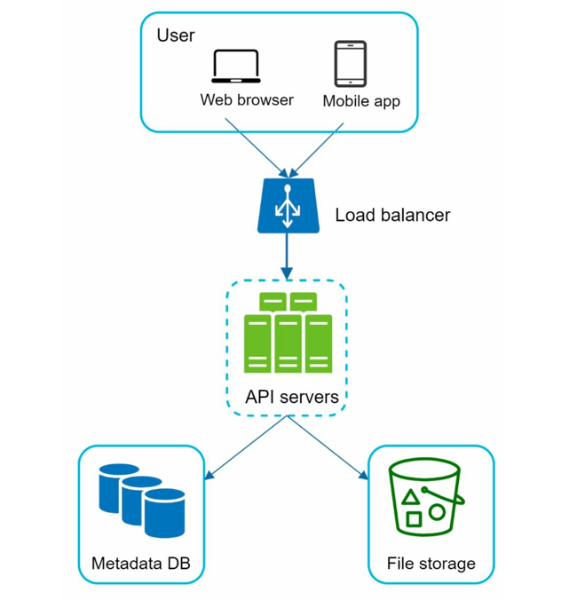
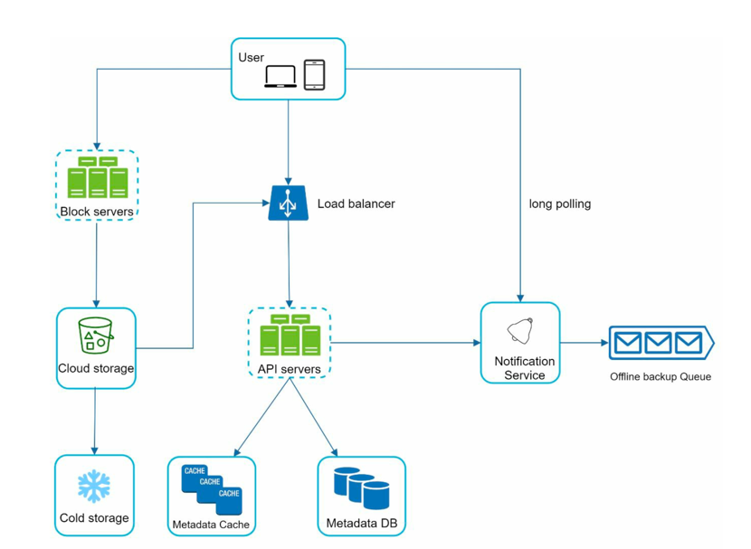
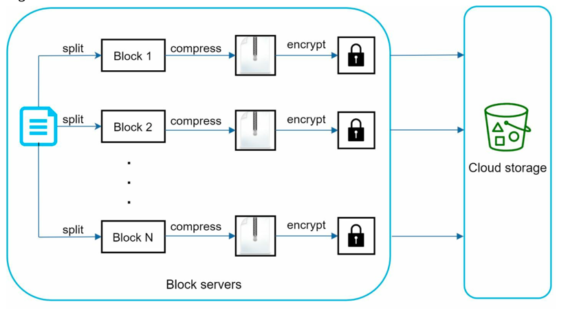
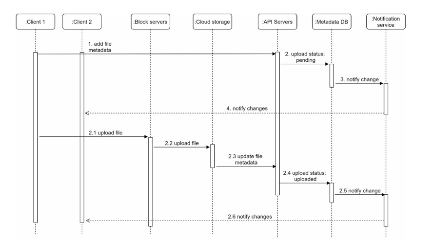
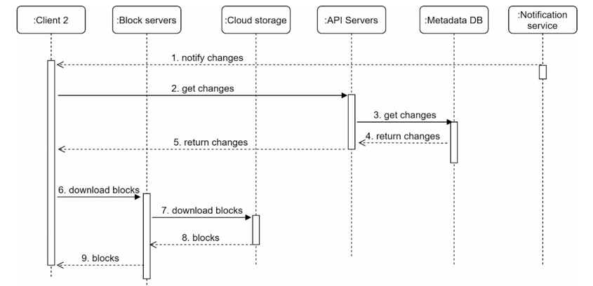

# Google Drive

Google Drive is a file storage and synchronization service developed by Google. It allows users to store files, photos and videos in the cloud, synchronize files across devices, and share files with others.

- Similar Services
    - Dropbox
    - OneDrive
    - iCloud Drive

## Step 1: Requirements

> Candidate: What are the most important features?
> 
> Interviewer: Upload and download files, file sync, and notifications.

> Candidate: Is this a mobile app, a web app, or both? 
> 
> Interviewer: Both. 

> Candidate: What are the supported file formats? 
> 
> Interviewer: Any file type. 

> Candidate: Do files need to be encrypted? 
> 
> Interview: Yes, files in the storage must be encrypted.

> Candidate: Is there a file size limit? 
> 
> Interview: Yes, files must be 10 GB or smaller. 

> Candidate: How many users does the product have? 
> 
> Interviewer: 10M DAU.

### Design Scope

- Add files
- Download files
- Sync files across multiple devices
- See file revisions.
- Share files with your friends, family, and coworkers
- Send a notification when a file is edited, deleted, or shared with you.

### Non-Functional Requirements

- Reliability: The system should be highly reliable, ensuring that files are not lost or corrupted.
- Scalability: The system should be able to handle a large number of users and files.
- Fast sync speed: Changes made to files should be synced quickly across all devices.
- Bandwidth efficiency: The system should minimize the amount of data transferred during sync operations.
- High availability: The system should be available 24/7 with minimal downtime.

### Estimations
- Assume application has 50 million users.
- There are 10M DAU.
- Users get 10GB free space.
- Assume users upload 2 files per day. Average file size is 500KB.
- 1:1 read to write ratio.

> Total Space Allocated: 50M * 10GB = 500 PB
> QPS for upload: 10M * 2 / 86400 = 232 ~ 240 QPS
> Peak QPS = QPS * 2 = 480 QPS

## Step 2: High-Level Design

- Start with a single server.
- We need 3 main components
  - web server: to upload and download files
  - metadata database: to store file and user metadata
  - file storage: to store the actual files. We allocate 1TB of storage.

- For the start, use Apache web server, MySQL database, and local file system for storage.

### API Design

- We primarily need 3 APIs
  - upload
  - download
  - get revisions

#### API Specifications
- `UploadFile(userID, file, uploadType)`: 
  - Uploads a file for a user.
  - Upload can be of 2 types
    - Simple upload: for files smaller than 5MB
    - Resumable upload: for files larger than 5MB, allows resuming upload if connection is lost.
  - Endpoint:
    - `/files/upload?uploadType={simple|resumable}`
  - Params
    - uploadType: simple or resumable
    - file: local file to be uploaded
  
- `DownloadFile(userID, path)`: 
  - Downloads a file for a user.
  - Endpoint:
    - `/files/download?path={path}`
  - Params:
    - path: path of the file to be downloaded
    
- `getRevisions(userID, path, limit)`:
  - Gets the revisions for a file.
  - Endpoint:
    - `/files/revisions`
  - Params:
    - path: path of the file
    - limit: number of revisions to return

### Scaling from single server to multiple servers

- Our single server can handle 1TB of storage and 480 QPS.
- To handle more traffic and storage, we need to scale our system.
- We can add more web servers behind a load balancer to handle more QPS.
- For metadata database, we can use a distributed database like Cassandra or DynamoDB.

- Storage can be scaled by sharding based on userID.
- But still potential data losses in case of storage server failure.
- So we can use distributed file system like HDFS or cloud storage like AWS S3, GCP Cloud Storage.

> Optimizations
> 
> 1. Load Balancer: Add a load balancer to distribute incoming requests across multiple web servers.
> 2. Web servers: Add multiple web servers to handle increased traffic.
> 3. Metadata Database: Move database out of server to avoid SPOF. Use a distributed database like Cassandra or DynamoDB to handle increased metadata storage and query load.
> 4. File Storage: Amazon S3 is used for file storage to provide scalability, durability, and availability. To ensure durability, files are replicated across multiple availability zones.

### Sync conflicts
- When a file is edited on multiple devices simultaneously, sync conflicts can occur.
- To handle sync conflicts, we follow following strategy
  - the first version that gets processed wins
  - the other versions are saved as separate files with a timestamp appended to the filename.

### High level Design

#### Components
| **Component**            | **Description**                                                                                                                                                                                                                                                           |
|--------------------------|---------------------------------------------------------------------------------------------------------------------------------------------------------------------------------------------------------------------------------------------------------------------------|
| **User**                 | Uses the application via a web browser or mobile app.                                                                                                                                                                                                                     |
| **Block Servers**        | Upload file blocks to cloud storage. Files are split into independent blocks (max size ~4 MB, inspired by Dropbox), each identified by a unique hash and stored as separate objects (e.g., in S3). File reconstruction is done by joining blocks in order using metadata. |
| **Cloud Storage**        | Stores file data as smaller blocks uploaded by block servers.                                                                                                                                                                                                             |
| **Cold Storage**         | Stores inactive or rarely accessed files for long-term, cost-efficient storage.                                                                                                                                                                                           |
| **Load Balancer**        | Distributes incoming requests evenly across API servers to improve availability and scalability.                                                                                                                                                                          |
| **API Servers**          | Handle all non-upload logic such as user authentication, profile management, file metadata updates, and coordination between services.                                                                                                                                    |
| **Metadata Database**    | Stores metadata only (users, files, blocks, versions, etc.). Actual file data resides in cloud storage.                                                                                                                                                                   |
| **Metadata Cache**       | Caches frequently accessed metadata to reduce database load and improve read latency.                                                                                                                                                                                     |
| **Notification Service** | Pub/Sub system that notifies clients when files are added, edited, or removed so they can sync the latest changes.                                                                                                                                                        |
| **Offline Backup Queue** | Queues file change notifications for offline clients so updates can be delivered when they reconnect.                                                                                                                                                                     |

## Step 3: Detailed Design

### Block Servers

- For large files, sending whole file on each update is inefficient.
- Two possible optimizations:
  - Delta sync: only send the changes made to the file.
  - Compression: compress the file before sending it.
- Block Servers upload file blocks to cloud storage. 
- Files are split into independent blocks (max size ~4 MB, inspired by Dropbox), each identified by a unique hash and stored as separate objects (e.g., in S3). 
- File reconstruction is done by joining blocks in order using metadata.

- A file is split into smaller blocks.
- Each block is compressed using compression algorithms.
- To ensure security, each block is encrypted before it is sent to cloud storage.
- Blocks are uploaded to the cloud storage.

> Only modified blocks are uploaded during file updates to save bandwidth. 

### High Consistency for File Operations

- We need strong consistency for file operations to ensure that users always see the latest version of their files.
- Possible by:
  - Data in cache is always consistent with data in database.
  - Invalidate cache on DB writes
- Use relational database like MySQL or PostgreSQL to store metadata.
- Relational databases provide strong consistency guarantees, as it supports ACID transactions.

### Metadata Database

- Store metadata only (users, files, blocks, versions, etc.). Actual file data resides in cloud storage.
- Use relational database like MySQL or PostgreSQL to store metadata.
- Relational databases provide strong consistency guarantees, as it supports ACID transactions.
- Database schema
  - User: The user table contains basic information about the user such as username, email,
    profile photo, etc. 
  - Device: Device table stores device info. Push_id is used for sending and receiving mobile
    push notifications. Please note a user can have multiple devices.
  - Namespace: A namespace is the root directory of a user.
  - File: File table stores everything related to the latest file.
  - File_version: It stores version history of a file. Existing rows are read-only to keep the
    integrity of the file revision history.
  - Block: It stores everything related to a file block. A file of any version can be reconstructed
    by joining all the blocks in the correct order.

### Upload Flow

- Two requests are sent in parallel: add file metadata and upload the file to cloud storage.Both requests originate from client 1.
- Add file metadata.
  1. Client 1 sends a request to add the metadata of the new file.
  2. Store the new file metadata in metadata DB and change the file upload status to "pending".
  3. Notify the notification service that a new file is being added.
  4. The notification service notifies relevant clients (client 2) that a file is being
     uploaded.
- Upload files to cloud storage.
  - 2.1 Client 1 uploads the content of the file to block servers.
  - 2.2 Block servers chunk the files into blocks, compress, encrypt the blocks, and
       upload them to cloud storage.
  - 2.3 Once the file is uploaded, cloud storage triggers upload completion callback. The
       request is sent to API servers.
  - 2.4 File status changed to “uploaded” in Metadata DB.
  - 2.5 Notify the notification service that a file status is changed to "uploaded"
  - 2.6 The notification service notifies relevant clients (client 2) that a file is fully
       uploaded.

Similar flow when file is edited.

### Download Flow

- Download flow is triggered when the file is added or edited.
- Two ways for client to find out:
  - If client A is online, notification service sends a push notification to client A.
  - If client A is offline, notification service adds a message to offline backup queue.
- When client knows that a file is added or edited, it sends a request to API servers to download the metadata first and then downloads blocks to construct the file.

1. Notification service informs client 2 that a file is changed somewhere else.
2. Once client 2 knows that new updates are available, it sends a request to fetch metadata.
3. API servers call metadata DB to fetch metadata of the changes.
4. Metadata is returned to the API servers.
5. Client 2 gets the metadata.
6. Once the client receives the metadata, it sends requests to block servers to download
   blocks.
7. Block servers first download blocks from cloud storage.
8. Cloud storage returns blocks to the block servers.
9. Client 2 downloads all the new blocks to reconstruct the file.

### Notification Service

- Notification service is responsible for notifying clients when files are added, edited, or removed so they can sync the latest changes.
- It is implemented as a Pub/Sub system.
- Two options:
  - Long polling: clients send a request to the server and the server holds the request until there is new data available or a timeout occurs.
  - WebSockets: a persistent connection between the client and server that allows for real-time communication
- We use Long polling, as communication is mostly one-way (server to client) and it is easier to implement and scale.

### Optimization for Storage Space

#### Problem

- File version history requires storing multiple versions across multiple data centers
- Frequent backups can quickly consume storage

#### Techniques to Reduce Storage Cost

1. Data Block De-duplication
   - Split files into blocks
   - Store only unique blocks
   - Identify duplicates using hash values
   - De-duplication is done at account level
2. Intelligent Backup Strategy
   - Version Limit
     - Set a maximum number of versions per file
     - When limit is reached:
       - Delete oldest version
       - Keep latest version
   - Store Only Valuable Versions
     - Some files change very frequently
     - Avoid saving every minor edit
     - Give higher priority to recent versions
     - Limit total stored versions per file
     - Use experimentation to decide optimal version count 
3. Cold Storage for Inactive Data
  - Identify cold data (unused for months/years)
  - Move it to cheaper storage
  - Example: Amazon S3 Glacier
  - Reduces cost compared to regular storage (S3)