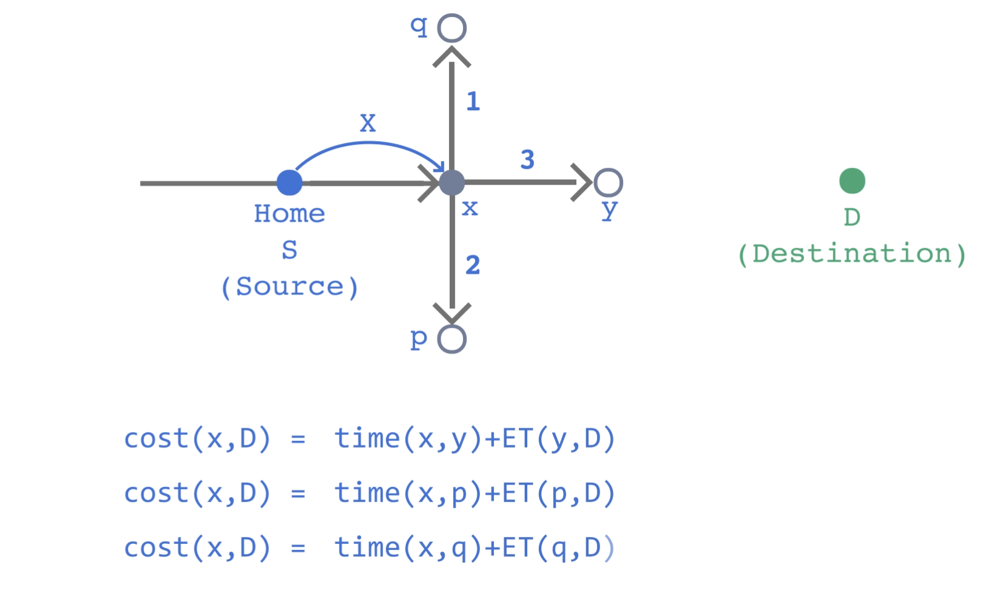
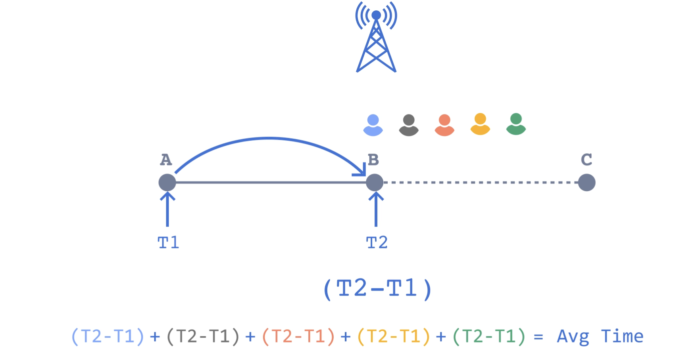
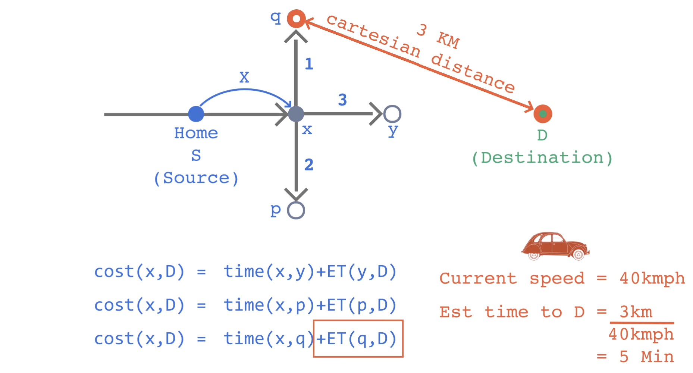

# Location Based Service - Google Maps

## Requirements

- Finding the best route from a source to destination
- Adding Locations in the map
- Finding Nearby Stores
- Notifying users with traffic updates
- Calculating the estimated time of arrival

### Good to have features 
- Public Transport
- Time to leave
- rating and reviews
- Live Sharing permissions
- Location history
  


## 1. Finding the best route from a source to destination

### Assumptions
- We have source and destination
- Distance/time for road A to B

Seems like a graph problem.
But! There are few challenges


### High level requirements
- Model the map as a graph, where:
    - Nodes = intersections or key points ("limiters"),
    - Edges = road segments with weights (distance/time).
### Challenges

1. Arbitrary Location Handling: 
   - Location can be in the middle of roads
   - Solution: 
     - Approximate location to nearest limiter node (intersection).
2. Too Many Possible Paths: 
   - Dense road networks → exponentially many path options.
   - Solution: 
     - Only consider significant turns or intersections.
     - Use limiters to reduce unnecessary nodes.
3. Real-Time Updates
   - Routes change due to traffic, accidents, etc.
   - Solution: 
     - Update edge weights periodically using traffic APIs.


### Conclusion
- Approximation is acceptable in many use cases (e.g., ETA accuracy ±1 min).
- Exact shortest path is computationally heavy at scale.
- Tradeoff: Speed vs Accuracy (use heuristics, e.g., A* search).
- Scalability depends on:
  - Efficient node reduction (limiters),
  - Caching frequent routes,
  - Real-time edge weight updates.

## A. Splitting graph into regions

This is to solve the porblem of too many routes.

### Idea 
- To reduce computation, assume that each location (source or destination) is near a hub/intersection.
- Hubs act as pre-computed waypoints—common across nearby sources/destinations.

    

### Tradeoff
- The path via hub might not be an optimal path. 
- There might be a possibility of shorter path from direct points.
    

### Optimization Focus
- Focus is not on finding the most optimal path.
- Instead, focus is on:
  - Reducing computation per request.
  - Quick route suggestions for a good user experience.


> NOTE: 
> 
> - Google uses graph partitioning algorithms and AI techniques to divide the road network into regions/hubs.
> 
> - This allows efficient lookup of pre-computed paths between hubs.
>
> - The same approach is also used in public transport (e.g., bus/metro routing).

## B. Fast Computation

Algorithm used -> A* search

- Why A*?
  - A* search chooses paths based on:
    - Actual cost so far: time(from, to)
    - Estimated time (ET) from current to destination
- This algorithm takes into account the time taken to move from one position to another as well as the estimated time to reach the final destination.

- Lets suppose we are moving from S -> D
  - from S -> x, At node x, consider 3 directions:
  - ```
        cost(x, D) = time(x, y) + ET(y, D)
        cost(x, D) = time(x, p) + ET(p, D)
        cost(x, D) = time(x, q) + ET(q, D)
    ```
  - Choose the direction with minimum total estimated cost.

    
- The algorithm will give a good path -> of the edges have accurate time.

### Q: How Do We Estimate Time Accurately?


#### 1. Real Data (Preferred)
  - Collect historical travel times from GPS/cellular networks.
   - Use this for segments like time(A → x).
    
#### 2. Estimation via Physics
  - Use: Cartesian distance
  - Assumed speed (from GPS or traffic APIs)
    - For (x,B), we will take an approximation.

    


>  Use a Graph Database like Neo4j
> 
> (Each point = Node, road = Weighted Edge)


### When is A* helpful?
- Fast and reasonably accurate
- Uses heuristics to guide path selection
- Works well if:
  - Edge times are accurate (real/historic data)
  - ET heuristic is admissible (doesn’t overestimate)


## Resources
- [Google's way of partitioning](https://research.google/blog/efficient-partitioning-of-road-networks/#:~:text=To%20understand%20how%20routing%20might,until%20it%20finds%20the%20destination.)
  - Short Summary: 
    - Road networks can be modeled as graphs, where intersections are nodes and roads are edges. Routing algorithms like Dijkstra become inefficient for long distances due to exhaustive searches. 
    - To speed this up, the network is partitioned into smaller, well-connected components with few external connections (beacons).

    - The partitioning algorithm recursively splits the graph into balanced parts while minimizing the number of inter-component roads (beacons), using random walks to identify natural boundaries (e.g., islands, isolated regions). 
    - These areas are then contracted into supernodes, and the graph is partitioned using the inertial flow algorithm to reduce beacon count. The result is faster routing by limiting the search to a smaller subset of the graph, with minimal loss in accuracy.
- [Vehicle Routing problem](https://developers.google.com/optimization/routing/vrp)
- [Public Transport Routing](https://research.google/blog/an-update-on-fast-transit-routing-with-transfer-patterns/)