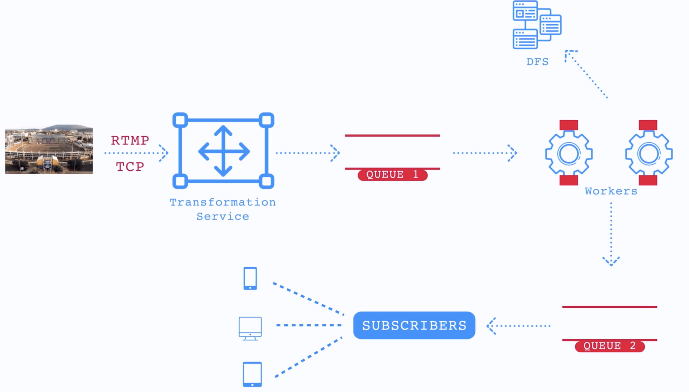
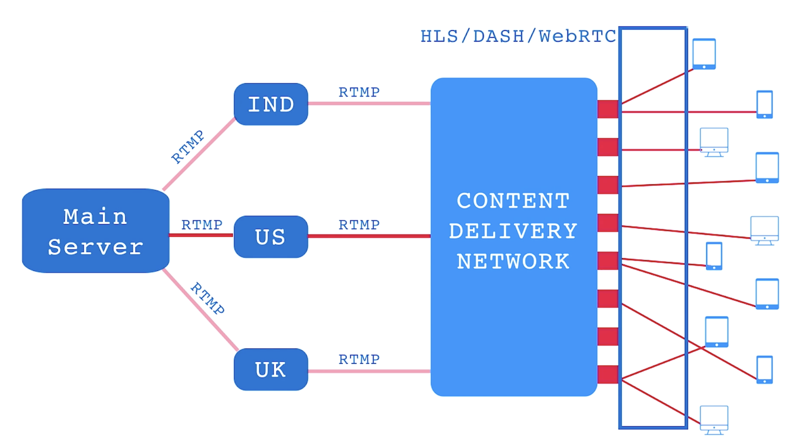

# Hotstar - Live Streaming

> Check the final architecture Diagram [here](./final-architecture.png)

For large users, these are the requirements
- Ingest live HD video.
- Transform video for different users.
- Transport videos to end user.

## Assumption and Requirements

1 minute is the maximum delay between live event and its streaming.
- Transform original video
- heterogenous delivery
- caching
- Fault tolerance

## Available in diff resolutions

- Maintain a 2D matrix for `resolutions`(8K, 4k, 1080p, 720p, ..) and `codecs`(HLS, MP4, DASH).
- Before transporting, the raw videos will be transformed into every supported resolution and codec.
- This will be transformation service
- The service will have a job scheduler. Tasks will be assigned to worker nodes.
- From workers videos can be posted into a DFS. and a completion event can be sent to the message queue. 
- Subscribers can pull these videos from the message queue.

- This needs `compute`

## Transport Videos

- We will be using RMTP (No loss) for video ingestion
- Video replicas must be stored for fault tolerance (DB)

### RMTP
- RTMP, or Real-Time Messaging Protocol, is a streaming protocol initially developed by Macromedia (later acquired by Adobe) to deliver live audio, video, and data over the internet as both an ingest and playback protocol.
-  By establishing a persistent connection between the source (like a camera or encoder) and the streaming server, it ensures smooth and reliable data flow. 
-  It became widely recognized for its low latency, making it ideal for interactive applications and live streaming events

- RTMP is most commonly used for: 

  - Live Broadcasting: Delivering real-time video feeds to audiences during sports events, concerts, and other live events. 
  - Ingesting Streams: Sending video data from an encoder to a streaming server.
  
- Usage today: OBS → RTMP → Media server → viewers get HLS/DASH.
  - OBS streams live video using RTMP to a media server.
  - The media server converts RTMP into HLS or DASH formats.
  - Viewers watch the stream using HLS/DASH, which works in browsers and apps.

### Tradeoffs
| Protocol | Type                 | Latency         | Browser Support      |                                         Feature    | Use Case                                   |
| -------- | -------------------- | --------------- | ------------------------------------------------------------------ | ----- | ------------------------------------------ |
| **RTMP** | Push streaming (old) | Very Low (2-5s) | Needs Flash (now deprecated)   |                                     | Live streaming (OBS → Server), low latency |
| **HLS**  | HTTP-based streaming | Higher (6-30s)  | Native on Safari, works everywhere via JS players (e.g., Video.js) | Adaptive Bitrate| Live + on-demand, works on all devices     |
| **DASH** | HTTP-based streaming | Medium (3-10s)  | Supported in modern browsers, except iOS Safari (partial)   |   Adaptive Bitrate    | Adaptive streaming, more flexible than HLS |

---

## Transferring processed videos

- architecture
  - layer 1 : processed video
  - layer 2: Geographically distributed servers
  - layer 3: CDNs
  - Layer 4: Users

- We want CDNs to take care of the Caching of videos
- We can cache the user requested endpoints. `(userId, liveStreamId) -> endpoint`.
- cache hot video segments in memory (Servers - layer 2)

### Tradeoffs

- CMAF vs WebRTC
  
    | Protocol   | Type                    | Latency         | Transport                    | Use Case                                      |
    | ---------- | ----------------------- | --------------- | ---------------------------- | --------------------------------------------- |
    | **CMAF (HLS/DASH)**   | HTTP-based streaming    | Low (2-5s)      | **TCP** (HTTP-based)         | Scalable live streaming (sports, events)      |
    | **WebRTC** | Real-time communication | Ultra-low (<1s) | **UDP** (uses SRTP over UDP) | Video calls, gaming, interactive live streams |

### Diagram

---

### FAQs
---
1.  How the video captured by camera finally reaches the transformation service?

    - Modern IP cameras have in-built RTMP encoders so they can directly post the video frames to backend.

    - Otherwise, need an encoder that initiates RTMP requests for posting the frames.

    - Cameras (Video Captures) output to HDMI/USB connected to → Mixer (Software/Hardware) (optional) -> Encoder (Software/Hardware) converts to H.264 and initates → RTMP Stream → Backend Server (RTMP Server)

    - When you have multiple cameras, Mixer is used by broadcaster to mix all inputs of video/audio feeds to produce a single output

    - For authentication, the initial request comes in with user_id and video_id.
    - For security, use RTMPS which is secured version (similar to SSL/TLS)
---
2. Why are we not chunking the video into pieces on the ingestion side?
   - The original video will be broken into chunks of equal size, and assigned to different worker nodes in the system. 
   - As these chunks are processed into different resolutions and codecs, we push the results to a distributed file system like S3.
   - We are mainly interested in the hot chunks of the video (last 60 seconds) as most of our viewers want to view the video live.
 ---

3. How do you serve dynamic ads to different user cohorts in real-time?

      > Virtual advertising is the use of digital technology to insert virtual advertising content into a live or pre-recorded television show, often in sports events. 
      > 
      > This technique is often used to allow broadcasters to overlay existing physical advertising panels (on the playfield) with virtual content on the screen when broadcasting the same event in multiple regions

- Identify user cohort based on attributes (e.g., location, age, behavior, device).
- Call an ad server (or DSP) that selects the best ad using real-time bidding (RTB) or rules.
- The ad server returns a personalized ad (video, banner, etc.) tailored to that user group.
- Ads are delivered via ad tags or dynamically inserted into streams (using VAST, SSAI/DAI for video).
- For real-time streams (like live video), Server-Side Ad Insertion (SSAI) is used to stitch ads without buffering.