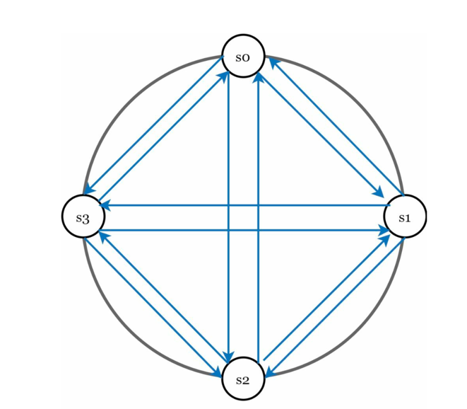
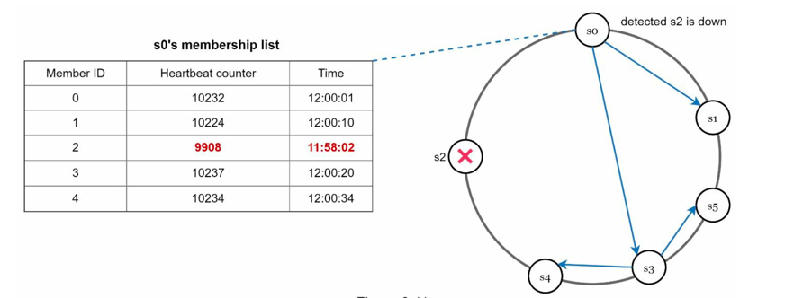

# Key Value Store

- A **key-value store** is a type of _non-relational_ database that uses a simple key-value pair to store data. 
- Each key is unique and is used to retrieve the corresponding value. 
- Keys can be plaint text or hashed values, while values can be any type of data, such as strings, numbers, JSON objects, or binary data.
- Key-value stores are designed for high performance, scalability, and flexibility, making them suitable for various applications such as caching, session management, and real-time analytics.

## Step 1: Requirements and Design Scope

- Support basic operations: `put(key, value)` and  `get(key)`.
- The size of key-value pair is small (few KBs).
- Ability to store big data (few TBs).
- High availability: System responds quickly even during failures.
- High Scalability: System can be scaled to support large data set.
- Automatic Scaling: System should automatically scale up/down based on load.
- Tunable Consistency: Ability to choose between strong and eventual consistency based on use case.
- Low Latency: Fast read and write operations.

## Step 2: Proposing High Level Design
### Designing a Single server Key-Value Store

- Store key-value pairs in hash table, which keeps everything in memory.
- Memory access is fast, so read and write operations are quick.
- But memory is expensive and limited, so this design is not suitable for large data sets.
- Optimizations?
  - Data Compression: Compress data before storing to save memory.
  - Store only frequently accessed data in memory, and move less frequently accessed data to disk.
- Even with these optimizations, a single server key-value store is not suitable for large data sets.

### Designing a Distributed Key-Value Store

- To handle large data sets, we need to distribute data across multiple servers.
- We need to understand CAP theorem before designing a distributed key-value store.

#### CAP Theorem

- It states that in a distributed system, you can only achieve two out of the following three guarantees:
  - `Consistency`: Every read receives the most recent write or an error. All clients see same data at the same time no matter which node they connect to.
  - `Availability`: Every request receives a response, without guarantee that it contains the most recent version of the information. Clients get a response, even if some nodes aee down.
  - `Partition Tolerance`: The system continues to operate despite network failures or delays.

- Possible combinations are:
  - `CP`- Consistency and Partition Tolerance: System remains consistent even during network partitions, but may not be available.
  - `AP`- Availability and Partition Tolerance: System remains available even during network partitions, but may not be consistent.
  - `CA`- Consistency and Availability: System is consistent and available, but cannot handle network partitions. 

- Since network failures are inevitable in distributed systems, CA is not a practical choice. So distributed systems must choose between `CP` and `AP`.

#### Choosing between CP and AP
- Example
  - If there are 3 servers (n1, n2, n3) and a client wants to write a key-value pair (k1, v1). Lets say k1 is written to n3, but not propagated yet to n1 and n2.
  - Now, if n3 goes down and a client wants to read k1.
    - In `CP` system, the client will not get a response because it cannot guarantee consistency. It will wait until n3 is back up.
    - In `AP` system, the client will get a response from n1 or n2, but it may not be the most recent value of k1.
- For a key-value store, we can choose either `CP` or `AP` based on the use case.
- Choosing between AP and CP depends on the specific requirements of the application.
- For example:
  - A banking application would prefer `CP` to ensure data consistency.
  - A social media application would prefer `AP` to ensure availability.

### System Components and Techniques

#### 1. Data Partitioning
- For large applications, data is partitioned across multiple servers to distribute load and improve performance.
- Challenges with partitioning:
  - How to distribute data across multiple servers evenly?
  - How to minimize data movement when nodes are added or removed?
- Techniques for data partitioning:
  - **Range-based Partitioning**: Data is partitioned based on key ranges. For example, keys starting with 'A' to 'M' are stored in server 1, and keys starting with 'N' to 'Z' are stored in server 2.
    - Pros: Simple to implement and understand.
    - Cons: Can lead to hot spots if certain key ranges are accessed more frequently.
  - **Hash-based Modulo Partitioning**: A hash function is applied to the key to determine which server will store the data. For example, `hash(key) % number_of_servers` can be used to determine the server.
    - Pros: Distributes data evenly across servers.
    - Cons: When a server is added or removed, a large portion of data needs to be moved.
  - **Consistent Hashing**: A more advanced technique that minimizes data movement when servers are added or removed. Servers and keys are mapped to a circular hash space, and each key is assigned to the next server in a clockwise direction.
    - Pros: 
      - Automatic Scaling: Minimizes data movement during scaling operations.
      - Heterogeneity: the number of virtual nodes for a server is proportional to its capacity. For example, a server with double the capacity can have double the virtual nodes, allowing it to handle more keys.
    - Cons: More complex to implement.
- For further reading refer [Consistent Hashing](./../consistent-hashing/main.md).


#### 2. Data Replication
- To ensure high availability and fault tolerance, data is replicated across multiple servers.
- In consistent hashing, each key can be replicated to the next `N` (configurable) servers in a clockwise direction on the hash ring.
- This way, if one server goes down, the data can still be accessed from another server
- With virtual nodes, the first `N` distinct servers in a clockwise direction are chosen for replication.
- Nodes in same data center often fail at same time due to power/network issues. To handle this, replicas can be placed in different data centers and data centers are connected through high speed networks.
- For further reading refer [Data replication and Migration in Distributed Systems](./../../concepts/data-replication-and-migration.md).

#### 3. Consistency Model
- In a distributed key-value store, we can choose between strong consistency and eventual consistency based on the use case.
- **Strong Consistency**: Ensures that all clients see the most recent write. This can be achieved using techniques like quorum-based replication, where a write is considered successful only when a majority of replicas acknowledge the write.
- **Eventual Consistency**: Ensures that all replicas will eventually converge to the same value, but there may be a delay before all replicas are updated. This can be achieved using techniques like asynchronous replication, where writes are propagated to replicas in the background.
- The choice between strong and eventual consistency depends on the specific requirements of the application.
- Consider
  ```
    N -> The number of replicas
    W -> The number of replicas that must acknowledge a write for it to be considered successful
    R -> The number of replicas that must be read to ensure the most recent write is read
  ```
- To achieve strong consistency, we can set `W + R > N`. This ensures that there is at least one replica that has acknowledged the write and is read during a read operation.
- To achieve eventual consistency, we can set `W + R <= N`. This allows for faster writes and reads, but there may be a delay before all replicas are updated.
- if R = 1 and W = N, The system is optimized for fast read.
- if W = 1 and R = N, The system is optimized for fast write.
- For further reading refer [Consistency Models in Distributed Systems](./../../concepts/consistency.md).
    

- Out of 3 consistency models (Strong, Eventual, Causal), key-value stores typically use Eventual consistency models.
- From concurrent writes, eventual consistency allows inconsistent values to enter the system and forces client to read the values to reconcile them.

#### 4. Inconsistency Resolution

- In eventually consistent systems, replicas may hold conflicting versions of the same data due to:
  - Concurrent writes 
  - Network partitions 
  - Delayed replication 
- To resolve, systems track versions of each object instead of overwriting blindly.

- Techniques for versioning:
  
  | Technique                                       | Description                                               | Working                                                                          | Pros                                                           | Cons                                                                                                        | Real-world Analogy                                                                          |
  |-------------------------------------------------|-----------------------------------------------------------|----------------------------------------------------------------------------------|----------------------------------------------------------------|-------------------------------------------------------------------------------------------------------------|---------------------------------------------------------------------------------------------|
  | **Simple Version Numbers**                      | Each update increments a version counter.                 | Replicas compare counters; higher counter overwrites lower.                      | Simple to implement.                                           | Cannot capture concurrent writes properly (overwrites valid updates).                                       | Book editions: higher edition replaces the previous one, but parallel drafts are lost.      |
  | **Timestamps (LWW)**                            | Each version is tagged with a timestamp.                  | Latest timestamp chosen as the correct value.                                    | Easy and efficient.                                            | Requires synchronized clocks; may lose valid updates.                                                       | “Last modified time” in a file system – the newest timestamp wins.                          |
  | **Vector Clocks**                               | Each version tagged with a list of (node, counter) pairs. | Tracks causal history; detects whether versions are concurrent or one dominates. | Can detect concurrent updates and preserve causality.          | Complex to implement; more storage overhead.(set threshold for length, discard old pairs if limit exceeded) | Google Docs edit history: can detect parallel edits and keep both until merged.             |
  | **Conflict-free Replicated Data Types (CRDTs)** | Special data structures designed for automatic merging.   | CRDTs define merge rules ensuring eventual consistency without conflicts.        | Automatically resolves conflicts; strong eventual consistency. | Limited to specific data types (counters, sets, maps).                                                      | Shared shopping cart: items from different users are merged automatically without conflict. |

---

---
#### 5. Handling Failures
- In a distributed key-value store, we need to handle various types of failures to ensure high availability and fault tolerance.

##### A. Failure Detection
1. **All-to-All heartbeat Mechanism**: 
   - It requires atleast two independent failure detectors to avoid false positives. 
   - An all-to-all multicast heartbeat mechanism can be used where each node sends heartbeat messages to all other nodes at regular intervals. 
   - If a node does not receive a heartbeat from another node within a certain timeout period, it can mark that node as failed.
   
---
2. **Gossip Protocol**:
  - Each node maintains a node membership list, which contains member IDs and heartbeat
    counters. 
  - Each node periodically increments its heartbeat counter.
  - Each node periodically sends heartbeats to a set of random nodes, which in turn
    propagate to another set of nodes.
  - Once nodes receive heartbeats, membership list is updated to the latest info.
  - If the heartbeat has not increased for more than predefined periods, the member is
    considered as offline.
  - For example
    - Node s0 maintains a node membership list shown on the left side.
    - Node s0 notices that node s2’s (member ID = 2) heartbeat counter has not increased for a
      long time.
    - Node s0 sends heartbeats that include s2’s info to a set of random nodes. Once other
      nodes confirm that s2’s heartbeat counter has not been updated for a long time, node s2 is
      marked down, and this information is propagated to other nodes.
      