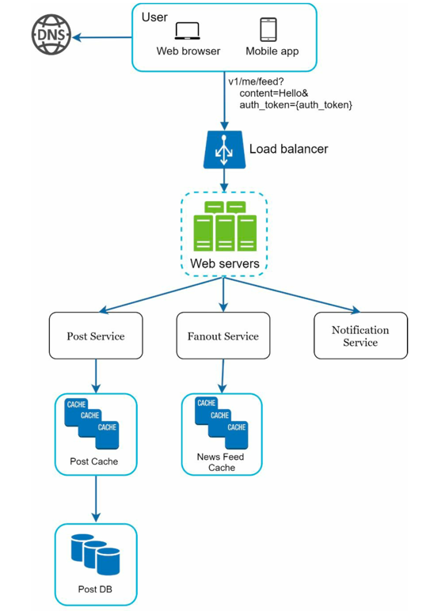
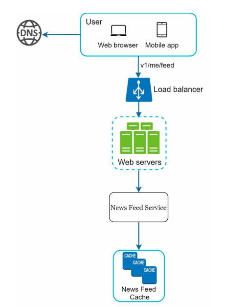
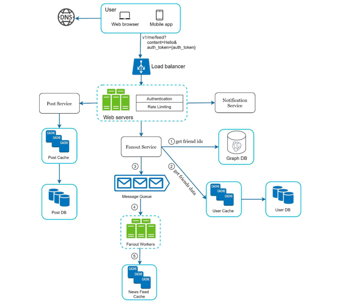

# Design a News Feed System

## Introduction

> News feed is the constantly updating list of stories in the middle of your home page. it includes status updates, photos, videos, links, app activity and likes from people, pages and groups.
> 
> Similar to Facebook news feed, Instagram feed, Twitter timeline.

## Step 1: Understand the requirement

> Q: Is this a mobile app? or a web app? or both?
> 
> A: Both

> Q: what are important features?
>
> A: A user can publish a post and can see their friends' posts on news feed page.

> Q: Is the news feed sorted by reverse chronological order or any particular order?
> 
> A : Assume feed is sorted by reverse chronological order

> Q: How many friends can user have?
>
> A : 5000

> Q: What is traffic volume?
>
> A : 10 million DAU (Daily Active User)

> Q: Can feed contain images, videos or just text?
>
> A : It can contain media files, both images and videos.

## Step 2: High Level Design

- Two flows:
  - `Feed publishing`: When a user publishes a post, data is written into cache and database. A post is populated to their friends' news feed.
  - `Newsfeed Building`: Considering news feed is built by aggregating friends' post in reverse chronological order.

### NewsFeed APIs

#### 1. Feed publishing API

To publish a post, HTTP POST request is sent.
`POST/v1/feed`

- Params
  - `content`: text/media of the post
  - `auth_token`: to authenticate API requests.

#### 2. NewsFeed retrieval API

To retrieve feed, HTTP GET request is used.
`GET/v1/feed`

- Params
  - `auth_token`: to authenticate API requests.

### Feed Publishing

- User: User makes a post request with content "hello" through API
  - `/v1/feed?content=hello?auth_token={auth_token}`
- Load Balancer: distributes traffic to web servers.
- Web servers: web servers redirect traffic to different internal services.
- Post service: persist post data in database and cache.
- Fanout service: push new content to friends' feed. Newsfeed data is stored in cache for fast retrieval.
- Notification service: Inform friends that new content is available and send out push notifications.

### NewsFeed Building

- User: User sends a GET request to retrieve the feed: `v1/feed`
- Load Balancer: distributes traffic to web servers
- Web servers: web servers redirect traffic to newsfeed service.
- Newsfeed service: this service fetches news feed from the cache.
- Newsfeed cache: store news feed IDs needed to render the news feed.
---

## Step 3: Design Deep Dive

Two components have been modified
- Web servers
- Fanout service

### Web Servers
- Authentication: Only users signed in with valid auth_token are allowed to make posts
- Rate Limiting: System limits the number of posts a user can make within a certain period, to prevent spam and abusive content.

### Fanout Service

- Fanout: Process of delivering a post to all of the user's friends' news feeds.
- Models
  - Fanout on Write (push model): When a user makes a post, the system immediately pushes the post to all of the user's friends' news feeds. This approach ensures that when friends access their news feeds, the posts are already available, resulting in faster retrieval times.
  - Fanout on Read (pull model): When a user accesses their news feed, the system retrieves the latest posts from the user's friends in real-time. This approach reduces the storage requirements since posts are not pre-populated in friends' feeds, but it may lead to slower retrieval times as posts need to be fetched on-the-fly.
- Hybrid Approach: A combination of both fanout on write and fanout on read can be used. For example, popular users' posts can be pushed to friends' feeds (fanout on write), while less active users' posts can be fetched in real-time when friends access their feeds (fanout on read). This approach balances storage efficiency and retrieval speed.
