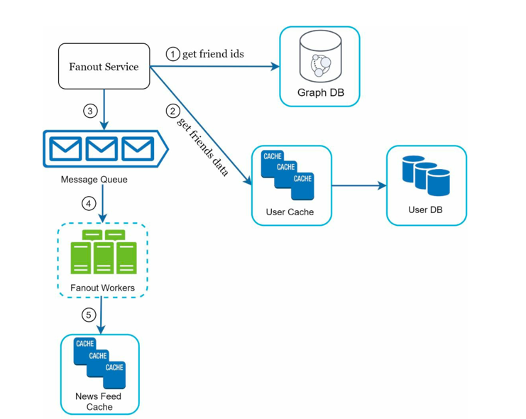
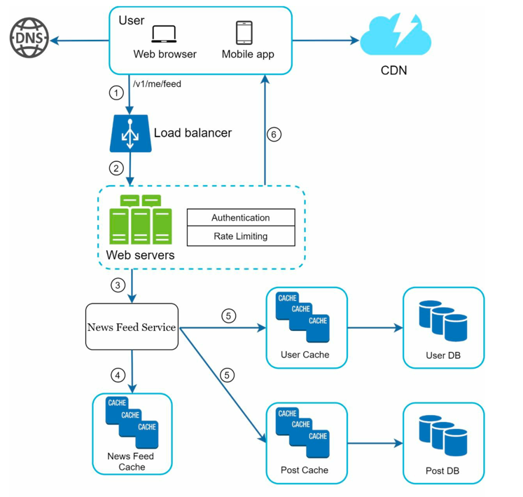

# Design a News Feed System

## Introduction

> News feed is the constantly updating list of stories in the middle of your home page. it includes status updates, photos, videos, links, app activity and likes from people, pages and groups.
> 
> Similar to Facebook news feed, Instagram feed, Twitter timeline.

## Step 1: Understand the requirement

> Q: Is this a mobile app? or a web app? or both?
> 
> A: Both

> Q: what are important features?
>
> A: A user can publish a post and can see their friends' posts on news feed page.

> Q: Is the news feed sorted by reverse chronological order or any particular order?
> 
> A : Assume feed is sorted by reverse chronological order

> Q: How many friends can user have?
>
> A : 5000

> Q: What is traffic volume?
>
> A : 10 million DAU (Daily Active User)

> Q: Can feed contain images, videos or just text?
>
> A : It can contain media files, both images and videos.

## Step 2: High Level Design

- Two flows:
  - `Feed publishing`: When a user publishes a post, data is written into cache and database. A post is populated to their friends' news feed.
  - `Newsfeed Building`: Considering news feed is built by aggregating friends' post in reverse chronological order.

### NewsFeed APIs

#### 1. Feed publishing API

To publish a post, HTTP POST request is sent.
`POST/v1/feed`

- Params
  - `content`: text/media of the post
  - `auth_token`: to authenticate API requests.

#### 2. NewsFeed retrieval API

To retrieve feed, HTTP GET request is used.
`GET/v1/feed`

- Params
  - `auth_token`: to authenticate API requests.

### Feed Publishing

- User: User makes a post request with content "hello" through API
  - `/v1/feed?content=hello?auth_token={auth_token}`
- Load Balancer: distributes traffic to web servers.
- Web servers: web servers redirect traffic to different internal services.
- Post service: persist post data in database and cache.
- Fanout service: push new content to friends' feed. Newsfeed data is stored in cache for fast retrieval.
- Notification service: Inform friends that new content is available and send out push notifications.

### NewsFeed Building

- User: User sends a GET request to retrieve the feed: `v1/feed`
- Load Balancer: distributes traffic to web servers
- Web servers: web servers redirect traffic to newsfeed service.
- Newsfeed service: this service fetches news feed from the cache.
- Newsfeed cache: store news feed IDs needed to render the news feed.
---

## Step 3: Design Deep Dive

Two components have been modified
- Web servers
- Fanout service

### Feed Publishing Deep Dive

#### Web Servers
- Authentication: Only users signed in with valid auth_token are allowed to make posts
- Rate Limiting: System limits the number of posts a user can make within a certain period, to prevent spam and abusive content.

#### Fanout Service

- Fanout: Process of delivering a post to all of the user's friends' news feeds.
- Models
  - Fanout on Write (push model)
  - Fanout on Read (pull model)

##### Fanout on Write
- news feed is pre-computed during write operation.
- new post is pushed to all friends' cache as soon as user makes a post.
- Pros:
  - **Fast read performance**: since news feed is pre-computed, users can retrieve their feed quickly.
  - **Reduced latency**: users experience minimal delay when accessing their news feed.
- Cons:
  - **High write amplification**: when a user with many friends makes a post, the system needs to update multiple caches, leading to increased write operations. -> _hotkey problem_.
  - **Storage overhead**: storing pre-computed news feeds for all users can consume significant storage space. Also, irrelevant for inactive users.
> `Hotkey`: A key that gets disproportionately high traffic(writes/reads) compared to other keys in the system.
> 
> For example, a celebrity user with millions of followers posting frequently can create a hotkey situation, overwhelming the system with write operations to update all followers' feeds.

##### Fanout on Read
- news feed is computed during read operation.
- when user requests their news feed, system fetches posts from friends in real-time and aggregates them. On-demand model
- Pros:
  - For inactive users or those who rarely log in, no storage is wasted on pre-computed feeds.
  - Data is not pushed to friends, so no hotkey problem.
- Cons:
  - Increased latency: users may experience delays when accessing their news feed, especially if they have many friends with numerous posts.
  - Higher read load: fetching and aggregating posts from multiple friends can put a strain on the system during peak times.

##### Hybrid Approach

- Combine both fanout on write and fanout on read.
- For regular users with a manageable number of friends, use fanout on write to ensure fast read performance.
- For celebrity users with a massive following, use fanout on read to avoid hotkey issues (with consistent hashing).
- This approach balances the benefits of both models while mitigating their respective drawbacks.

### Fanout Service Closer Look

1. Fetch friend IDs from the graph database. Graph databases are suited for managing
   friend relationship and friend recommendations.
2. Get friends info from the user cache. The system then filters out friends based on user
   settings. For example, if you mute someone, her posts will not show up on your news feed
   even though you are still friends. Another reason why posts may not show is that a user
   could selectively share information with specific friends or hide it from other people.
3. Send friends list and new post ID to the message queue.
4. Fanout workers fetch data from the message queue and store news feed data in the news
   feed cache. You can think of the news feed cache as a <post_id, user_id> mapping table.
   The memory consumption can become very large if we store the entire user
   and post objects in the cache. Thus, only IDs are stored. To keep the memory size small,
   we set a configurable limit. The chance of a user scrolling through thousands of posts in
   news feed is slim. Most users are only interested in the latest content, so the cache miss
   rate is low.
5. Store <post_id, user_id > in news feed cache.

### NewsFeed Retrieval Deep Dive

1. A user sends a request to retrieve her news feed. The request looks like this: `/v1/me/feed`
2. The load balancer redistributes requests to web servers.
3. Web servers call the news feed service to fetch news feeds.
4. News feed service gets a list post IDs from the news feed cache.
5. A user’s news feed is more than just a list of feed IDs. It contains username, profile
   picture, post content, post image, etc. Thus, the news feed service fetches the complete
   user and post objects from caches (user cache and post cache) to construct the fully
   hydrated news feed.
6. The fully hydrated news feed is returned in JSON format back to the client for
   rendering.

### Cache Architecture
- `News Feed`: It stores IDs of news feeds.
- `Content`: It stores every post data. Popular content is stored in hot cache.
- `Social Graph`: It stores user relationship data.
- `Action`: It stores info about whether a user liked a post, replied a post, or took other
actions on a post.
- `Counters`: It stores counters for like, reply, follower, following, etc.