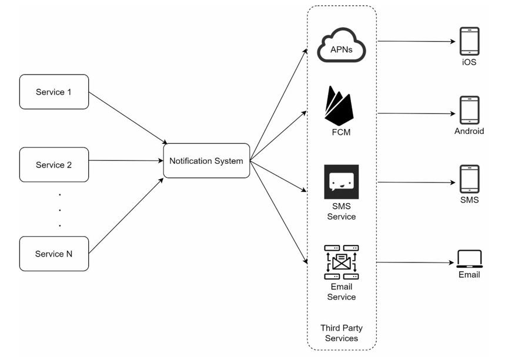
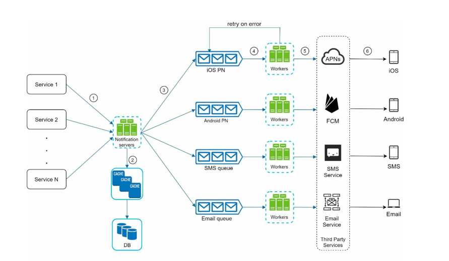
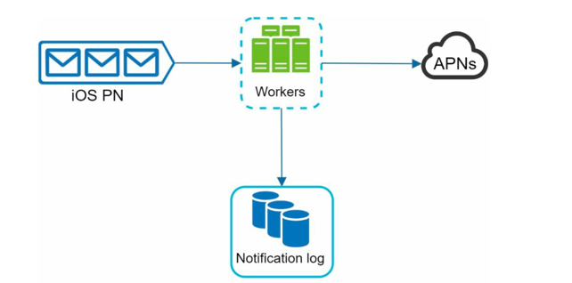
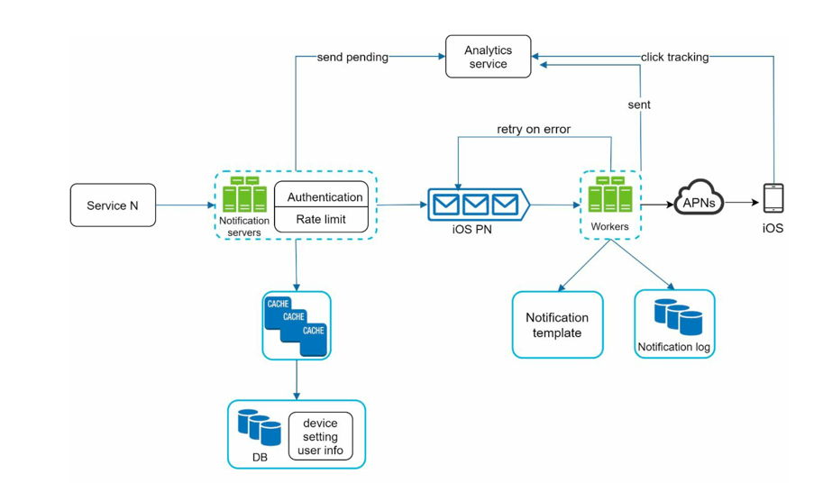

# Design a Notification System

- [Introduction](#introduction)

## Introduction

> A notification system is responsible for sending notifications to users through various channels such as email, SMS, and push notifications.

## Step 1: Understand the Requirements

> Q. What type of notifications will the system support?
>
> A. Push notifications, emails, and SMS.

> Q. Is it a real-time notification system or batch processing?
>
> A. It is a soft real-time system. Notifications should be sent ASAP, but slight delays are acceptable.

> Q. What are supported devices/platforms?
>
> A. Ios devices, Android devices, and web browsers(laptop/desktop).

> Q. What triggers the notifications?
>
> A. Notifications can be triggered by client application. Can also be schedule by server-side.

> Q. What many notifications are sent out per day?
>
> A. 10 million mobile push notifications, 1 million SMS msgs, and 5 million emails.

## Step 1: High Level Design

- Our notification system will support following notification types:
  - iOS Push Notification
  - Android Push Notification
  - SMS message
  - Email

- 3 main components:
  - Different types of Notifications
  - Contact info gathering flow
  - Notification sending/receiving flow

### Different Types of Notifications

#### iOS Push Notification
- 3 components needed   
  - **Provider**: Builds and sends notification requests to` Apple Push Notification service (APNs)` by sending following data
    - Device token: Unique identifier for the target device.
    - Payload: The actual notification content (title, body, custom data).
  - **APNs**: Apple's service that routes notifications to iOS devices.
  - **Device**: The iOS device that receives and displays the notification.

---

#### Android Push Notification
- Similar notification flow as iOS
- Instead of APNs, there's `Firebase Cloud Messaging (FCM)` as the intermediary service.

---

#### SMS Message
- SMS uses services like:
  - `Twilio`: 
    - microservices-based, cloud-native system built primarily on AWS.
    - It uses API gateways for request handling, a service mesh for routing between communication services (SMS, Voice, Email, Video), and message queues like Kafka for reliability.
    - Twilio connects to global telecom carriers via SIP/PSTN gateways, ensuring redundancy and low latency.
  - `Nexmo`:
    - cloud-based, microservices-driven communication platform that connects applications to global telecom networks.
    - It uses RESTful APIs and webhooks to handle SMS, Voice, and Verification services.
    - At its core, it runs on AWS, uses API gateways for authentication and routing, and message brokers for reliable delivery.
    - maintains direct SMPP and SIP connections with carriers worldwide for low-latency communication
- Most of them are commercial services that provide APIs to send SMS messages.

---

#### Email
- Companies can set up their own email service.
- But mostly use commercial email services like:
  - `Sendgrid`: 
    - cloud-based, distributed email delivery system designed for high scalability and reliability.
    - It uses microservices hosted on AWS, with API gateways handling authentication and rate limiting.
    - Emails are queued and processed through message brokers (like Kafka or RabbitMQ), then routed to global SMTP relays for delivery.
  - `Mailchimp`:
    - cloud-based, microservices-oriented marketing automation platform built for scalability and personalization.
    - It runs primarily on AWS, using API gateways and RESTful services to manage campaigns, users, and analytics.
    - Mailchimp uses message queues for async processing (email scheduling, tracking),

---

> Summary: Provider -> Third Party Service -> Device/Recipient

### Contact Info Gathering Flow

- To send notifications, we need to gather contact info from users.
- Contact info includes:
  - Email address
  - Phone number
  - Device tokens for push notifications
- This info can be collected during user registration or profile update.
- Store this info securely in a database.

> Note: Email addresses and phone numbers should be verified to ensure they are valid.

---

### Notification Sending/Receiving Flow

- Following is the initial design:

  

1. `Service 1 to N`: 
   - Different services that trigger notifications (e.g., order service, chat service).
   - It can be a micro-service, a cron job or a distributed task.
   - Example: Order service sends order confirmation notification.
2. `Notification System`:
   - Receives notification requests from various services.
   - Currently, only 1 notification server is used.
   - provides APIs for services and build payloads for third party services.
3. `Third Party Services`:
   - APNs, FCM, Twilio, Sendgrid, etc.
   - Responsible for delivering notifications to end-users.
   - Considerations:
     - Extensibility: flexible system with easy plugging and unplugging third party services.
     - Availability: Some services may not be available in certain regions. Ex: FCM is not available in China, alternatives: Jpush
4. `Users`:
   - End-users who receive notifications on their devices.

---
#### Problems with Initial Design

1. Single Point of Failure: 
   - Single notification server can become a bottleneck and thus a SPOF.
2. Scalability Issues:
   - As the number of notifications grows, a single server may struggle to handle the load. 
   - Challenging to scale DBs, caches and different notification processing components independently.
3. Performance Bottlenecks:
   - Processing and sending notifications is resource-intensive.
   - A single server may lead to delays in notification delivery.

---

### Improved Design

- Improvements:
  1. Database and Cache Moved out of Notification server.
  2. Multiple Notification Servers added with automatic horizontal scaling.
  3. Introduced message queues for async processing.

1. `Service 1 to N`: (unchanged)
2. `Notification Servers`:
   - Provides APIs for services to send notification requests.
   - APIs are only accessible internally or by verified clients to prevent spam.
   - Basic validation of verify emails, phone numbers, device tokens.
   - Queries DB/Cache for contact info.
   - Adds notification requests to message queues for parallel processing.
3. `Cache`:
    - Stores user info, device info and notification templates for quick access.
4. `Database`:
    - Stores user contact info, notification logs, templates, etc.
5. `Message Queues`:
   - Decouples notification request submission from processing.
   - Serves as a buffer to handle spikes in notification requests.
   - Each notification type is assigned to a distinct queue, outage in one third party service won't affect others.
6. `Workers`:
   - List of servers that pull notification events from message queues.
   - Send notifications via appropriate third party services.
   - Can be scaled independently based on load.
7. `Third Party Services`: (unchanged)
8. `Users`: (unchanged)

### Flow

1. A service calls APIs provided by notification servers to send notifications.
2. Notification servers fetch metadata such as user info, device token, and notification setting from the cache or database.
3. A notification event is sent to the corresponding queue for processing. For instance, an iOS push notification event is sent to the iOS PN queue.
4. Workers pull notification events from message queues.
5. Workers send notifications to third party services.
6. Third-party services send notifications to user devices.

---

## Step 3: Detailed Design Considerations

### Reliability

> How to prevent data loss?

- Notification events can be delayed or reordered, but never lost.
- Notification system should persist notification data in a database and implement a retry mechanism for failed notifications.

    

> Will recipient receive duplicate notifications?

- Yes, duplicate notifications may be sent due to distributed nature of the system.
- To mitigate this, dedupe mechanism can be implemented on the client side using unique notification IDs.
- Dedupe mechanism:
  - When notification arrives, we check if it is seen before by checking notification ID against a local cache.
    - If seen before, discard it. 
    - Otherwise, display it and store the ID in cache
    

 
Why Exactly-Once Delivery is Impossible

- [Resource](https://bravenewgeek.com/you-cannot-have-exactly-once-delivery/)
- Why Exactly-Once Delivery is Impossible:
    - Exactly-once delivery is impossible in a distributed system.
    - Any system where components communicate over a network (browser ↔ server, server ↔ DB, server ↔ message queue) is distributed and thus cannot guarantee perfect delivery.
- Analogy:
    - Sending a letter → asking for confirmation call → no response.
    - Either the letter got lost or the receiver ignored it.
    - Sending multiple copies doesn’t guarantee success either.
- Why It’s Impossible:
    - Network failures, dropped messages, lost acknowledgments, or crashed nodes.
    - You can’t distinguish between a slow and a failed system.
    - FLP impossibility and Two Generals Problem prove that reliable coordination can’t be fully guaranteed in asynchronous distributed systems.

---

### Additional Components

#### 1. Notification Template

- Predefined templates for different notification types.
- Stored in DB for easy management and updates.
- Introduced to avoid building every notification from scratch.
- Benefits:
  - Consistent Format
  - Reducing margin error
  - saving time

#### 2. Notification Setting

- Websites and apps give users fine-grained control over notification settings.
- This info is stored in notification setting table (DB)
- Before any notification is sent, first the table is checked if the user has opted-in or not.

#### 3. Rate Limiting

- avoid overwhelming user with too many notifications
- limit the number of notifications a user can receive

#### 4. Retry mechanism

- In case of third party service failure in sending notification, notification should be added to queue for retrying.
- if problem persists, report 

#### 5. Security in push notifications

- In iOS or android, appKey and appSecret are used to secure push notification APIs.
- Only authenticated or verified clients are allowed to send notifications.

#### 6. Monitoring

- Total number of queued notifications is an important metrics.
- if number is large, processing is slow -> increase workers.

#### 7. Event tracking

- Metrics like open rate, click rate and engagement are important.
- Event stages should be added for tracking.
---

### Updated Design

