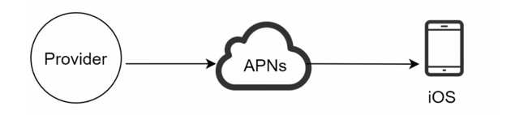
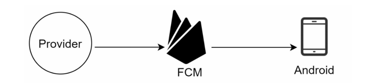
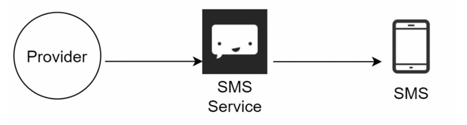
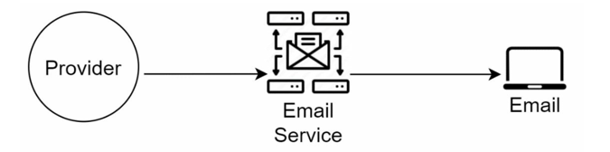
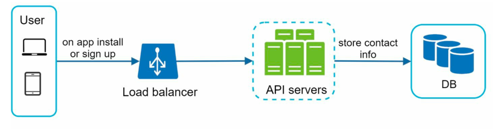

# Design a Notification System

## Introduction

> A notification system is responsible for sending notifications to users through various channels such as email, SMS, and push notifications.

## Step 1: Understand the Requirements

> Q. What type of notifications will the system support?
>
> A. Push notifications, emails, and SMS.

> Q. Is it a real-time notification system or batch processing?
>
> A. It is a soft real-time system. Notifications should be sent ASAP, but slight delays are acceptable.

> Q. What are supported devices/platforms?
>
> A. Ios devices, Android devices, and web browsers(laptop/desktop).

> Q. What triggers the notifications?
>
> A. Notifications can be triggered by client application. Can also be schedule by server-side.

> Q. What many notifications are sent out per day?
>
> A. 10 million mobile push notifications, 1 million SMS msgs, and 5 million emails.

## Step 1: High Level Design

- Our notification system will support following notification types:
  - iOS Push Notification
  - Android Push Notification
  - SMS message
  - Email

- 3 main components:
  - Different types of Notifications
  - Contact info gathering flow
  - Notification sending/receiving flow

### Different Types of Notifications

#### iOS Push Notification
- 3 components needed   
  - **Provider**: Builds and sends notification requests to` Apple Push Notification service (APNs)` by sending following data
    - Device token: Unique identifier for the target device.
    - Payload: The actual notification content (title, body, custom data).
  - **APNs**: Apple's service that routes notifications to iOS devices.
  - **Device**: The iOS device that receives and displays the notification.

---

#### Android Push Notification
- Similar notification flow as iOS
- Instead of APNs, there's `Firebase Cloud Messaging (FCM)` as the intermediary service.

---

#### SMS Message
- SMS uses services like:
  - `Twilio`: 
    - microservices-based, cloud-native system built primarily on AWS.
    - It uses API gateways for request handling, a service mesh for routing between communication services (SMS, Voice, Email, Video), and message queues like Kafka for reliability.
    - Twilio connects to global telecom carriers via SIP/PSTN gateways, ensuring redundancy and low latency.
  - `Nexmo`:
    - cloud-based, microservices-driven communication platform that connects applications to global telecom networks.
    - It uses RESTful APIs and webhooks to handle SMS, Voice, and Verification services.
    - At its core, it runs on AWS, uses API gateways for authentication and routing, and message brokers for reliable delivery.
    - maintains direct SMPP and SIP connections with carriers worldwide for low-latency communication
- Most of them are commercial services that provide APIs to send SMS messages.

---

#### Email
- Companies can set up their own email service.
- But mostly use commercial email services like:
  - `Sendgrid`: 
    - cloud-based, distributed email delivery system designed for high scalability and reliability.
    - It uses microservices hosted on AWS, with API gateways handling authentication and rate limiting.
    - Emails are queued and processed through message brokers (like Kafka or RabbitMQ), then routed to global SMTP relays for delivery.
  - `Mailchimp`:
    - cloud-based, microservices-oriented marketing automation platform built for scalability and personalization.
    - It runs primarily on AWS, using API gateways and RESTful services to manage campaigns, users, and analytics.
    - Mailchimp uses message queues for async processing (email scheduling, tracking),

---

> Summary: Provider -> Third Party Service -> Device/Recipient

### Contact Info Gathering Flow

- To send notifications, we need to gather contact info from users.
- Contact info includes:
  - Email address
  - Phone number
  - Device tokens for push notifications
- This info can be collected during user registration or profile update.
- Store this info securely in a database.

> Note: Email addresses and phone numbers should be verified to ensure they are valid.

---

### Notification Sending/Receiving Flow