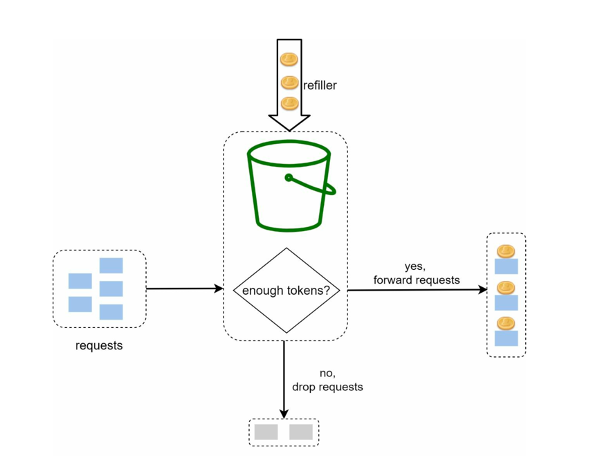
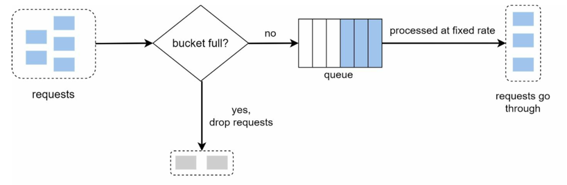
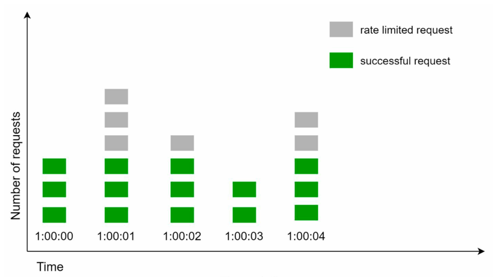

# Rate Limiter: Table of Content

- [Rate Limiter](#rate-limiter)
  - [Need for Rate Limiter](#need-for-rate-limiter)
  - [Step 1: Design Scope](#step-1-design-scope)
  - [Step 2: Propose High Level Design](#step-2-propose-high-level-design)
    - [Q1. Where to place the Rate Limiter?](#q1-where-to-place-the-rate-limiter)
    - [Q2. More guidelines to consider](#q2-more-guidelines-to-consider)
    - [Rate Limiting Algorithms](#rate-limiting-algorithms)
      - [1. Token Bucket Algorithm](#1-token-bucket-algorithm)
      - [2. Leaky Bucket Algorithm](#2-leaky-bucket-algorithm)
      - [Fixed Window Counter](#fixed-window-counter)
      - [Summary - Algorithms](#summary---algorithms)
  - [Articles](#articles)

# Rate Limiter

- A rate limiter is a system that controls the rate at which requests are processed to ensure fair usage and prevent
  overload.
- It is commonly used in APIs, web services, and distributed systems to manage traffic and maintain performance.

## Need for Rate Limiter

- Prevent resource starvation caused by Denial of Service (DoS) attacks.
- Ensure fair usage of resources among multiple clients.
- Reduce Costs by limiting excessive usage.
- Prevent servers from being overwhelmed by too many requests.

## Step 1: Design Scope

- **Correctness**: Accurately limit excessive requests. Should support different set of throttling policies.
- **Low Latency**: The rate limiting process should introduce minimal latency.
- **Server Side Rate Limiting**: Implement rate limiting on the server side to control incoming requests.
- **Scalability**: The system should handle a large number of requests and clients.
- **Distributed Rate Limiting**: The rate limiter can be shared among multiple servers.
- **Exception Handling**: The system should gracefully handle failures and exceptions.
- **High Fault Tolerance**: The system should be resilient to failures and continue to operate under adverse conditions.

---

## Step 2: Propose High Level Design

- Using basic client-server architecture.
- Next important question: Where to place the rate limiter?

### Q1. Where to place the Rate Limiter?

| Type                                                     | Pros                                                                                                                                                                                                                 | Cons                                                                  | Use Cases                                                | Diagrams                                                      | 
|----------------------------------------------------------|----------------------------------------------------------------------------------------------------------------------------------------------------------------------------------------------------------------------|-----------------------------------------------------------------------|----------------------------------------------------------|---------------------------------------------------------------|
| **Client Side Rate Limiting**                            | - Clients are responsible for limiting their own request rates.<br/>- Unreliable as clients can be malicious or misconfigured.                                                                                       | No control over client behavior.                                      | Use only for well-behaved clients, not security.         |                                                               | 
| **Server Side Rate Limiting**                            | - Rate Limiting logic implemented inside microservices.<br/> - Fine-grained (per-user, per-API, per-plan).                                                                                                           | Backend servers already received the request → some wasted resources. | Useful when rate limits depend on domain-specific rules. |             |
| **Rate Limiter Middleware (API Gateway/ Load Balancer)** | - Rate limiter sits before traffic enters backend. <br/>- Protects backend servers from overload. <br/>- Central enforcement → consistent across services.                                                           | Limited flexibility (may not know fine-grained app-level logic).      | Most common placement in real-world systems.             |  |
| **Distributed Shared Store (Redis / Memcached)**         | - Rate limiting counters/tokens stored in Redis or Memcached. <br/>- API Gateway / Service → queries Redis to check limit. <br/>- Works in distributed systems (multiple servers).<br/> Provides global consistency. |                                                                       |                                                          |                                                               |

For this design, we will use a hybrid of `Rate Limiter Middleware` and `Distributed Shared Store`.

### Q2. More guidelines to consider

- Rate limiter placement(server side vs middleware) is dependent on many factors, there is no absolute answer. Consider:
    - Programming Language
    - Cache Service
    - Infrastructure
    - Traffic Patterns
- Identify which rate limiting algorithm to use.
    - Token Bucket
    - Leaky Bucket
    - Fixed Window Counter
    - Sliding Window Log
    - Sliding Window Counter
    - Hybrid Approaches
- If already using microservice architecture, and api gateway is included, then placing rate limiter in api gateway is a
  good choice.
- Building your own rate limiter is complex, consider using existing solutions like Envoy, NGINX, Kong, or cloud
  provider services.

---

### Rate Limiting Algorithms

### 1. Token Bucket Algorithm

Simple, Well understood, commonly used by internet companies (
e.g., [Amazon](#how-amazon-used-token-bucket-for-api-rate-limiting), [Stripe](#stripes-rate-limiting-strategy)).

| **Aspect**            | **Details**                                                                                                                                                                                                                                                                                                                                                                                              |
|-----------------------|----------------------------------------------------------------------------------------------------------------------------------------------------------------------------------------------------------------------------------------------------------------------------------------------------------------------------------------------------------------------------------------------------------|
| **Definition**        | Bucket with fixed capacity that holds tokens.                                                                                                                                                                                                                                                                                                                                                            |
| **How Requests Work** | Each incoming request consumes a token.                                                                                                                                                                                                                                                                                                                                                                  |
| **Refill Mechanism**  | Tokens are added to the bucket at a fixed rate.                                                                                                                                                                                                                                                                                                                                                          |
| **When Bucket Empty** | If no tokens → request is rejected/throttled.                                                                                                                                                                                                                                                                                                                                                            |
| **Parameters**        | - **Bucket size (B)**: max tokens in bucket <br> - **Refill rate (R)**: tokens added per second                                                                                                                                                                                                                                                                                                          |
| **Working**           | **Symbols:** <br> - **B**: bucket capacity (max tokens) <br> - **R**: token refill rate (tokens/sec) <br> - **T**: current tokens in bucket <br><br> **Steps:** <br> 1. Initially, `T = B` (bucket full). <br> 2. On each request: <br>   • If `T > 0` → consume 1 token, request allowed. <br>   • If `T = 0` → request rejected/throttled. <br> 3. Tokens refill at rate `R` until `T = B` (capacity). |
| **Example**           | - B = 10, R = 5/sec. <br> - At t=0, 10 requests arrive → all allowed (T=10→0). <br> - At t=1, bucket refilled with 5 tokens (T=5). <br> - At t=1, 20 requests arrive instantly → 5 allowed (T=5→0), 15 rejected.                                                                                                                                                                                         |
| **Advantage**         | - Allows bursts (better than leaky bucket).<br/>- Easy to implement.<br/>- O(1) check per request.<br/>- Widely used (APIs, CDNs, Cloud).                                                                                                                                                                                                                                                                |
| **Disadvantage**      | - Needs precise timing for refill.<br/>- Requires distributed coordination in multi-server setup.<br/>- Difficult to tune parameters: B and R.                                                                                                                                                                                                                                                           |
| **Use Cases**         | - API rate limiting (per user / per IP). <br> - Network bandwidth shaping (ISP data control). <br> - Distributed systems (fair usage of shared resources).                                                                                                                                                                                                                                               |
| **Code**              | [TokenBucket code](./../../code/rate-limiter-algorithms/TokenBucketLimiter.java)                                                                                                                                                                                                                                                                                                                                |



#### FAQs

| Question # | Question                                                  | Answer                                                                                                                                                                                                                                                                                                                                |
|------------|-----------------------------------------------------------|---------------------------------------------------------------------------------------------------------------------------------------------------------------------------------------------------------------------------------------------------------------------------------------------------------------------------------------|
| 1.         | How many buckets do we need?                              | - Depends on granularity of rate limiting.<br/>- Usually per user, per API key, or per IP address.<br/>- If system allows a max of 10000 requests per second, and we want to limit each user to 100 requests per second, it makes sense to have a global bucket shared by all resources.                                              |
| 2.         | Can the bucket overflow with tokens?                      | No. If new tokens arrive and the bucket is already full, they are discarded.                                                                                                                                                                                                                                                          |
| 3.         | Can Token Bucket support multiple users?                  | Yes, by maintaining a separate bucket per user/client/IP.                                                                                                                                                                                                                                                                             |
| 4.         | How does it differ from Leaky Bucket?                     | - Token Bucket allows bursts — requests are allowed if tokens are available. <br/>- Leaky Bucket enforces a strict constant rate — requests are queued and processed steadily. <br/>- Token Bucket is used for APIs where occasional bursts are fine, while Leaky Bucket is used for network shaping where steady output is critical. |
| 5.         | How to implement in a distributed system?                 | - Use Redis / Memcached to store token counts. <br/>- Use atomic operations (e.g., Redis Lua scripts) to avoid race conditions                                                                                                                                                                                                        |
| 6.         | What if multiple servers are rate limiting the same user? | - Without coordination, limits break. <br/>- Solution: centralized store (Redis) or sharded buckets with consistent hashing.                                                                                                                                                                                                          |
| 7.         | What response is returned when request is rejected?       | Usually HTTP 429 Too Many Requests with optional Retry-After header.                                                                                                                                                                                                                                                                  |

---

### 2. Leaky Bucket Algorithm

[Shopify](#shopifys-rate-limiting-strategy) Uses Leaky Bucket for Rate Limiting.

| **Aspect**        | **Details**                                                                                                                                                                                                         |
|-------------------|---------------------------------------------------------------------------------------------------------------------------------------------------------------------------------------------------------------------|
| **Definition**    | Rate-limiting algorithm where requests enter a bucket (queue) and leave at a constant leak rate. If bucket overflows → requests are dropped.                                                                        |
| **Parameters**    | - **Bucket Capacity (B):** Max requests the bucket (queue) can hold <br> - **Leak Rate (R):** Requests processed per second                                                                                         |
| **Working**       | 1. Requests arrive → added to bucket. <br> 2. Bucket drains at fixed rate `R`. <br> 3. If bucket exceeds capacity → extra requests dropped.                                                                         |
| **Example**       | - B = 10, R = 2/sec. <br> - 12 requests come instantly. <br> - First 10 stored, 2 dropped. <br> - Requests then exit at steady rate (2/sec).                                                                        |
| **Advantages**    | - Smooth constant traffic flow <br> - Simple to implement <br> - Ensures fairness                                                                                                                                   |
| **Disadvantages** | - No bursts allowed.<br/> - Burst of traffic will fill the bucket with old requests, and new requests are rejected <br> - Latency can increase (requests wait in queue) <br> - Extra requests wasted if bucket full |
| **Use Cases**     | - Network routers & ISPs (bandwidth shaping) <br> - Video streaming/VoIP (steady flow required) <br> - Systems prioritizing fairness over bursts                                                                    |
| **Analogy**       | Funnel with a small hole → pour water fast, but it drips out at constant rate. Overflowing water = dropped requests.                                                                                                |
| **Code**          | [LeakyBucket code ](./../../code/rate-limiter-algorithms/LeakyBucketLimiter.java)                                                                                                                                          |



#### FAQs
| Question # | Question                                | Answer                                                                                                          |
|------------|-----------------------------------------|-----------------------------------------------------------------------------------------------------------------|
| 1.         | Why is it called “Leaky Bucket”?        | Because it works like a bucket with a small hole at the bottom: requests flow in, but leak out at a fixed rate. |
| 2.         | What problem does it solve?             | It smooths out bursty traffic by enforcing a constant processing rate, preventing sudden spikes.                |
| 3.         | What happens when bucket is full?       | New incoming requests are dropped/rejected until space becomes available.                                       |
| 4.         | Does it allow bursts?                   | No. All requests are processed at a strict constant rate (unlike Token Bucket, which allows bursts).            | 
| 5.         | Time complexity per request?            | O(1) – simple queue operations (enqueue/dequeue).                                                               | 
| 6.         | Where is it used in real-world systems? | - Routers and ISPs for bandwidth shaping <br> - Streaming services (VoIP, video) where steady flow is required. | 
| 7.         | Does it waste requests?                 | Yes, if the bucket is full, incoming requests are dropped (no waiting allowed beyond capacity).                 |
| 8.         | Is it suitable for distributed systems? | Not ideal for distributed request limiting (like APIs), but great for **traffic shaping in networks**.          | 
---

### Fixed Window Counter

| **Aspect**        | **Details**                                                                                                                                                                                                                                                 |
|-------------------|-------------------------------------------------------------------------------------------------------------------------------------------------------------------------------------------------------------------------------------------------------------|
| **Definition**    | Time is divided into fixed windows (e.g., 1 minute). <br/>A counter tracks the number of requests in the current window. <br/>Requests are allowed until the counter exceeds the threshold.                                                                 |
| **Parameters**    | - **Window Size (W):** Duration of each time window (e.g., 1 min) <br> - **Limit (L):** Max requests allowed per window                                                                                                                                     |
| **Working**       | 1. Track count of requests in the current window. <br> 2. If count ≤ limit → allow request and increment counter. <br> 3. If count > limit → reject request. <br> 4. Counter resets at start of new window.                                                 |
| **Example**       | - W = 1 min, L = 5. <br> - At 12:00:00 → counter resets, allow 5 requests. <br> - At 12:00:30 → if 6th request arrives → rejected. <br> - At 12:01:00 → counter resets, requests allowed again.                                                             |
| **Advantages**    | - Simple to implement <br> - Low memory (just a counter) <br> - Easy to reason about                                                                                                                                                                        |
| **Disadvantages** | - Bursty at boundaries (e.g., 5 requests at 12:00:59 and 5 at 12:01:00 → 10 allowed in 2 seconds) <br> - Not smooth, can overload system briefly and allows spikes at window edges. <br/> - There is no queue or retry mechanism built into this algorithm. |
| **Use Cases**     | - Simple API rate limits (small systems) <br> - When approximate fairness is acceptable <br> - Quick prototyping                                                                                                                                            |
| **Analogy**       | Toll gate allows up to **L cars per minute**. At minute reset, a new set of cars can immediately enter → causing sudden bursts.                                                                                                                             |
| **Code**          | [LeakyBucket code ](./../../code/rate-limiter-algorithms/FixedWindowLimiter.java)                                                                                                                                                                           |

```W = 1 second, L = 3 requests/second```


#### FAQs
| Question # | Question                                     | Answer                                                                                                                                              |
|------------|----------------------------------------------|-----------------------------------------------------------------------------------------------------------------------------------------------------|
| 1.         | Why is it called "fixed window"?             | Because time is divided into non-overlapping fixed intervals (e.g., every 1 minute).                                                                | 
| 2.         | What problem can it cause?                   | Burstiness at window boundaries. Example: if limit=5/min, 5 requests at 12:00:59 + 5 at 12:01:00 = 10 requests in 2 seconds.                        | 
| 3.         | How is it different from Leaky/Token bucket? | - Leaky Bucket: smooth flow, constant drain.<br/>- Token Bucket: allows bursts if tokens available.<br/>- Fixed Window: simple but bursty at edges. |
| 4.         | How to fix burstiness?                       | Use Sliding Window Counter/Log or Token Bucket instead.                                                                                             | 
| 5.         | Time complexity per request?                 | O(1) - just incrementing a counter and checking limit.                                                                                              |
| 6.         | Is it suitable for distributed systems?      | Yes, but requires synchronization (e.g., Redis) to maintain consistent counters across servers.                                                     |

---

### Summary - Algorithms

| Algorithm            | Interview Answer                                                                                                                                                                                                                                                                                                                 |
|----------------------|----------------------------------------------------------------------------------------------------------------------------------------------------------------------------------------------------------------------------------------------------------------------------------------------------------------------------------|
| Token Bucket         | We use a token bucket algorithm where each client has a bucket with max capacity. Tokens are added at a fixed rate and each request consumes a token. At the API Gateway, we check the bucket (stored in Redis for distributed consistency). This allows us to control average request rate while still supporting short bursts. |
| Leaky Bucket         | Leaky Bucket ensures a strict constant rate (smooth flow, no bursts). Token Bucket allows bursts up to a limit, but enforces the average rate.                                                                                                                                                                                   |
| Fixed Window Counter | Fixed Window Counter is easy to implement and works well for simple APIs, but it suffers from burstiness at window boundaries. If fairness and smoothing are critical, Token Bucket or Sliding Window would be better choices.                                                                                                   |
|                      |                                                                                                                                                                                                                                                                                                                                  |
---

## Articles

### [How Amazon used Token Bucket for API Rate Limiting](https://aws.amazon.com/blogs/compute/amazon-api-gateway-helps-customers-throttle-api-calls-to-protect-backend-services/)
### [Stripe's Rate Limiting Strategy](https://stripe.com/blog/rate-limiters)
### [Shopify's Rate Limiting Strategy](https://shopify.dev/docs/api/usage/limits)