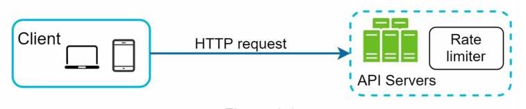
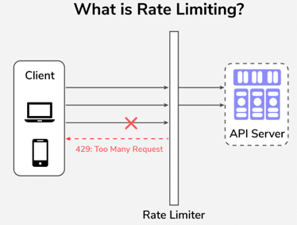

# Rate Limiter

- A rate limiter is a system that controls the rate at which requests are processed to ensure fair usage and prevent
  overload.
- It is commonly used in APIs, web services, and distributed systems to manage traffic and maintain performance.

## Need for Rate Limiter

- Prevent resource starvation caused by Denial of Service (DoS) attacks.
- Ensure fair usage of resources among multiple clients.
- Reduce Costs by limiting excessive usage.
- Prevent servers from being overwhelmed by too many requests.

## Step 1: Design Scope

- **Correctness**: Accurately limit excessive requests. Should support different set of throttling policies.
- **Low Latency**: The rate limiting process should introduce minimal latency.
- **Server Side Rate Limiting**: Implement rate limiting on the server side to control incoming requests.
- **Scalability**: The system should handle a large number of requests and clients.
- **Distributed Rate Limiting**: The rate limiter can be shared among multiple servers.
- **Exception Handling**: The system should gracefully handle failures and exceptions.
- **High Fault Tolerance**: The system should be resilient to failures and continue to operate under adverse conditions.

---

## Step 2: Propose High Level Design

- Using basic client-server architecture.
- Next important question: Where to place the rate limiter?

### Q1. Where to place the Rate Limiter?

| Type                                                     | Pros                                                                                                                                                                                                                 | Cons                                                                  | Use Cases                                                |                                                               | 
|----------------------------------------------------------|----------------------------------------------------------------------------------------------------------------------------------------------------------------------------------------------------------------------|-----------------------------------------------------------------------|----------------------------------------------------------|---------------------------------------------------------------|
| **Client Side Rate Limiting**                            | - Clients are responsible for limiting their own request rates. - Unreliable as clients can be malicious or misconfigured.                                                                                       | No control over client behavior.                                      | Use only for well-behaved clients, not security.         |                                                               | 
| **Server Side Rate Limiting**                            | - Rate Limiting logic implemented inside microservices.  - Fine-grained (per-user, per-API, per-plan).                                                                                                           | Backend servers already received the request → some wasted resources. | Useful when rate limits depend on domain-specific rules. |             |
| **Rate Limiter Middleware (API Gateway/ Load Balancer)** | - Rate limiter sits before traffic enters backend.  - Protects backend servers from overload.  - Central enforcement → consistent across services.                                                           | Limited flexibility (may not know fine-grained app-level logic).      | Most common placement in real-world systems.             |  |
| **Distributed Shared Store (Redis / Memcached)**         | - Rate limiting counters/tokens stored in Redis or Memcached.  - API Gateway / Service → queries Redis to check limit.  - Works in distributed systems (multiple servers).  Provides global consistency. |                                                                       |                                                          |                                                               |

For this design, we will use a hybrid of `Rate Limiter Middleware` and `Distributed Shared Store`.

### Q2. More guidelines to consider

- Rate limiter placement(server side vs middleware) is dependent on many factors, there is no absolute answer. Consider:
    - Programming Language
    - Cache Service
    - Infrastructure
    - Traffic Patterns
- Identify which rate limiting algorithm to use.
    - Token Bucket
    - Leaky Bucket
    - Fixed Window Counter
    - Sliding Window Log
    - Sliding Window Counter
    - Hybrid Approaches
- If already using microservice architecture, and api gateway is included, then placing rate limiter in api gateway is a
  good choice.
- Building your own rate limiter is complex, consider using existing solutions like Envoy, NGINX, Kong, or cloud
  provider services.

### Q3. What are available Rate Limiting Algorithms?

#### 1. Token Bucket Algorithm

- Simple, Well understood, commonly used by internet companies. Both Amazon and Stripe use this algorithm.

