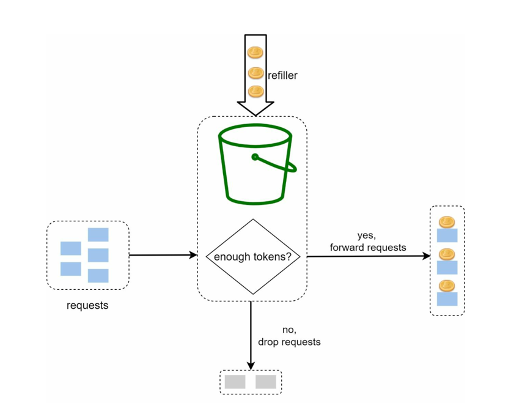

# Rate Limiter

- A rate limiter is a system that controls the rate at which requests are processed to ensure fair usage and prevent
  overload.
- It is commonly used in APIs, web services, and distributed systems to manage traffic and maintain performance.

## Need for Rate Limiter

- Prevent resource starvation caused by Denial of Service (DoS) attacks.
- Ensure fair usage of resources among multiple clients.
- Reduce Costs by limiting excessive usage.
- Prevent servers from being overwhelmed by too many requests.

## Step 1: Design Scope

- **Correctness**: Accurately limit excessive requests. Should support different set of throttling policies.
- **Low Latency**: The rate limiting process should introduce minimal latency.
- **Server Side Rate Limiting**: Implement rate limiting on the server side to control incoming requests.
- **Scalability**: The system should handle a large number of requests and clients.
- **Distributed Rate Limiting**: The rate limiter can be shared among multiple servers.
- **Exception Handling**: The system should gracefully handle failures and exceptions.
- **High Fault Tolerance**: The system should be resilient to failures and continue to operate under adverse conditions.

---

## Step 2: Propose High Level Design

- Using basic client-server architecture.
- Next important question: Where to place the rate limiter?

### Q1. Where to place the Rate Limiter?

| Type                                                     | Pros                                                                                                                                                                                                                 | Cons                                                                  | Use Cases                                                | Diagrams                                                      | 
|----------------------------------------------------------|----------------------------------------------------------------------------------------------------------------------------------------------------------------------------------------------------------------------|-----------------------------------------------------------------------|----------------------------------------------------------|---------------------------------------------------------------|
| **Client Side Rate Limiting**                            | - Clients are responsible for limiting their own request rates. - Unreliable as clients can be malicious or misconfigured.                                                                                       | No control over client behavior.                                      | Use only for well-behaved clients, not security.         |                                                               | 
| **Server Side Rate Limiting**                            | - Rate Limiting logic implemented inside microservices.  - Fine-grained (per-user, per-API, per-plan).                                                                                                           | Backend servers already received the request → some wasted resources. | Useful when rate limits depend on domain-specific rules. |             |
| **Rate Limiter Middleware (API Gateway/ Load Balancer)** | - Rate limiter sits before traffic enters backend.  - Protects backend servers from overload.  - Central enforcement → consistent across services.                                                           | Limited flexibility (may not know fine-grained app-level logic).      | Most common placement in real-world systems.             |  |
| **Distributed Shared Store (Redis / Memcached)**         | - Rate limiting counters/tokens stored in Redis or Memcached.  - API Gateway / Service → queries Redis to check limit.  - Works in distributed systems (multiple servers).  Provides global consistency. |                                                                       |                                                          |                                                               |

For this design, we will use a hybrid of `Rate Limiter Middleware` and `Distributed Shared Store`.

### Q2. More guidelines to consider

- Rate limiter placement(server side vs middleware) is dependent on many factors, there is no absolute answer. Consider:
    - Programming Language
    - Cache Service
    - Infrastructure
    - Traffic Patterns
- Identify which rate limiting algorithm to use.
    - Token Bucket
    - Leaky Bucket
    - Fixed Window Counter
    - Sliding Window Log
    - Sliding Window Counter
    - Hybrid Approaches
- If already using microservice architecture, and api gateway is included, then placing rate limiter in api gateway is a
  good choice.
- Building your own rate limiter is complex, consider using existing solutions like Envoy, NGINX, Kong, or cloud
  provider services.

---

### Rate Limiting Algorithms

### 1. Token Bucket Algorithm

Simple, Well understood, commonly used by internet companies (e.g., Amazon, Stripe).

| **Aspect**            | **Details**                                                                                     |
|-----------------------|-------------------------------------------------------------------------------------------------|
| **Definition**        | Bucket with fixed capacity that holds tokens.                                                   |
| **How Requests Work** | Each incoming request consumes a token.                                                         |
| **Refill Mechanism**  | Tokens are added to the bucket at a fixed rate.                                                 |
| **When Bucket Empty** | If no tokens → request is rejected/throttled.                                                   |
| **Parameters**        | - **Bucket size (B)**: max tokens in bucket   - **Refill rate (R)**: tokens added per second |
| Code                  | [TokenBucket code ](./../../code/rate-limiter-algorithms/TokenBucket.java)                      |

#### Working

| **Symbol** | **Meaning**                            |
|------------|----------------------------------------|
| B          | Bucket capacity (max tokens).          |
| R          | Token refill rate (tokens per second). |
| T          | Current tokens in bucket.              |

- Initially, the bucket is full: `T = B`.
- Each request checks if `T > 0`:
    - If yes → consume 1 token, request allowed.
    - If no → reject/throttle request.
- Tokens refill gradually at rate `R`.
- The bucket never exceeds capacity `B`.

#### Example

| **Time** | **Action**                    | **Tokens Left (T)** | **Result**             |
|----------|-------------------------------|---------------------|------------------------|
| t = 0    | 10 requests arrive            | 10 → 0              | All 10 allowed         |
| t = 1    | Bucket refilled with 5 tokens | 5                   | 5 allowed              |
| t = 1    | 20 requests arrive instantly  | 5 → 0               | 5 allowed, 15 rejected |

#### Advantages

- Allows bursts (better than leaky bucket).
- Easy to implement.
- O(1) check per request.
- Widely used (APIs, CDNs, Cloud).

#### Disadvantages

- Needs precise timing for refill.
- Requires distributed coordination in multi server setup.
- Difficult to set tune parameters: B and R.

#### Use Cases

- API rate limiting (per user / per IP).
- Network bandwidth shaping (ISP data control).
- Distributed systems (fair usage of shared resources).

#### FAQs

| Question # | Question                                                  | Answer                                                                                                                                                                                                                                                                                                                                |
|------------|-----------------------------------------------------------|---------------------------------------------------------------------------------------------------------------------------------------------------------------------------------------------------------------------------------------------------------------------------------------------------------------------------------------|
| 1.         | How many buckets do we need?                              | - Depends on granularity of rate limiting. - Usually per user, per API key, or per IP address. - If system allows a max of 10000 requests per second, and we want to limit each user to 100 requests per second, it makes sense to have a global bucket shared by all resources.                                              |
| 2.         | Can the bucket overflow with tokens?                      | No. If new tokens arrive and the bucket is already full, they are discarded.                                                                                                                                                                                                                                                          |
| 3.         | Can Token Bucket support multiple users?                  | Yes, by maintaining a separate bucket per user/client/IP.                                                                                                                                                                                                                                                                             |
| 4.         | How does it differ from Leaky Bucket?                     | - Token Bucket allows bursts — requests are allowed if tokens are available.  - Leaky Bucket enforces a strict constant rate — requests are queued and processed steadily.  - Token Bucket is used for APIs where occasional bursts are fine, while Leaky Bucket is used for network shaping where steady output is critical. |
| 5.         | How to implement in a distributed system?                 | - Use Redis / Memcached to store token counts.  - Use atomic operations (e.g., Redis Lua scripts) to avoid race conditions                                                                                                                                                                                                        |
| 6.         | What if multiple servers are rate limiting the same user? | - Without coordination, limits break.  - Solution: centralized store (Redis) or sharded buckets with consistent hashing.                                                                                                                                                                                                          |
| 7.         | What response is returned when request is rejected?       | Usually HTTP 429 Too Many Requests with optional Retry-After header.                                                                                                                                                                                                                                                                  |

---

### 2. Leaky Bucket Algorithm

### Summary - Algorithms

| Algorithm    | Interview Answer                                                                                                                                                                                                                                                                                                                 |
|--------------|----------------------------------------------------------------------------------------------------------------------------------------------------------------------------------------------------------------------------------------------------------------------------------------------------------------------------------|
| Token Bucket | We use a token bucket algorithm where each client has a bucket with max capacity. Tokens are added at a fixed rate and each request consumes a token. At the API Gateway, we check the bucket (stored in Redis for distributed consistency). This allows us to control average request rate while still supporting short bursts. | 