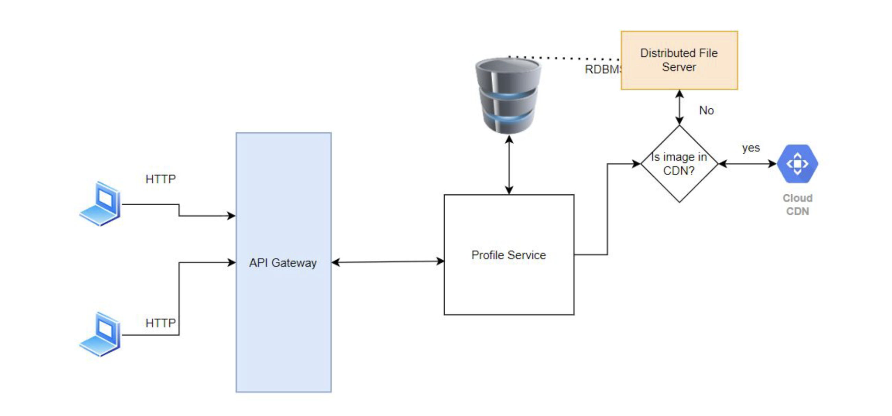
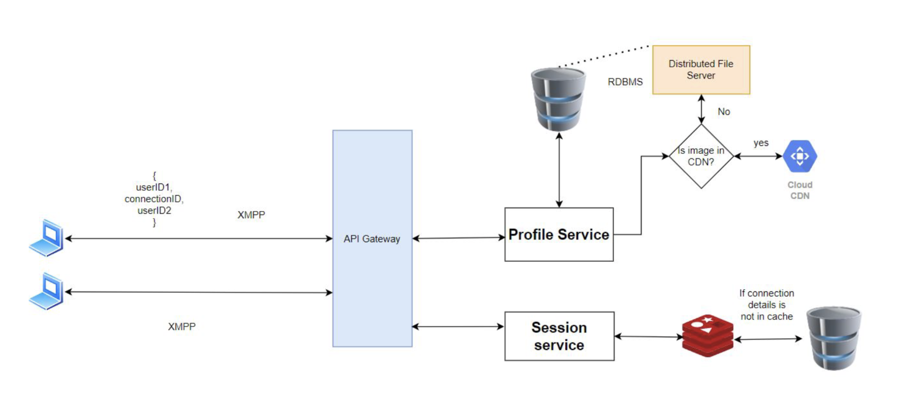
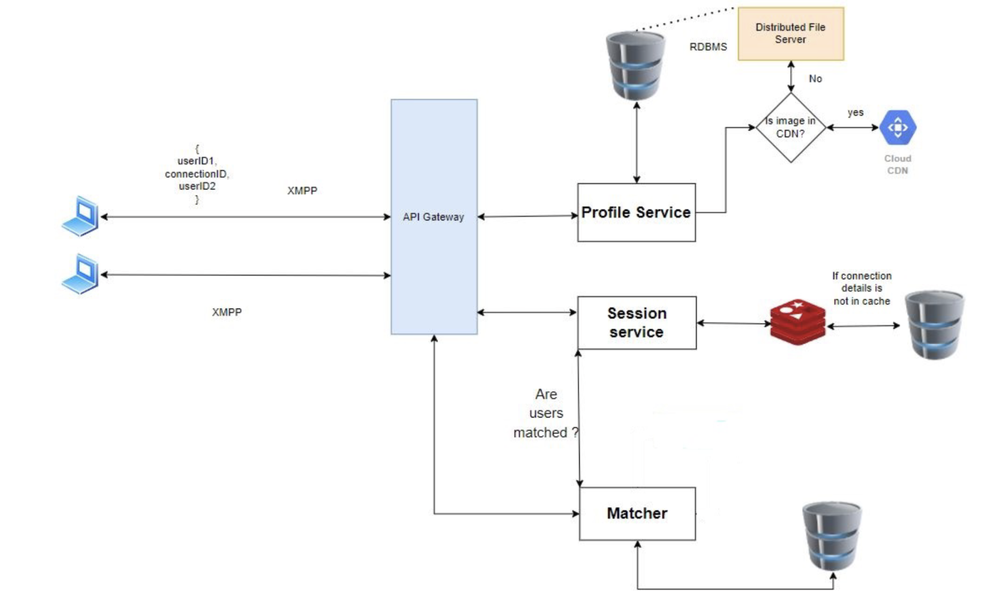

# Tinder

## Requirement

- Storing Profiles
- Recommend Profiles
- Note Matches
- Direct Messaging

## Tinder Feature breakdown

### Image Storing

How images are stored in DB. If we assume there are 5 images uploaded per user. Its a large number.

#### File vs Blob (Binary Large Object)

 > Features provided by database when store images as BLOB

| Feature | Requirement | 
| ------- | ----------- |
| Mutability |  When we store an image as a BLOB in database we can change its value. However, this is useless as because an update on image is not going to be a few bits. We can simply create a new image file. |
| Transaction Guarantee | We are not going to do an atomic operation on the image. So this feature is useless. | 
| Indexes | We are not going to search image by its content (which is just O's and 1's) so, this is useless. | 
| Access control | Storing images as BLOB's in database provides us access control, but we can achieve the same mechanisms using the file system. |

#### Why file is better
- File is cheaper
- faster as store large files seperately
- Use CDNs for faster access, since files are static
- Store File url in DB
> We Use Distributed File System

### Profile Creation, authentication

- First the system should allow a new user to create an account and once the account has been created then it needs to provide the user with an authentication token. 
- This token will be used by the API gateway to validate the user.
- System needs to store profile name, age, location and description in a relational database. However, there are 2 ways to store images.
  - We can store images as file in File systems
  - We can store images as BLOB in databases.

#### Components Required

- API Gateway Service
- DFS Image Storing
- Relational Database for User details

---

### One to One Chat Messaging

- System should allow one to one chat messaging between two users if and only if they have matched. So we have to connect one client to another.
- To achieve this we use XMPP protocol that allows peer to peer communication.
  - Direct Messaging or chatting with matches can be done using the XMPP protocol, which uses web sockets to have peer to peer communications between client and server. 
  - Each connection is built over TCP, ensuring that the connection is maintained. 

#### Components required
- Relational database
  - We will use this database to store the user ID and connection ID
- Cache
  - We do not want to access database every time a client sends a message, so we can use a cache to store the user ID and connection ID.

#### Trade-offs

- Use of HTTP for chat v/s Use of XMPP for one to one messaging

  - When we use HTTP XMPP we can only message from client to server. The only way we can allow messaging is by constantly sending request to server to check if there is any new message (polling).

  - XMPP is a peer to peer protocol that allows client and server to send messages to each other.

  - As we do not need to constantly send requests to sever, using XMPP will be more efficient.

---

### Matched Users Data

- Server should store the following information
  - Users who have matched (both have right swiped each other)
  - One or both the users have left swiped each other.
- This service would also allow the chat service to check if the users are matched and then allow one to one chat messaging.

#### Components required
- Relational database
  - We will use this database to store the user IDs of both the user
  - We will use indexes on the user ID to make queries faster.
  - 
#### Trade-offs
- Storing match details on the client v/s Storing match details on the server
  - One benefit of storing the match details on the client we save storage on the server side.
  However, as we are storing only the user IDs it is not significant.
  - If we store match data on client side then all data is lost when user uninstalls the applications but if we store it on the server then the data is not lost.
  - Benefit of storing the details on the server side is that it becomes a source of truth. And as the details on the server cannot be tampered so, it is more secure.
  - So we store the relevant details on the server side

----