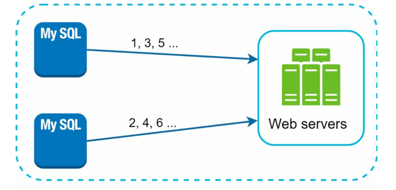
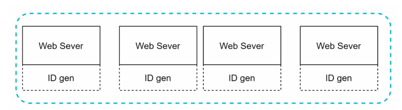
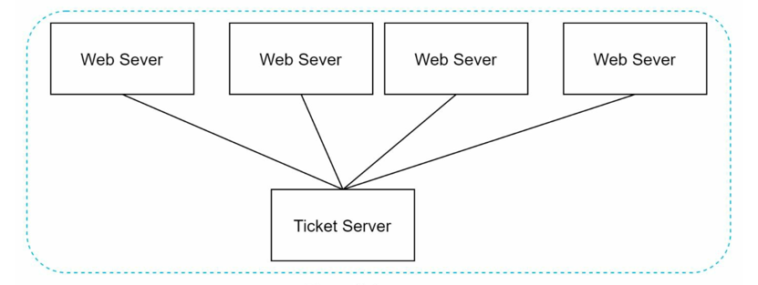
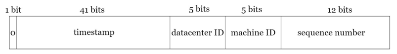

# Unique ID generator

A service or algorithm that generates globally unique identifiers across distributed systems.
- Properties can vary:
  - Globally unique (no collisions). 
  - K-sortable (IDs roughly increase with time → helps in DB sharding). 
  - Compact (smaller than UUIDs for efficiency). 
  - Stateless vs Stateful depending on design.
  

> A naive approach is to use a primary key in a central database with auto-increment. But this creates a bottleneck and single point of failure.

## Problem Statement
- In large-scale distributed systems, every entity (user, order, transaction, message, etc.) needs a unique identifier.
- Challenges:
  - **Collisions**: If multiple nodes generate IDs independently, they might overlap. 
  - **Scalability**: Must support billions of IDs efficiently. 
  - **Ordering**: Sometimes we need time-ordered IDs (e.g., Kafka offsets, Twitter Snowflake). 
  - **Availability**: System should not depend on a single machine or DB auto-increment (bottleneck, SPOF). 
  - **Low latency**: ID generation must be very fast, ideally <1ms.

## Step 1: Understand Requirements and Design Scope

> Q. What are characteristics of the unique IDs?
> 
> A. IDs must be globally unique and k-sortable (k: number of servers).

> Q. For each new record, does ID increment by 1?
> 
> A. The ID increments by timestamp, not by 1. IDs should be ordered by date.

> Q. Do IDs only contain numbers, or can they include letters/symbols?
> 
> A. IDs are only numeric.

> Q. What is the expected scale of ID generation (e.g., number of IDs per second)?
> 
> A. The system should handle up to 10,000 ID requests per second.

### Requirements
- IDs must be unique across distributed systems.
- IDs should be k-sortable (roughly ordered by date).
- IDs should be numeric.
- The system should handle up to 10,000 ID requests per second.
- IDs should fit within 64 bits.
- The system should be highly available and fault-tolerant.
- The system should have low latency (ID generation should be <1ms).

## Step 2: High-Level Design
We have multiple options to design a unique ID generator.

| Option                                            | Description                                                                                                                                                                                                                                                                 | Diagram(if any)         | Pros                                                                                                         | Cons                                                                                                                                           |
|---------------------------------------------------|-----------------------------------------------------------------------------------------------------------------------------------------------------------------------------------------------------------------------------------------------------------------------------|-------------------------|--------------------------------------------------------------------------------------------------------------|------------------------------------------------------------------------------------------------------------------------------------------------|
| Multi-Master Replication                          | - A system where multiple masters (nodes) can generate IDs concurrently.  - Each master has a guaranteed unique range or namespace, avoiding collisions. - Replication ensures consistency of state if ranges or configurations change.                             |      | - Solves scalibility issue, since IDs can scale with number of nodes.                                        | - Hard to scale with multi data centers - IDs are not time ordered                                                                     |
| UUID                                              | - 128-bit identifier. - Generated using algorithms that ensure uniqueness across space and time. - No central coordination needed. - Each node can have its own ID generator                                                                                    |  | - Simple to implement. - No central point of failure.   - ID generator can easily scale with servers | - Not k-sortable. - Larger size (128 bits). - Not numeric                                                                              |
| Ticket Server [Flickr](#ticket-servers-at-flickr) | - A centralized server that generates IDs. - Clients request IDs from this server. - The server ensures uniqueness and ordering.                                                                                                                                    |  | - Numeric IDs  - IDs are k-sortable. - Works for small to medium scale applications                  | - Single point of failure.(Multiple instances can be setup, but data synchronization is a challenge)  - Scalability issues with high load. |
| Snowflake [Twitter](#twitter-snowflake)           | - A distributed ID generation system. - Instead of generating the ID directly, divide ID into different sections - Combines timestamp, datacenter ID, machine ID, and sequence number to create a unique 64-bit ID. - Each node can generate IDs independently. |  | - Numeric IDs  - IDs are k-sortable. - Highly scalable and fault-tolerant. - Low latency.        | - More complex to implement. - Requires careful configuration of machine IDs to avoid collisions.                                          |

### Twitter Snowflake Design
- Snowflake is a 64-bit unique ID generation algorithm developed by Twitter.
- Provides:
  - Global uniqueness. 
  - Time ordering. 
  - High throughput (millions of IDs/sec).
- Components of the 64-bit ID:
  - `Sign Bit`: always 0. For future use.
  - `Timestamp`: 41 bits for milliseconds since a custom epoch (Use twitter snowflake default epoch. gives ~69 years of IDs).
  - `Datacenter ID`: 5 bits (supports up to 32 datacenters).
  - `Machine ID`: 5 bits (supports up to 32 machines per datacenter).
  - `Sequence Number`: 12 bits (supports 4096 IDs per machine per millisecond). The sequence number is incremented by 1 and resets to 0 every millisecond. 

- Datacenter ID and Machine ID can be configured via environment variables or configuration files, setup at startup time and are fixed for the lifetime of the service instance.
- If a machine restarts, it must ensure it uses the same Machine ID to avoid collisions.
- Timestamp and Sequence Number are generated at runtime.
- Timestamp is the part that makes IDs sortable by time.
- Sequence Number allows multiple IDs to be generated within the same millisecond. In theory a machine can generate up to 4096 IDs per millisecond. If the sequence number exceeds 4095 within the same millisecond, the generator must wait until the next millisecond to continue generating IDs.

## Follow Ups
### 1. **Clock Synchronization**: 
   - In our design, we assume ID generation servers have the same clock. 
   - This assumption might not be true when a server is running on multiple cores. 
   - The same challenge exists in multi-machine scenarios. 
   - How to handle clock drift between machines? (Use NTP for clock synchronization. If a machine's clock goes backward, it should wait until the clock catches up to avoid generating duplicate IDs.)

### 2. **Section Length Tuning**:
   - For example, fewer sequence numbers but more timestamp bits are effective for low concurrency and long-term applications.
   - Low concurrency Application (e.g., moderate-traffic SaaS, financial records, IoT logs): 
     - Don’t need to generate millions of IDs/sec. 
     - So they can afford fewer sequence bits. 
     - Benefit: More timestamp bits → IDs remain valid for decades/centuries.
   - High concurrency applications (e.g., Twitter, TikTok, large-scale e-commerce):
     - Need thousands of IDs/ms per node. 
     - So they need more sequence bits (12–14). 
     - Sacrifice timestamp lifespan → maybe only ~50–70 years, but that’s acceptable.
### 3. Handling Machine Failures:
   - If a machine goes down and comes back up, it must ensure it uses the same Machine ID to avoid collisions.
   - If a machine is permanently decommissioned, its Machine ID can be reused after a safe period (e.g., after the maximum timestamp duration).
### 4. High availability:
   - Since an ID generator is a mission-critical system, it must be highly available.
   - Deploy multiple instances behind a load balancer.
### 5. Choosing ID structure depending on requirements (uniqueness only vs time-ordering).
| Criteria                  | **UUID (v4)**                            | **Hash-based (MD5/SHA-1)**      | **Snowflake**                   | **ULID**                           | **DB Auto-Increment (Sharded)**      |
| ------------------------- | ---------------------------------------- | ------------------------------- | ------------------------------- | ---------------------------------- | ------------------------------------ |
| **Uniqueness**            | ✅ Very high (128-bit, random)            | ✅ Deterministic per content     | ✅ Guaranteed (via node+seq)     | ✅ Very high (time+rand)            | ✅ Guaranteed within shard            |
| **Time Ordering**         | ❌ None                                   | ❌ None                          | ✅ Strong (timestamp bits)       | ✅ Strong (lexicographic)           | ✅ Weak (approximate, shard-based)    |
| **Size**                  | 128-bit (16B)                            | 128–160-bit                     | 64-bit (8B)                     | 128-bit (16B)                      | 64-bit (8B)                          |
| **Readability (compact)** | ❌ Long string                            | ❌ Long string                   | ✅ Compact (int64)               | ❌ Long (26 chars)                  | ✅ Compact (int64)                    |
| **Coordination Needed**   | ❌ None                                   | ❌ None                          | ⚠️ Yes (unique machine IDs)     | ❌ None                             | ⚠️ Yes (shard offsets)               |
| **Collision Risk**        | Negligible                               | None (same input → same ID)     | None                            | Negligible                         | None within shard                    |
| **Ordering Stability**    | ❌ Random                                 | ❌ Random                        | ✅ Time-based                    | ✅ Time-based                       | ⚠️ Only within shard                 |
| **Best Use Cases**        | Session IDs, cache keys, security tokens | File deduplication, content IDs | Tweet IDs, orders, events, logs | DB keys, logs, distributed systems | Legacy systems, small-scale sharding |

## References/Articles

#### [Ticket Servers at Flickr](https://code.flickr.net/2010/02/08/ticket-servers-distributed-unique-primary-keys-on-the-cheap/)
#### [Twitter Snowflake](https://blog.x.com/engineering/en_us/a/2010/announcing-snowflake)