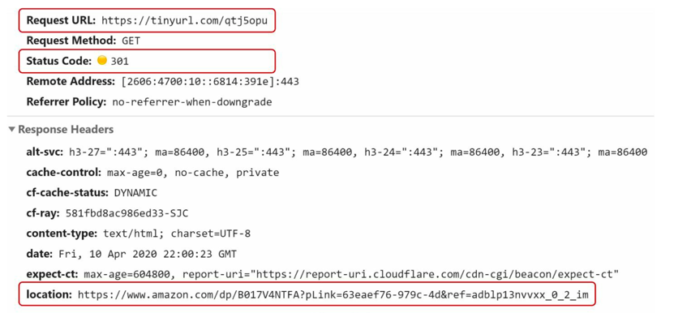
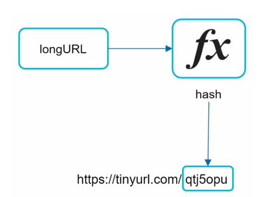

# URL Shortener

A URL shortener is a service that takes a long URL and converts it into a shorter, more manageable URL. This is often used for sharing links on social media, in emails, or in text messages where space is limited.

## Step 1: Understanding the Problem and design scope

> Q. Can you give an example of a URL shortening service?
>
> A. Assume URL https://www.systeminterview.com/q=chatsystem&c=loggedin&v=v3&l=long is the original
URL. Your service creates an alias with shorter length: https://tinyurl.com/ y7keocwj. If you
click the alias, it redirects you to the original URL.

> Q. What is the traffic volume?
>
> A. 100 million URLs are generated per day.

> Q. How long is the shortened URL?
>
> A. As short as possible.

> Q. What characters are allowed in the shortened URL?
>
> A. Shortened URL can be a combination of numbers (0-9) and characters (a-z, A- Z). 62 characters in total.

> Q. Can shortened URLs be deleted or updated?
>
> A. For simplicity, let us assume shortened URLs cannot be deleted or updated.

### Requirements

- URL shortening: given a long URL => return a much shorter URL
- URL redirecting: given a shorter URL => redirect to the original URL
- High availability, scalability, and fault tolerance considerations

### Estimations
- Number of URLs per day (write operations) : 100 million generated per day
- Write Operations: 100 million / 24 / 60 / 60 = 1157  ~ 1160 writes per second
- Read Operations: Assume 10 times more read operations than write operations = 11570  ~ 11600 reads per second
- Assuming URL shortening service is used for 10 years
  - 100 million * 365 * 10 = 365 billion URLs in total
- Storage: 
  - Assume average URL length is 100 characters. 
  - Each character takes 1 byte. 
  - Each URL mapping takes 200 bytes (100 bytes for long URL + 100 bytes for short URL). 
  - Total storage over 10 years = 365 billion * 200 bytes * 10 years = 730 TB.

## Step 2: High-Level Design

- In HLD for URL shortener, we will focus on the following components:
  - API endpoints
  - URL redirecting
  - URL shortening
  - Data Model

### API Endpoints

- Facilitate the interaction between clients and the URL shortening service.
- APIs will be designed REST-style for simplicity and ease of use.
- Two APIs are needed:
  - URL Shortening API
    - `POST api/v1/shorten`
    - Request Body: `{ "longUrl": "https://www.example.com/very/long/url" }`
    - Response Body: `{ "shortUrl": "https://tinyurl.com/abc123" }`
  - URL redirecting API
    - `GET api/v1/{shortUrl}`
    - Path Parameter: `shortUrl` (e.g., "https://tinyurl.com/abc123")
    - Response: HTTP 301/302 redirect to the original long URL

### URL Redirecting

- When a user clicks on a shortened URL, the service needs to redirect them to the original long URL.
- Once a server receives a tinyurl request, it changes the short URL to long URL with 301/302 redirect.

    

#### Detailed communication flow for URL redirecting

1. User clicks on a shortened URL (e.g., `https://tinyurl.com/abc123`).
2. Servers receive the request and redirect back with 301/302 and the original long URL.

    

#### 301 vs 302 Redirect

- `301 Moved Permanently`: 
  - Indicates that the resource has been permanently moved to a new URL. 
  - Search engines caches the response and subsequent requests for same URL wont be sent to URL shortening service.
  - Instead, requests are redirected to the new URL directly.
  - Use case: 
    - When you are sure that the URL will never change again.
    - Want to reduce server load and improve performance by allowing clients to cache the redirection.
- `302 Found (Temporary Redirect)`:
  - Indicates that the resource is temporarily located at a different URL.
  - Search engines do not cache the response and will continue to send requests to the original URL shortening service first.
  - Then they redirect to long URL.
  - Use case: 
    - When the URL might change again in the future.
    - Want to ensure that clients always check with the server for the latest URL.
    - Better analytics tracking since all requests go through the URL shortening service.

### Data model

- Most intuitive way is to use hash tables. 
- Hash tables store `<shortURL, longURL>` pairs, URL redirecting can be implemented easily.
  - GET longURL: `longURL = hashTable.get(shortURL)`
  - Once you get longURL, perform the URL redirect

### URL Shortening

- Let us assume short URL: `www.tinyurl.com/{hashValue}`
- We must find a hash function _fx_ that maps a long URL to _hashValue_\

    

- The hash function must abide:
  - Each _longURL_ must be hashed to one _hashValue_
  - Each _hashValue_ can be mapped back to _longURL_

## Step 3: Design Deep Dive