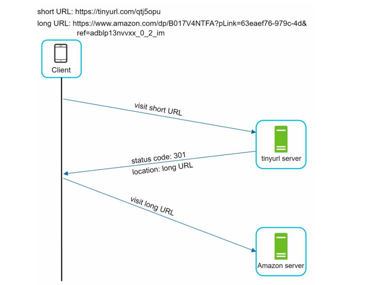

# URL Shortener: Table of Content

# URL Shortener

A URL shortener is a service that takes a long URL and converts it into a shorter, more manageable URL. This is often used for sharing links on social media, in emails, or in text messages where space is limited.

## Step 1: Understanding the Problem and design scope

> Q. Can you give an example of a URL shortening service?
>
> A. Assume URL https://www.systeminterview.com/q=chatsystem&c=loggedin&v=v3&l=long is the original
URL. Your service creates an alias with shorter length: https://tinyurl.com/ y7keocwj. If you
click the alias, it redirects you to the original URL.

> Q. What is the traffic volume?
>
> A. 100 million URLs are generated per day.

> Q. How long is the shortened URL?
>
> A. As short as possible.

> Q. What characters are allowed in the shortened URL?
>
> A. Shortened URL can be a combination of numbers (0-9) and characters (a-z, A- Z). 62 characters in total.

> Q. Can shortened URLs be deleted or updated?
>
> A. For simplicity, let us assume shortened URLs cannot be deleted or updated.

### Requirements

- URL shortening: given a long URL => return a much shorter URL
- URL redirecting: given a shorter URL => redirect to the original URL
- High availability, scalability, and fault tolerance considerations

### Estimations
- Number of URLs per day (write operations) : 100 million generated per day
- Write Operations: 100 million / 24 / 60 / 60 = 1157  ~ 1160 writes per second
- Read Operations: Assume 10 times more read operations than write operations = 11570  ~ 11600 reads per second
- Assuming URL shortening service is used for 10 years
  - 100 million * 365 * 10 = 365 billion URLs in total
- Storage: 
  - Assume average URL length is 100 characters. 
  - Each character takes 1 byte. 
  - Each URL mapping takes 200 bytes (100 bytes for long URL + 100 bytes for short URL). 
  - Total storage over 10 years = 365 billion * 200 bytes * 10 years = 730 TB.
---
## Step 2: High-Level Design

- In HLD for URL shortener, we will focus on the following components:
  - API endpoints
  - URL redirecting
  - URL shortening
  - Data Model

### API Endpoints

- Facilitate the interaction between clients and the URL shortening service.
- APIs will be designed REST-style for simplicity and ease of use.
- Two APIs are needed:
  - URL Shortening API
    - `POST api/v1/shorten`
    - Request Body: `{ "longUrl": "https://www.example.com/very/long/url" }`
    - Response Body: `{ "shortUrl": "https://tinyurl.com/abc123" }`
  - URL redirecting API
    - `GET api/v1/{shortUrl}`
    - Path Parameter: `shortUrl` (e.g., "https://tinyurl.com/abc123")
    - Response: HTTP 301/302 redirect to the original long URL

### URL Redirecting

- When a user clicks on a shortened URL, the service needs to redirect them to the original long URL.
- Once a server receives a tinyurl request, it changes the short URL to long URL with 301/302 redirect.

    

#### Detailed communication flow for URL redirecting

1. User clicks on a shortened URL (e.g., `https://tinyurl.com/abc123`).
2. Servers receive the request and redirect back with 301/302 and the original long URL.

    

#### 301 vs 302 Redirect

- `301 Moved Permanently`: 
  - Indicates that the resource has been permanently moved to a new URL. 
  - Search engines caches the response and subsequent requests for same URL wont be sent to URL shortening service.
  - Instead, requests are redirected to the new URL directly.
  - Use case: 
    - When you are sure that the URL will never change again.
    - Want to reduce server load and improve performance by allowing clients to cache the redirection.
- `302 Found (Temporary Redirect)`:
  - Indicates that the resource is temporarily located at a different URL.
  - Search engines do not cache the response and will continue to send requests to the original URL shortening service first.
  - Then they redirect to long URL.
  - Use case: 
    - When the URL might change again in the future.
    - Want to ensure that clients always check with the server for the latest URL.
    - Better analytics tracking since all requests go through the URL shortening service.

### Data model

- Most intuitive way is to use hash tables. 
- Hash tables store `<shortURL, longURL>` pairs, URL redirecting can be implemented easily.
  - GET longURL: `longURL = hashTable.get(shortURL)`
  - Once you get longURL, perform the URL redirect

### URL Shortening

- Let us assume short URL: `www.tinyurl.com/{hashValue}`
- We must find a hash function _fx_ that maps a long URL to _hashValue_\

    

- The hash function must abide:
  - Each _longURL_ must be hashed to one _hashValue_
  - Each _hashValue_ can be mapped back to _longURL_
---
## Step 3: Design Deep Dive

### Data Model

- Until now everything is stores in Hash tables.
- Good starting point. But, not feasible for real world systems as memory resources are limited and expensive.

- A better option is to store `<shortURL, longURL>` mapping in a relational database.
- Simplified version of table contains _id_, _shortURL_, _longURL_.

    
---
### Hash Function
- The hashValue consists of characters from [0-9, a-z, A-Z] -> 10 + 26 + 26 = 62 characters
- To figure out the length of hashValue, find smallest `n`, such that 62n >= 365 billion (system must support 365 billion records. refer [estimations](#estimations))
- with `n=7`, 627 ~ 3.5 trillion.
- so the length of hashValue is 7.
- Options for hash function include:
  - Hash + collision resolution
  - Counter + base62 encoding

#### Hash + Collision resolution
- To shorten the long URL, we nee dto implement a hash function that hashes a long URL to 7-character string.
- Following are the available hash functions:
  
  | Aspect                            | CRC32                                                  | MD5                                                                                      | SHA-1                                                       |
  |-----------------------------------|--------------------------------------------------------|------------------------------------------------------------------------------------------|-------------------------------------------------------------|
  | **Output Size**                   | 32-bit (4 bytes)                                       | 128-bit (16 bytes)                                                                       | 160-bit (20 bytes)                                          |
  | **Hash Length (Hex)**             | 8 hex chars                                            | 32 hex chars                                                                             | 40 hex chars                                                |
  | **Security**                      | Weak (not secure, easily reversible collisions)        | Broken (collision attacks possible)                                                      | Broken (collision attacks possible)                         |
  | **Speed**                         | Very Fast                                              | Fast                                                                                     | Slower than MD5, but still fast                             |
  | **Collision Probability**         | High (only 2³² space, \~4B values)                     | Lower than CRC32 but collisions still possible                                           | Lower than MD5 but still possible                           |
  | **Suitability for URL Shortener** | Not ideal (too small hash space → collisions at scale) | Better (can truncate safely to 7 chars with acceptable collision risk for smaller scale) | Even better (more entropy, can truncate to 7 chars safely)  |
  | **Use Case Fit**                  | Small-scale, low concurrency                           | Medium-scale apps (shortener with millions of URLs)                                      | Large-scale apps (billions of URLs, higher uniqueness need) |

- None of them have a character size of 7.
- MD5 or SHA-1, when truncated, provide much larger entropy → better uniqueness for URL shortener.
- How to make it shorter?
  - Collect first 7 characters -> Leads to collisions
- how to handle collision?
  - We can recursively append a new predefined string until no more collision is discovered. Check the diagram below
  - 
- This method can eliminate collision. 
- Problem? 
  - Database queries are expensive.
- Solution:
  - [Bloom Filters](#bloom-filters) can improve performance. A bloom filter is a probabilistic data structure used to test whether an element is a member of a set.
  - Can return:
    - Definitely not present 
    - Possibly present (with some false positive probability)
  - Uses bit array + multiple hash functions.

#### Base62 conversion
- Base conversion helps you convert the same number between its different number representation systems.
- Base62 is used here as there are 62 possible characters for _hashValue_.
- How this works?
  - Representation
    - Digits: 0–9 (10)
    - Uppercase letters: A–Z (26)
    - Lowercase letters: a–z (26)
  - Converts numeric values → short alphanumeric strings.
- Example: ID = 11157
- 
- Thus, shortURL is https://tinyurl.com/2TX

#### Hash + collision resolution vs base62
| Aspect                  | Hash + Collision Resolution                                          | Base62 Conversion                                                               |
|-------------------------|----------------------------------------------------------------------|---------------------------------------------------------------------------------|
| **Short URL length**    | Fixed short URL length.                                              | Short URL length is not fixed, grows with the ID.                               |
| **Unique ID generator** | Does not need a unique ID generator.                                 | Depends on a unique ID generator.                                               |
| **Collision handling**  | Collision is possible and must be resolved.                          | Collision is impossible because ID is unique.                                   |
| **Predictability**      | Impossible to figure out the next short URL (does not depend on ID). | Easy to figure out next short URL if ID increments by 1 → **security concern**. |
| **Use case**            | Best for: Public-facing shorteners (e.g., bit.ly, tinyurl).          | Best for: Enterprise/internal tools, low-security use cases.                    |

---
### URL Shortening: Deep Dive

- URL Shortening logic should be logically simple and functional.
- Base 62 conversion used.
- Flow
  1. longURL is the input.
  2. The system checks if the longURL is in the database.
  3. If it is, it means the longURL was converted to shortURL before. In this case, fetch the
     shortURL from the database and return it to the client.
  4. If not, the longURL is new. A new unique ID (primary key) is generated by the unique
     ID generator.
  5. Convert the ID to shortURL with base 62 conversion.
  6. Create a new database row with the ID, shortURL, and longURL.

#### Canonicalization: 
- converting different textual representations of the same webpage into one consistent, normalized form
- Before storing longURL in the database, it is important to canonicalize it to ensure that
  different representations of the same URL are treated as identical.
- For example, the following URLs should be considered the same:
  - `http://example.com`
  - `http://www.example.com`
  - `https://example.com/`
- Canonicalization steps may include:
1. Parse the input URL 
2. Lowercase the scheme and host 
3. Remove default ports 
4. Normalize the path (remove trailing slash, resolve dots)
5. Remove fragments 
6. Remove tracking parameters (optional but common)
7. Sort query parameters (optional)
8. Reconstruct the cleaned URL 
9. Compute SHA-256 hash of the canonical URL 
10. Use this hash for:
    - idempotency checks
    - duplication prevention
- Benefits
  - Idempotency: Same canonical URL → same short key.
  - Storage Optimization: Avoid storing thousands of duplicate entries.
  - Performance: Hash lookups become reliable and consistent.
  - Security: Prevents malicious fragment tricks and unnecessary noise.

- [Unique ID generator](./../unique-id-generator/main.md) -> generate globally unique IDs (Design from Distributed System perse)

---

### URL Redirecting: Deep Dive
- As there are more reads than writes, url mapping is stored in cache to improve performance.
- Load balancer is added to handle request.
- Flow:
  1. A user clicks a short URL link: https://tinyurl.com/zn9edcu
  2. The load balancer forwards the request to web servers.
  3. If a shortURL is already in the cache, return the longURL directly.
  4. If a shortURL is not in the cache, fetch the longURL from the database. If it is not in the
     database, it is likely a user entered an invalid shortURL.
  5. The longURL is returned to the user.

## Follow-Ups

1. [Rate Limiter](./../rate-limiter/main.md): A potential security problem we could face is that malicious users send an
   overwhelmingly large number of URL shortening requests. Rate limiter helps to filter out
   requests based on IP address or other filtering rules. 
2. Web server scaling: Since web tier is stateless, it is easy to scale by adding or removing web servers.
3. Database Scaling: Database replication and sharding are common techniques.
4. Availability: Use CSN to store mappings close to users globally.
5. Analytics: Data is increasingly important for business success. Integrating an analytics
   solution to the URL shortener could help to answer important questions like how many
   people click on a link? When do they click the link? etc.
6. How to handle custom aliases?
   - Allow users to specify their own custom short URLs.
   - Validate that the custom alias is unique and does not conflict with existing short URLs.
   - Update the database schema to accommodate custom aliases.

## Reference

#### [Bloom Filters](https://en.wikipedia.org/wiki/Bloom_filter)