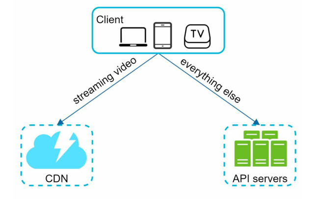
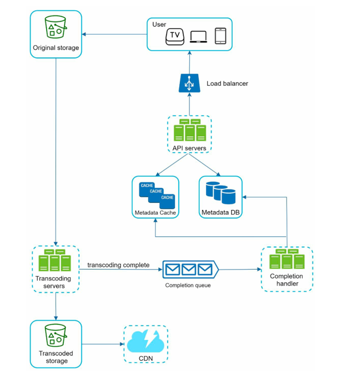
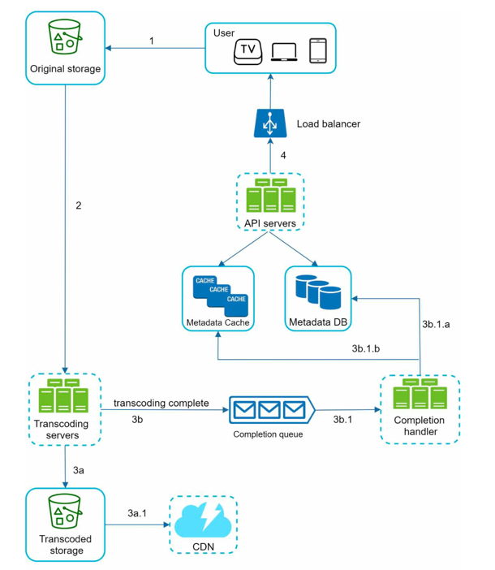
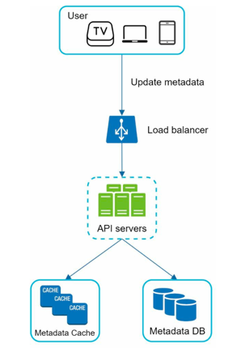

# Design Youtube-like Video Streaming Service

This problem is designing a video sharing/streaming service and can be applied to netflix, youtube, vimeo, udemy, etc.

The scope of this problem is very wide
  - Watching a video
  - Uploading a video
  - Commenting/Liking/ Sharing a video
  - Saving a video to playlist
  - Subscribe to a channel
and a lot more features can be added.

> Very important: Before jumping to design, make sure to gather requirements and clarify the scope of the problem.

## Step 1: Understand problem statement and requirements

> Candidate: What features are important?
> 
> Interviewer: Ability to upload a video and watch a video. 

> Candidate: What clients do we need to support? 
> 
> Interviewer: Mobile apps, web browsers, and smart TV. 

> Candidate: How many daily active users do we have? 
> 
> Interviewer: 5 million 

> Candidate: What is the average daily time spent on the product? 
> 
> Interviewer: 30 minutes. 

> Candidate: Do we need to support international users? 
> 
> Interviewer: Yes, a large percentage of users are international users. 

> Candidate: What are the supported video resolutions? 
> 
> Interviewer: The system accepts most of the video resolutions and formats.

> Candidate: Is encryption required? 
> 
> Interviewer: Yes

> Candidate: Any file size requirement for videos? 
> 
> Interviewer: Our platform focuses on small and medium-sized videos. The maximum
allowed video size is 1GB. 

> Candidate: Can we leverage some of the existing cloud infrastructures provided by Amazon,
Google, or Microsoft? 
> 
> Interviewer: That is a great question. Building everything from scratch is unrealistic for most
companies, it is recommended to leverage some of the existing cloud services.

### Important points to note

- Features supported
  - Ability to upload videos fast 
  - Smooth video streaming
  - Ability to change video quality
  - Low infrastructure cost
  - High availability, scalability, and reliability requirements
  - Clients supported: mobile apps, web browser, and smart TV

### Estimations
- Daily Active Users: 5 million
- Average time spent per user: 30 minutes
- 10% of users upload 1 video per day. 
- Users watch an average of 5 videos per day.
- Assume the average video size is 300 MB.
- Total daily storage space needed: 5 million * 10% * 300 MB = 150TB

### CDN cost estimation
- Since there are alot of international users, we will use CDN to cache videos closer to users.
- When cloud CDN serves a video, it charges for the data transfer out to the internet.
- Assume 100% of users are from the United States.
- Using AWS CloudFront as an example, the average cost per GB is $0.02
- Cost of video streaming per day = 5 million * 5 videos * 0.3GB * $0.02 = $150,000 per day

> Serving cost is very high for video streaming services. In the real world, companies negotiate with cloud providers to get a lower price. Still, we need to optimize the design to lower the serving cost.

## Step 2: High Level Design

- We will use CDN and blob storage as cloud services to store and serve videos.
- There are main 3 components in the design
  - `Client`: mobile apps, web browsers, smart TV apps
  - `CDN`: to cache and serve videos closer to users
  - `API servers`: Everything else including feed recommendation, user management, video upload management, etc.

- There are 2 main workflows
  - Video uploading flow
  - Video streaming flow

### 1. Video Uploading Flow

- The Video uploading flow has the following components:
  1. **User/Client**: A user watches YouTube on devices such as a computer, mobile phone, or smart TV.
  2. **Load balancer**: A load balancer evenly distributes requests among API servers.
  3. **API servers**: All user requests go through API servers except video streaming.
  4. **Metadata DB**: Video metadata is stored in Metadata DB.It is `sharded` and replicated to meet performance and high availability requirements.
  5. **Metadata cache**: For better performance, video metadata and user objects are cached.
  6. **Original storage**: A `blob storage system` is used to store original videos.
  7. **Transcoding servers**: Video transcoding is also called video encoding.It is the process of converting a video format to other formats (MPEG, HLS, etc.), which provide the best video streams possible for different devices and bandwidth capabilities.
  8. **Transcoded storage**: It is a blob storage that stores transcoded video files.
  9. **CDN**: Videos are cached in CDN. When you click the play button, a video is streamed from the CDN.
  10. **Completion queue**: It is a message queue that stores information about video transcoding completion events.
  11. **Completion handler**: This consists of a list of workers that pull event data from the completion queue and update metadata cache and database.
    

Video Uploading is done in 2 steps:
- **Upload Actual Video**
- **Update Video metadata** (metadata stores info about the video title, url, description, size, resolution, format, user info, etc)

#### Flow: Upload Actual Video

1. Videos are uploaded to the original storage.
2. Transcoding servers fetch videos from the original storage and start transcoding.
3. Once transcoding is complete, the following two steps are executed in parallel:
   3a. Transcoded videos are sent to transcoded storage.
   3b. Transcoding completion events are queued in the completion queue.
   3a.1. Transcoded videos are distributed to CDN.
   3b.1. Completion handler contains a bunch of workers that continuously pull event data
   from the queue.
   3b.1.a. and 3b.1.b. Completion handler updates the metadata database and cache when
   video transcoding is complete.
4. API servers inform the client that the video is successfully uploaded and is ready for
   streaming.

#### Flow: Update Video Metadata

- While the file is getting uploaded, in parallel, the client sends video metadata to API servers.
- API servers update metadata cache and database.

### 2. Video Streaming Flow

## FAQs

> Question: Why use cloud Services instead of building everything from scratch?
> 
> Answer: 
> - System Design interviews are not about low-level implementation details. 
> - Building everything from scratch is unrealistic for most companies, and it is recommended to leverage some of the existing cloud services.
> - Netflix leverages AWS services to store and serve videos.
> - Facebook leverages Akamai CDN to serve videos.
> - YouTube leverages Google Cloud Storage and Google CDN to store and serve videos.

> Question: What is blob storage system?
> 
> Answer: A Binary Large Object (BLOB) is a collection of binary data stored as a single entity in a database management system