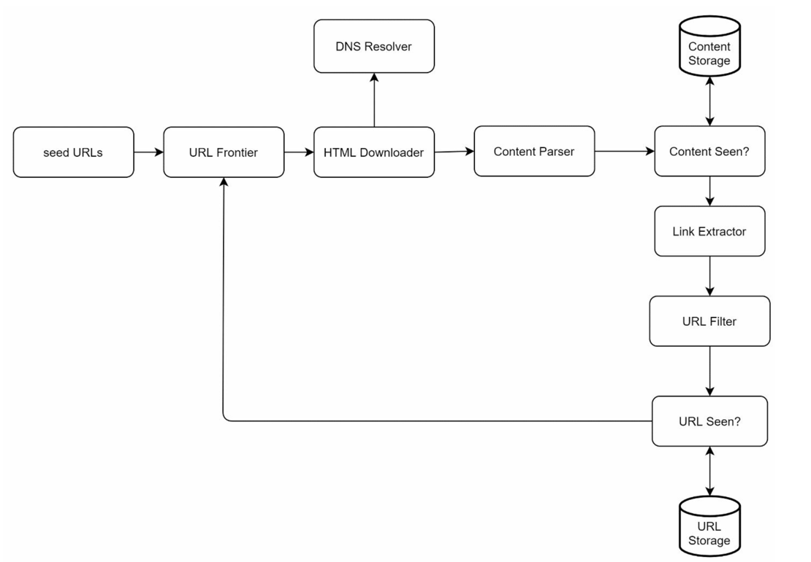
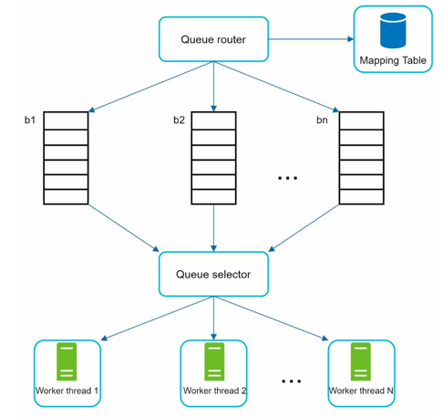
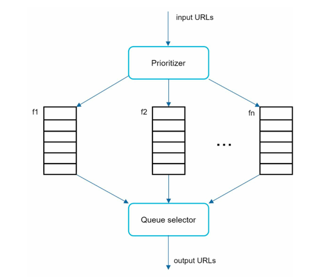
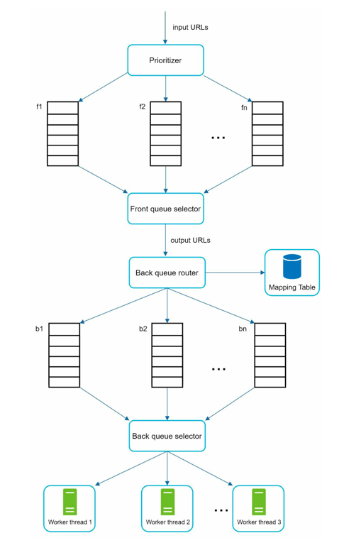

# Design a web crawler

- A web crawler is a system that crawls the internet, discovers new pages, and indexes data for later use (e.g., by a search engine).
- Crawler Use cases
  - **Search Engine Indexing**: A crawler collects web pages to create local index for search engines. A process by which search engines (like Google, Bing, or DuckDuckGo) collect, analyze, and store information from web pages so they can quickly return relevant results when you perform a search.
  - **Web archiving**: Process of collecting information from web to preserve data for future use.
  - **Web mining**: It helps to discover useful knowledge from the internet. For example, financial firms use crawlers to download shareholder meetings and annual reports to learn.
  - **Web monitoring**: Crawlers help to monitor copyrights and trademark infringements over the internet.

## Problem Statement

- Build a system that crawls the internet, discovers new pages, and indexes data for later use (e.g., by a search engine).
- Must handle billions of pages, ensure politeness (not overloading sites), and provide scalable + distributed crawling.

## Step 1: Understanding the problem and Design scope

- Algorithm:
  ```
  Repeat(
    Given a set of URLs, download all web pages addressed by URLs.
    Extract URLs from these web pages.
    Add new URLs to list of URLs to be downloaded. Repeat.
  )
  ```
- But the design goes beyond the simple algorithm and is highly dependent on the scale.

> Q. What is the main purpose of tte crawler? Search engine indexing, data mining or something else?
> 
> A. Search Engine Indexing

> Q. How many web pages does the crawler collects per month?
> 
> A. 1 billion pages

> Q. What content types are included? HTML only or other content types such as PDFs and images as well.
> 
> Only HTML

> Q. Shall we consider newly added or edited web pages?
> 
> A. Yes

> Q. Do we need to store HTML pages crawled from web?
> 
> A. Yes, up to 5 years.

> Q. Do we need to store HTML pages with duplicate content?
> 
> A. Pages wirth duplicate content should be ignored.

### Characteristics for a good crawler:
  - `Scalability`: The web is very large. There are billions of web pages out there. Web
    crawling should be extremely efficient using parallelization.
  - `Robustness`: The web is full of traps. Bad HTML, unresponsive servers, crashes,
    malicious links, etc. are all common. The crawler must handle all those edge cases.
  - `Politeness`: The crawler should not make too many requests to a website within a short
    time interval.
  - `Extensibility`: The system is flexible so that minimal changes are needed to support new
    content types. For example, if we want to crawl image files in the future, we should not
    need to redesign the entire system.

### Estimations

- Assume 1 billion web pages are downloaded every month.
- QPS: 1,000,000,000 / 30 days / 24 hours / 3600 seconds = ~400 pages per second. 
- Peak QPS = 2 * QPS = 800 
- Assume the average web page size is 500k.
- 1-billion-page x 500k = 500 TB storage per month. 
• Assuming data are stored for five years, 500 TB * 12 months * 5 years = 30 PB. A 30 PB
storage is needed to store five-year content.

## Step 2: High Level Design





1. Add seed URLs to the URL Frontier
2. HTML Downloader fetches a list of URLs from URL Frontier.
3. HTML Downloader gets IP addresses of URLs from DNS resolver and starts
downloading.
4. Content Parser parses HTML pages and checks if pages are malformed.
5. After content is parsed and validated, it is passed to the “Content Seen?” component.
6. “Content Seen” component checks if a HTML page is already in the storage. 
   1. If it is in the storage, this means the same content in a different URL has already been
   processed. In this case, the HTML page is discarded.
   2. If it is not in the storage, the system has not processed the same content before. The
   content is passed to Link Extractor.
7. Link extractor extracts links from HTML pages.
8. Extracted links are passed to the URL filter.
9. After links are filtered, they are passed to the “URL Seen?” component.
10. “URL Seen” component checks if a URL is already in the storage, if yes, it is
   processed before, and nothing needs to be done.
11. If a URL has not been processed before, it is added to the URL Frontier.

### Components

#### Seed URLs [Starting Points]
- Starting point for crawl process.
- A set of initial web addresses (URLs) to begin crawling.
- Example
  - To crawl all web pages from university's website, intuitive way to select seed URLs is to use the university's domain name.
- General strategy is to divide the entire URL space into smaller ones.
- Seed URL selection is an open-ended question.
- `Analogy`: Think of seed URLs as the roots of the crawling tree, from which the crawler explores the rest of the web.

#### URL Frontier [URL Queue]
- The component that stores URLs to be downloaded is called the URL frontier.
- Like a FIFO queue.

#### HTML downloader / Fetcher [Web Client]
- The HTML downloader downloads web pages from the internet.

#### DNS resolver [Domain Name System Resolver]
- To download a web page, URL must be translated to IP address.
- HTML downloader calls the DNS resolver to get the corresponding to get the IP address.

#### Content parser [Parser & Validator]
- After a web page is downloaded, it must be parsed and validated because malformed web pages could provoke problems and waste storage space.
- Extracts text, links, and metadata.
- Removes session IDs & duplicates.

#### Content Seen? [Duplicate Detector]
- “Content Seen?” data structure is used to eliminate data redundancy and shorten processing time.
- To compare two HTML documents, we can compare them character by character. 
- However, this method is slow and time-consuming, especially when billions of web pages are involved. 
- An efficient way to accomplish this task is to compare the hash values of the two web pages

#### Content Storage [HTML Storage]
- It is a storage system for storing HTML content.
- Choice of storage system depends on factors such as data type, data size, access frequency, life span, so on.
- Both disk and memory are used.
  - Most of tge content is store on disk because the data set is too big to fit in memory.
  - Popular content is kept in memory to reduce latency.

#### URL Extractor
- Extracts new URLs from downloaded web pages.
- New URLs are added to the URL frontier for future crawling.

#### URL Filter [URL Validator]
- Not all URLs are worth crawling.
- excludes certain content types, file extensions, error links and URLs in
  “blacklisted” sites.
- URL filter decides whether a URL should be crawled or not based on predefined rules.
- For example, URLs pointing to images, videos, or other non-HTML content can be filtered out.

#### URL Seen? [URL Deduplicator]
- To avoid downloading the same URL multiple times, a “URL Seen?” data structure is used to keep track of URLs that have already been crawled.
- Before adding a new URL to the URL frontier, the URL deduplicator checks if the URL has been seen before.
- This is typically implemented using a hash set or a Bloom filter for efficient membership testing.

#### URL Storage [URL Database]
- A database to store URLs that have been crawled or are scheduled to be crawled.
- Helps in managing and tracking the crawling process.

---
## Step 2: Design Deep Dive

---
### DFS vs BFS Crawling
- Think of web as a directed graph where web pages are nodes and hyperlinks are edges.
- Two common strategies for traversing this graph are Depth-First Search (DFS) and Breadth-First Search (BFS).
- **DFS Crawling**: Explores as far down a branch as possible before backtracking. 
  - Pros: Uses less memory, can quickly reach deep pages.
  - Cons: May get stuck in deep sections, less polite to servers.
- **BFS Crawling**: Explores all neighbors at the present depth before moving on to nodes at the next depth level.
  - Pros: More polite, better coverage of the web.
  - Cons: Uses more memory, slower to reach deep pages.
- For web crawling, BFS is generally preferred due to its politeness and better coverage.

#### Problems with BFS
- `Impolite requests`: Most links from the same web page are linked back to the same host. All
  the links in wikipedia.com are internal links, making the crawler busy processing URLs
  from the same host (wikipedia.com). When the crawler tries to download web pages in
  parallel, Wikipedia servers will be flooded with requests. This is considered as “impolite” .
- `Prioritization missed`: Standard BFS does not take the priority of a URL into consideration. The web is large
  and not every page has the same level of quality and importance. Therefore, we may want
  to prioritize URLs according to their page ranks, web traffic, update frequency, etc.

---

### URL Frontier
- To solve the problems with BFS, we can modify the URL frontier to be a priority queue of queues.
- It can ensure politeness, support URL prioritization and freshness.

#### 1. Politeness
- Web crawler should not bombard a web server with requests in a short time interval.
- Sending too many requests is considered impolite or may even be treated as DOS attack.
- The politeness constraint is implemented by maintain a mapping from website hostnames to download (worker) threads.
- Each downloader thread has a separate FIFO queue and only downloads URLs obtained from that queue. 

- `Queue Router`: It ensures that each queue (b1, b2, … bn) only contains URLs from the same host.
- `Mapping Table`: It maintains a mapping from hostnames to downloader threads.
- `FIFO Queues`: Each downloader thread has a separate FIFO queue for URLs from the same host.
- `Queue Selector`: It selects the next queue for a downloader thread to fetch URLs from.
- `Worker Threads`: Each downloader thread processes URLs from its assigned queue.

#### 2. Prioritization
- Each URL is assigned a priority score based on factors such as page rank, update frequency, and relevance to seed URLs.
- **Prioritizer** is the component that handles URL prioritization.

- `Prioritizer`: Takes URLs as inputs and assigns priority scores based on predefined criteria.
  - Queues: Each queue has an assigned priority. Queues with high priority are selected with higher probability.
- `Queue Selector`: Selects the next queue for a downloader thread to fetch URLs from, based on queue priorities.


#### URL Frontier Design

URL frontier design, and it contains two modules:
• Front queues: manage prioritization
• Back queues: manage politeness



#### Freshness
- Web pages are constantly being added, deleted, and edited. 
- A web crawler must periodically recrawl downloaded pages to keep our data set fresh. 
- Recrawling all the URLs is time-consuming and resource intensive. 
- Few strategies to optimize freshness are listed as follows:
  - Recrawl based on web pages’ update history.
  - Prioritize URLs and recrawl important pages first and more frequently.

#### Storage for URL Frontier
- Hybrid Approach
- **In-Memory Storage**: For high-priority URLs that need to be crawled frequently.
- **Disk-Based Storage**: For low-priority URLs that can be crawled less frequently.
- To reduce the cost of reading from the disk and writing to the disk, we
  maintain buffers in memory for enqueue/dequeue operations. Data in the buffer is
  periodically written to the disk.

---

### HTML Downloader
- The HTML downloader is responsible for fetching web pages from the internet using HTTP protocol.

#### Robots Exclusion Protocol - Robots.txt
- A standard used by websites to communicate with web crawlers and other web robots.
- It specifies which parts of the website should not be accessed or crawled by automated agents.
- Located at the root of a website (e.g., `www.example.com/robots.txt`).
- Before attempting to crawl a web site, a crawler should check its corresponding robots.txt first and follow its rules.
- To avoid repeat downloads of robots.txt file, we cache the results of the file. 
- The file is downloaded and saved to cache periodically.

#### Performance Optimization
1. **Distributed Crawl**:
   - To achieve high performance, we can distribute the crawling task to multiple machines.
   - URL space is partitioned into smaller subspaces, and each machine is responsible for crawling a specific subspace.
2. **Cache DNS Resolver**:
   - Once a request to DNS is carried out by a crawler thread, other threads are blocked until the first request is completed.
   - DNS resolution can be time-consuming. To reduce latency, we can cache the results of DNS lookups.
   - Our DNS cache keeps the domain name to IP address mapping and is updated periodically by cron jobs.
3. **Locality**:
    - Distribute crawl servers geographically. 
    - When crawl servers are closer to website hosts, crawlers experience faster download time. 
4. **Short Timeout**:
   - Some web servers respond slowly or may not respond at all. 
   - To avoid long wait time, a maximal wait time is specified. 
   - If a host does not respond within a predefined time, the crawler will stop the job and crawl some other pages.

---

### Robustness

1. **Consistent Hashing**:
   - When a crawl server goes down, its workload must be redistributed to other servers.
   - Consistent hashing is used to minimize the amount of data that needs to be moved when servers are added or removed.
2. **Save Crawl States and Data**:
    - Periodically save the current state of the crawler (e.g., URL frontier, downloaded pages) to persistent storage.
    - In case of a crash, the crawler can resume from the last saved state instead of starting from scratch.
3. **Error Handling**:
   - Implement robust error handling to manage issues such as network failures, timeouts, and malformed HTML.
   - Retry failed requests a limited number of times before giving up.
4. **Data validation**:
    - Validate downloaded content to ensure it meets expected formats and standards.
---

### Extensibility
- Design the crawler with modular components that can be easily extended or replaced.
- The crawler can be extended by plugging in new modules.
- PNG Downloader module is plugged-in to download PNG files.
- Web Monitor module is added to monitor the web and prevent copyright and trademark infringements.
---

### Detect and Avoid Traps
1. **Redundant Content**:
   - Some websites may have multiple URLs pointing to the same content (e.g., session IDs, tracking parameters).
   - Hashes or checksum can be used to identify and avoid downloading duplicate content.
2. **Spider Traps**:
   - Some websites may have infinite loops or dynamically generated pages that can trap crawlers.
   - Implement depth limits and URL pattern checks to avoid getting stuck in such traps.
3. **Data Noise**:
    - Some web pages may contain a lot of irrelevant or low-quality content.
    - Implement content quality checks to filter out noisy data.

## Additional Considerations

### Server-side rendering: 

- Numerous websites use scripts like JavaScript, AJAX, etc. to generate links on the fly. 
- If we download and parse web pages directly, we will not be able to retrieve dynamically generated links. 
- To solve this problem, we perform server-side rendering (also called dynamic rendering) first before parsing a page.

### Filter out unwanted pages: 

- With finite storage capacity and crawl resources, an anti-spam component is beneficial in filtering out low quality and spam pages.

### Database replication and sharding: 

- Techniques like replication and sharding are used to improve the data layer availability, scalability, and reliability.

### Horizontal scaling: 

- For large scale crawl, hundreds or even thousands of servers are needed to perform download tasks. The key is to keep servers stateless.

### Availability, consistency, and reliability: 
- These concepts are at the core of any large system’s success. 

### Analytics: 

- Collecting and analyzing data are important parts of any system because data is key ingredient for fine-tuning.