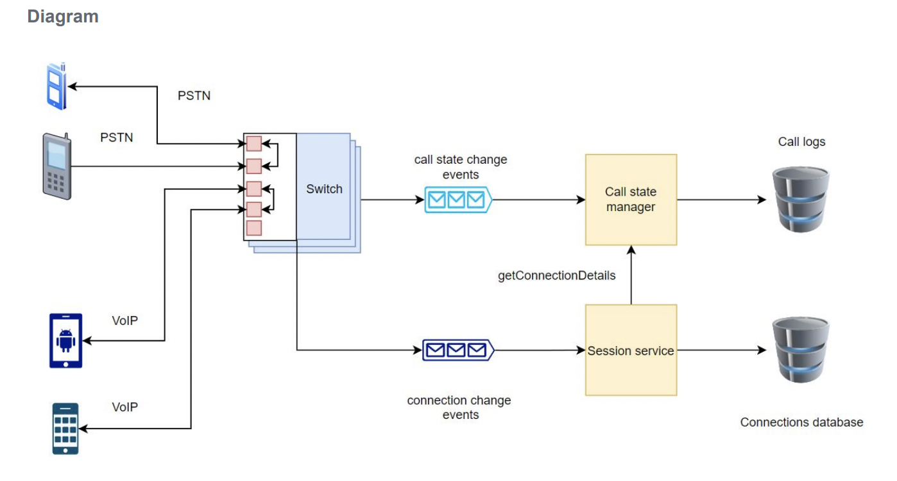
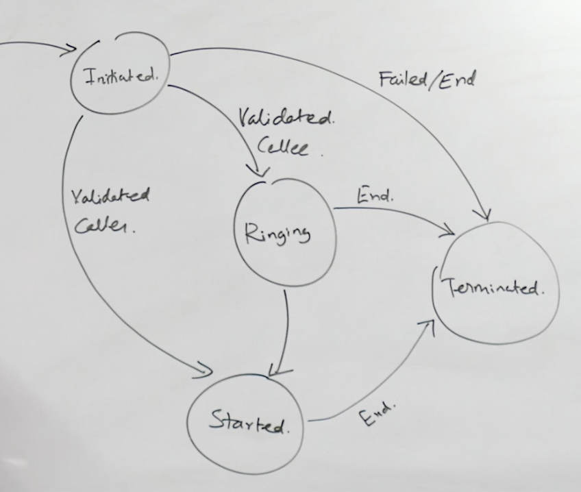
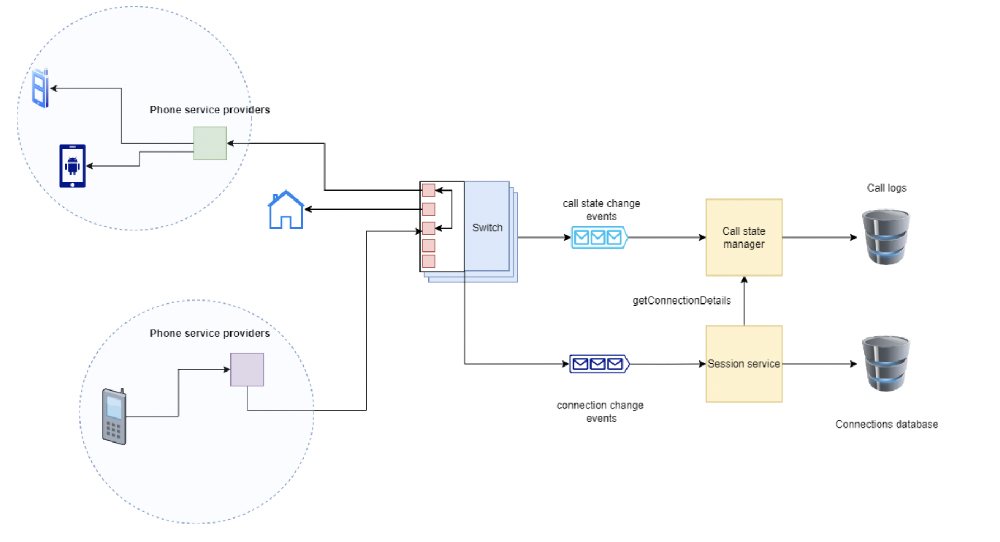
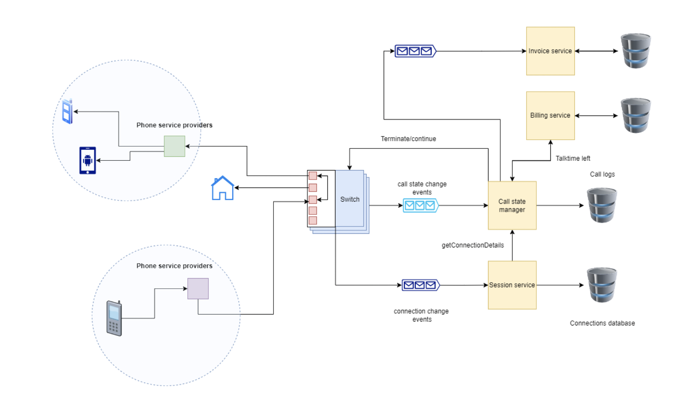

# WhatsApp Calling

## Features
The features are listed below:
1. Users can call each other over VOIP or PSTN
2. Call Routing
3. Charge user for making calls
4. Choose a provider for each call

## Requirement 1: Users can call each other over VOIP or PSTN

### Components Required

- `Switch` Whenever there is a call we get a receiver address and sender address. Switch bridges the
connection between these two addresses.
- `Message queue`
We need two message queues.
  - First, whenever there is a change in call state (like user has picked up call or a call is requested)
we push it to call state change queue. Call manager subscribes to this message queue and then
processes the events one by one.
  - Secondly, whenever a connection is created or terminated we push it to Connection Event Queue.
- `Call state manager`
This component is the brain of our system. It receives the call event from the switch .It receives the connection ID of both users from the session service and tells the switch which two connections it has to bridge. Apart from that it also checks what is the current state of call. Like, wether the call is terminated or is ongoing. This data is then provided to billing service.
- `Session service` It pulls call events from the connection event queue. It stores the mapping of user to call session. And each session is mapped to a connection.

### SIP - Signal Initiation Protocol
It is a **signaling protocol** used to **initiate, manage, and terminate** real-time sessions involving:

- **Voice calls**
- **Video calls**
- **Instant messaging**
- **Multimedia conferences**

It is widely used in **VoIP (Voice over IP)** systems.

### VoIP vs PSTN

| Feature                              | VoIP (Voice over IP)                        | PSTN (Public Switched Telephone Network)       |
|--------------------------------------|---------------------------------------------|------------------------------------------------|
| **Connection Requirement**           | Only internet connection is required        | Telephone lines are required                   |
| **Bandwidth Usage**                  | Requires variable bandwidth                 | Reserves fixed bandwidth                       |
| **Cost Dependency**                  | Not dependent on distance and time          | Dependent on distance and time                 |
| **Service Cost**                     | Generally free to use                       | Paid service                                   |

## Requirement 2: Call Routing and Government Surveillance Support

### Objective

- Enable **routing of calls** from one user (sender) to another (receiver).
- Allow **government bodies** to **record suspicious calls**.
- Ensure **only authenticated users** can initiate calls.

### Call Routing Process

- Each call is initiated by a **sender with the receiver’s address**.
- Calls are routed via **service providers** and **intermediate routers**:
  - Routers **forward the call** to the next node in the path.
  - This continues until the call reaches the **receiver**.
  

### Authentication

- The system must **verify user credentials** before allowing call initiation.
- Only **authenticated users** can place calls through the system.

### Government Surveillance Requirement

- For **suspicious calls**, the system should:
  - **Open a separate connection** to allow **government agencies** to **record or monitor** the call.
  - This connection is **independent** of the primary call flow.

### State Machine

- We need a state machine for calling.
- Cannot place this logic in the switch, therefore, a State manager is required.
  - The switch is stateless, It requests for call transitions through `call state manager (CSM)`
  

## Requirement 3: Charging Users for making calls

We need to:

- **Check the user's balance and maximum talk time**.
- **Terminate the call** if the talk time exceeds the allowed limit.
- **Generate an invoice** for completed calls.
  
### Functional Flow

1. Before/during the call, the system:
   - Checks **current balance** and **remaining talk time**.
   - Monitors call duration.
2. If user **exceeds allowed time**, the call is **terminated**.
3. After the call ends, an **invoice is generated** and sent to the user.

###  Data Persistence Options

#### Option 1: Persist on Switch
- **Pros**:
  - Fewer API calls.
  - Switch can **directly terminate** the call.
- **Cons**:
  - **Switch becomes overloaded** with responsibilities.
  - Violates the **single-responsibility principle**.

#### Option 2: Persist on Call State Manager (Recommended)
- **Pros**:
  - **CSM (Call State Manager)** acts as the **brain** of the system.
  - Clear separation of concerns: **Switch handles bridging**, CSM handles **logic & decisions**.
- **Cons**:
  - Requires **more API calls**.
  - Slight increase in **latency and complexity**.

**Conclusion**: Persisting data in **Call State Manager** is preferred for better design and separation of concerns.

### System Components Needed

#### 1. Billing Service
- Maintains:
  - **Current balance**
  - **Maximum allowed talk time**
- Communicates with **Call State Manager (CSM)** to update or query balance/time.

---

#### 2. Invoice Service
- Generates **invoices** after call ends.
- Uses:
  - **Call duration**
  - **Cost per minute**
- Data is fetched from **CSM**.

---

### 3. Message Queue
- Acts as a bridge between:
  - **Call State Manager** (producer of call events)
  - **Invoice Service** (consumer)
- Each call event has a **unique ID** to ensure **idempotency**.
  - If the ID is already processed → skip invoice creation.
  - This prevents **duplicate billing**.

---

