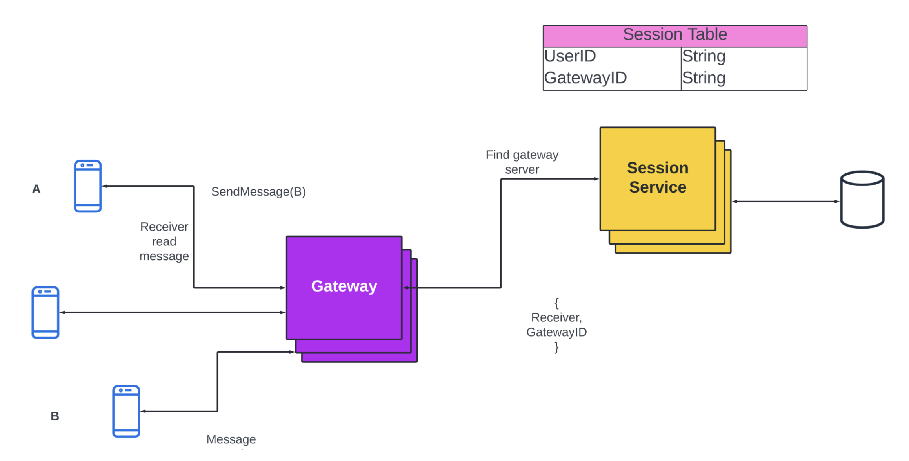
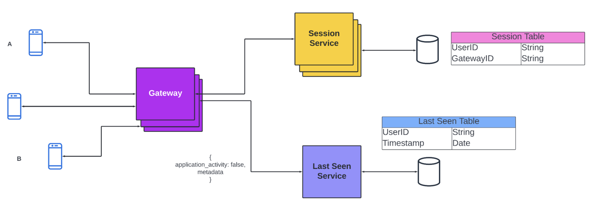
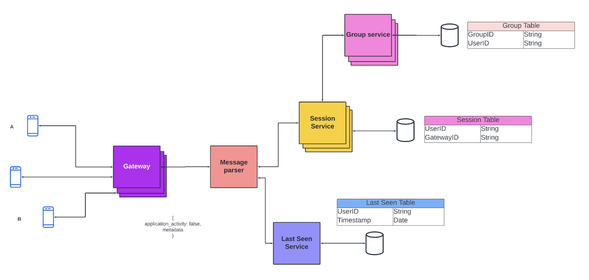

# Whatsapp - Chat Application

> Check the final architecture Diagram [here](./final-architecture.png)

## Requirements
- One to One Chat
- Group Messaging
- Sent + Delivered + Read Receipts
- Online/Last seen
- Image Sharing
- Chats are temporary/permanent

## One to One Chat

- Whenever users want to send a message they send a request to our server. This request is received by the gateway service. Then the client applications maintain a TCP Connection with the gateway service to send messages.
- Once the server sends the message to the recipient, our system must also notify the sender that the message has been delivered. So we also send a parallel response to the sender that the message has been delivered. 
- (Note: To ensure that message will be delivered we store the message in the database and keep retrying till the recipient gets the message.) This takes care of `Sent receipts`.
- When the recipient receives the message it sends a response (or acknowledgment) to our system.
- This response is then routed to session service. It finds the sender from the mapping and sends the `Delivery receipts`.
- The process to send the `Read receipts` is also the same. As soon as the user reads the message we perform the above process.

### Components

- Gateway Service
  - Multiple Servers
  - Receives all requests from users
  - Maintain TCP connection with users
- Session Service
  - Gateway service is also distributed. So if we want to send messages from one user to another we must know which user is connected to which gateway server. This is handled by session service.
It maps each user (userlD) to the particular gateway server.
- Database
  - For storing messages

### Tradeoffs

#### Storing the mapping in gateway service v/s Storing it in session service
  - If we store the mapping in the gateway service then we can access it faster. To get the mappings from the session service we have to make a network call.
  - Gateway services have limited memory. If we store the mapping of the gateway we have to reduce the number of TCP connections.
  - Gateway service is distributed. So there are multiple servers. In that case, there will be a lot of duplication. Also every time there is an update we have to update the data on every server.
  - So we can conclude that storing the mapping in the session service is a better idea.
  
#### Using HTTP for messaging v/s Websockets (WSS)
  - HTTP can only send messages from client to server. The only way we can allow messaging is by constantly sending a request to the server to check if there is any new message (Long Polling).
  - WSS is a peer-to-peer protocol that allows clients and servers to send messages to each other.

#### TCP/WebSocket v/s P2P connection
  - For general chat applications, WebSocket (TCP) via a gateway/server is the preferred and industry-standard choice.
  - P2P is better suited for specialized cases like video/audio streaming using WebRTC where lower latency is critical and the connection is temporary.

### Diagram

---

## Last Seen Timestamps

- We want to show other users whether any user is online or when was he/she last seen. 
- To implement this we can store a table that contains the userlD and the LastSeenTimestamps. W
- Whenever any user makes an activity (like sending or reading a message) that request is sent to the server. At the time at which the request is sent we update the key-value pair. 
- We must also consider the requests sent by the application and not by the user (like polling for messages etc.) These requests do not count as user activity so we won't be logging them. 
- We can have an additional flag (something like application _activity) to differentiate the two.

- We also need to define a threshold. If the last seen is below the threshold then instead of showing the exact time difference, we will just show online.
E.g. if the last seen of user X is 3sec and the threshold is 5sec then other users will see X as online.

### Components

- Last Seen Service
  - Every time there is a user activity, it is routed to this service.
- Database

---

## Group messaging

- Each group will have many users. Whenever a participant in a group sends a message we first find the list of users present in the group. 
- Once the session service has the list of users it finds the gateway services that the users are connected to and then sends the message.
> Note: We should also limit the number of users in a group. If there are a lot of users then it can cause a fanout. We can ask the client applications to pull new messages from our system but our messages won't be real-time in such case.
- We do not want the gateway service to parse messages because we want to minimize the memory usage and maximize the TCP connections. So we will use a `message parser` to convert the unparsed to sensible message.
- We have a mapping of groupID to userlD. This is one-many relationships. Group messaging service has multiple servers so there can be data redundancy. To reduce redundancy we use `consistent hashing`. We hash the groupID and send the request to the server according to the result.
- We also need to use a `message queue` in case there are any failures while sending requests.
- Once we give a request to the message queue it ensures that message will be sent. If we reach the maximum number of retries it tells the sender that it failed and we can notify the user.

- While sending messages in a group we must take care of three things
  - `Retries` - The message queue takes care of that.
  - `Idempotency` - It means that each message should be sent only once. We can achieve this by sending messages to queue at least once but each message will have a unique ID. If the service has already seen the ID then it means that message is already sent to the new message is ignored.
  - `Ordering of messages` - Messages must be ordered by their timestamps in a group. To ensure this we always assign the messages of a particular group to a particular thread from the thread pool.

### Components

- Group Messaging service
  - It stores the mapping of groupID to userlD and provides this data to the session service.
- Message parser service
  - It receives the unparsed message from the gateway service and converts it to a sensible format before sending it to other services.
- Message queue

## Sending Images, Audio, Video Files

- We can use a distributed file service to store the files as they are much more efficient and cost-effective compared to storing images as BLOBs in a database. 
- Every time a user sends an image we can store it in the file service and when we can get the image when we need to send it.

### Features provided by database when store images as BLOB

| Feature | Requirement | 
| ------- | ----------- |
| Mutability |  When we store an image as a BLOB in database we can change its value. However, this is useless as because an update on image is not going to be a few bits. We can simply create a new image file. |
| Transaction Guarantee | We are not going to do an atomic operation on the image. So this feature is useless. | 
| Indexes | We are not going to search image by its content (which is just O's and 1's) so, this is useless. | 
| Access control | Storing images as BLOB's in database provides us access control, but we can achieve the same mechanisms using the file system. |

### Why file is better
- File is cheaper
- faster as store large files seperately
- Use CDNs for faster access, since files are static
- Store File url in DB
> We Use Distributed File System

## Optimizations
- `Graceful degradations`: On some occasions, our system might get so many messages that systems get overloaded. In such cases, we can temporarily shut down services that are not critical to our service (like sending read receipts or last seen status, etc).
- `Rate Limiting`: In some situations, it might happen that we cannot handle any more requests. In such cases, we can rate-limit the number of requests and drop extra requests. However, this results in a bad user experience.

