# Whatsapp - Chat Application

> Check the final architecture Diagram [here](./final-architecture.png)


## Step 1: Understand problem statement and requirements

> Candidate: What kind of chat app shall we design? 1 on 1 or group based?
> 
> Interviewer: It should support both 1 on 1 and group chat.

> Candidate: Is this a mobile app? Or a web app? Or both? 
> 
> Interviewer: Both. 

> Candidate: What is the scale of this app? A startup app or massive scale? 
> 
> Interviewer: It should support 50 million daily active users (DAU). 

> Candidate: For group chat, what is the group member limit? 
> 
> Interviewer: A maximum of 100 people 

> Candidate: What features are important for the chat app? Can it support attachment? 
> 
> Interviewer: 1 on 1 chat, group chat, online indicator. The system only supports text messages. 

> Candidate: Is there a message size limit? 
> 
> Interviewer: Yes, text length should be less than 100,000 characters long. 

> Candidate: Is end-to-end encryption required? 
> 
> Interviewer: Not required for now but we will discuss that if time allows. 

> Candidate: How long shall we store the chat history? 
> 
> Interviewer: Forever.


### Requirements
- One to One Chat with low delivery latency
- Group Messaging (max of 100 people)
- Sent + Delivered + Read Receipts
- Multiple Device Support
- Online/Last seen
- Image Sharing
- Chats are temporary/permanent
- Push notifications for new messages


## Step 2: High Level Design

- How clients and servers will communicate?
  - Clients do not communicate directly. All communication is done via our chat servers.
  - Functions supported
    - Receive messages from other clients
    - Find recipient and relay the message
    - if recipient is not online, hold the message and deliver it when the recipient comes online.
    - `SENDER --> CHAT SERVICE (store message / relay message) --> RECIPIENT`
- When client starts a chat, it connects to chat service using a network protocol.

---

---

### Network Protocol
- HTTP Protocol
  - Client sends HTTP request to server to send a message.
  - Server responds with HTTP response.
  - Keep alive allows persistent connections and reduces TCP handshake overhead.
  - Problem: HTTP is stateless and unidirectional. Server cannot send messages to clients unless clients poll the server.

#### How to handle receiver side communication?
- **Option 1: Polling**
  - Client sends HTTP request to server to check for new messages.
  - Server responds with new messages or empty response.
  - Problem: Polling introduces latency, is costly and increases server load.
  
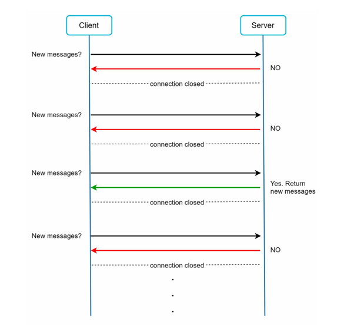
- **Option 2: Long Polling**
  - Client sends HTTP request to server to check for new messages.
  - Server holds the request until new messages arrive or timeout occurs.
  - Server responds with new messages or empty response.
  - Client immediately sends another request after receiving response.
  - Problem: Still has overhead of HTTP and not truly bidirectional.
  
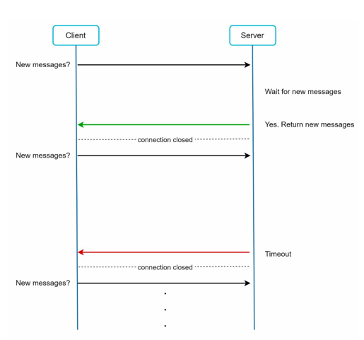
- **Option 3: WebSockets (WSS)**
  - Starts as a HTTP handshake and then upgrades to WebSocket protocol.
  - Both client and server can send messages to each other at any time.
  - works even with firewalls and proxies as it uses standard HTTP ports (80 and 443).
  - Low latency and efficient for real-time communication.
  - Industry standard for chat applications.

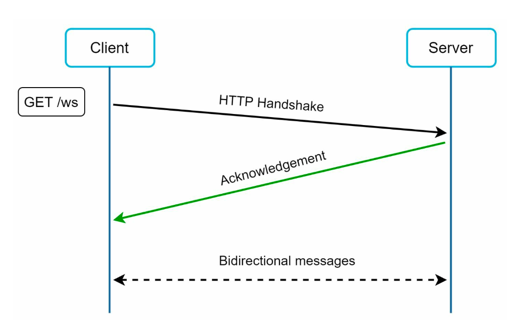

---

### High Level Architecture
- Clients connect to Chat Service using WebSockets.
- Other features like sign up, login, user profile etc use REST APIs (HTTP) via Load Balancer to Web Servers.

- Chat system has 3 main components
  - **Stateless Services**
    - Public facing request/response services
    - Used to manage login, signup, user profile, etc.
    - Load Balancer + Web Servers
    - Can be monolithic or microservices based
    - Can be integrated with 3rd party services like OAuth, SMS gateway, Email service, etc.
    - Example - Service Discovery, API Gateway, Auth Service
  - **Stateful Services**
    - Chat Service is the only stateful service
    - Because each client maintains a persistent WebSocket connection with Chat Service
    - Client normally doesn't switch Chat Service servers during a session
    - Service discovery is needed to find the right Chat Service server
  - **Third Party Integrations**
    - Push Notification Service for offline message alerts
    - Distributed File Storage for media files (images, audio, video)
    - CDN for faster media file delivery


  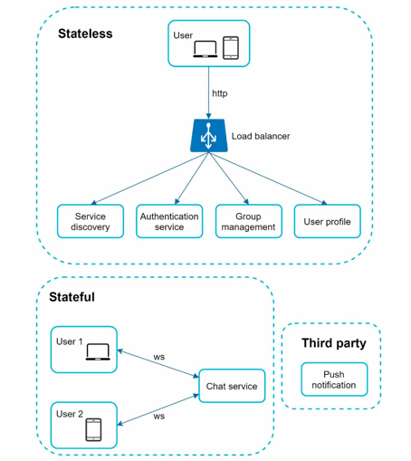

---

### Architecture Diagram

- Chat servers are distributed behind a Load Balancer.
- Clients connect to Chat Service using WebSockets which facilitate bidirectional communication.
- Presence servers manage online/last seen status.
- API servers handle REST API requests for non-chat features.
- Notification servers send push notifications.
- Key-value store is used to store chat history and user data.


  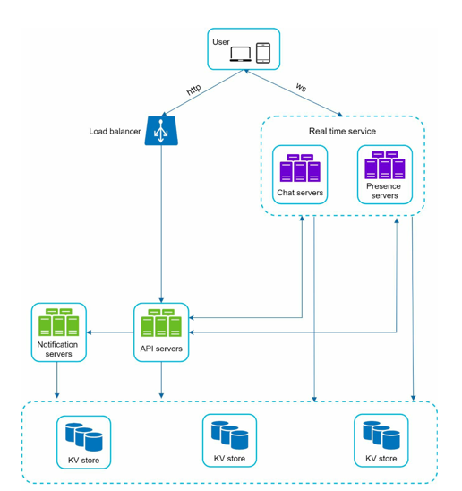

---

### Storage Design
> Question: Which database to use? (Relational database / NoSQL database) 

- Two types of data exists in chat system
  - Generic data: user profile, contacts, groups, etc.
    - Structured data with relationships
    - Requires ACID transactions
  > _Relational database_ is suitable
  - Chat data: chat history/messages, media files, etc.
    - Enormous volume of unstructured data
    - Requires high write throughput and low latency reads
    - Only recent chats are accessed frequently
    - Users might use features that need random access of data like search, view mentions, jump to specific message, etc.
  > _Key-value store_ is suitable.

#### Why key-value store for chat data?
- Easy horizontal scaling by sharding data across multiple nodes.
- Very low latency for reads/writes.
- Relational databases dont handle long chat histories well.
- Adopted by facebook messenger (HBase) and discord (Cassandra).


---
### Data Model
- Message Table for 1:1 chats
  - Primary Key: (message_id)
  - messageId decided message sequence 

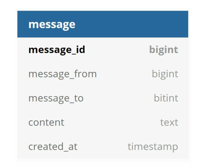
- GroupMessage Table for group chats
  - Primary Key: (channel_id, message_id)

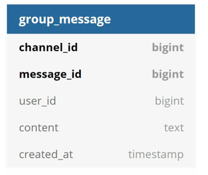

> Question: How to generate message_id?
> - message_id ensures ordering of messages. It should satisfy the following properties:
>   - IDs must be unique
>   - IDs must be sortable by creation time
> 
> - Option 1: Use **Auto-incrementing IDs** in mysql
> - Option 2: Use **global 64-bit sequence number generator** like Twitter Snowflake
> - Option 3: Use **Local sequence number generator**. Local Ids are only unique per user or per group. 
> 
> Finally, option 3 is used as maintaining message sequence within one-on-one channel or group channel is sufficient. Combine with userID/groupID to get global uniqueness (if needed).

---


## Step 3: Detailed Design

- There are 3 main components we need to design in detail
  - Service Discovery
  - Messaging flow
  - Presence Service

### Service Discovery

- recommends best chat server to client based on various factors (geographical location, server capacity, etc)
- Apache Zookeeper: open source solution
- Registers all chat servers and picks best one for client.


---

### Message Flows

#### 1 on 1 chat flow

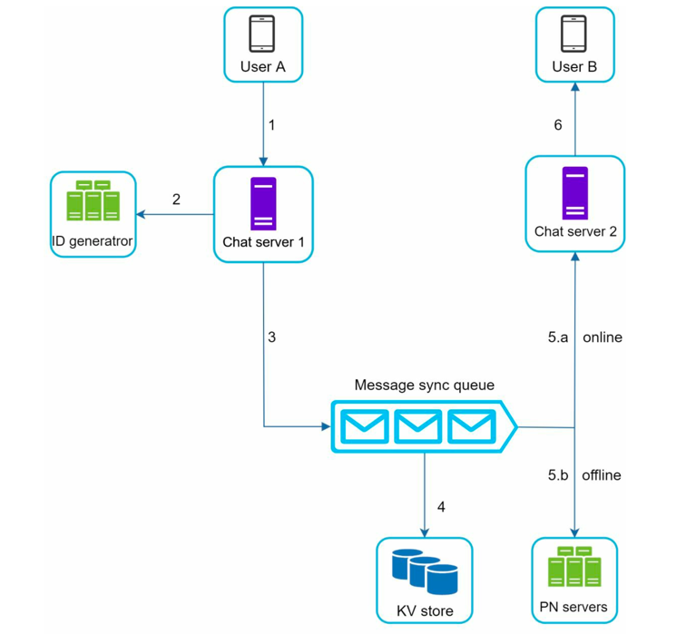

1. User A sends a chat message to Chat server 1.
2. Chat server 1 obtains a message ID from the ID generator.
3. Chat server 1 sends the message to the message sync queue.
4. The message is stored in a key-value store.
5. Checks presence status 
   1. If User B is online, the message is forwarded to Chat server 2 where User B is
         connected. 
   2. If User B is offline, a push notification is sent from push notification (PN) servers.
6. Chat server 2 forwards the message to User B. There is a persistent WebSocket
   connection between User B and Chat server 2.

#### Message Synchronization Across Devices
Let's suppose user A has two devices: a phone and a laptop.

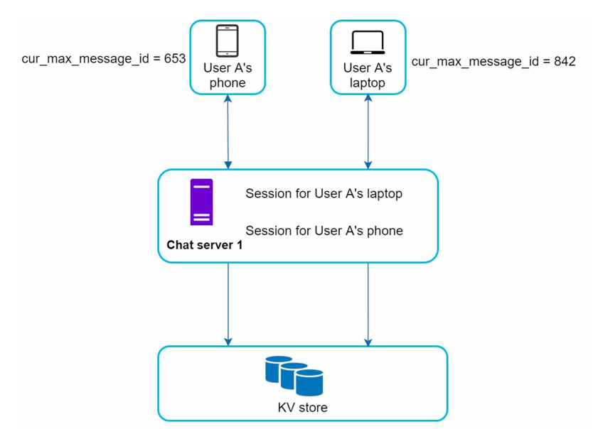

- When User A logs in to the chat app with her phone, it establishes a WebSocket connection with Chat server 1. 
- Similarly, there is a connection between the laptop and Chat server 1.
- Each device maintains a variable called _cur_max_message_id_, which keeps track of the latest
message ID on the device. 
- Messages that satisfy the following two conditions are considered as news messages:
  - The recipient ID is equal to the currently logged-in user ID.
  - Message ID in the key-value store is larger than _cur_max_message_id_.
  
- With distinct _cur_max_message_id_ on each device, message synchronization is easy as each device can get new messages from the KV store.

#### Small group chat flow

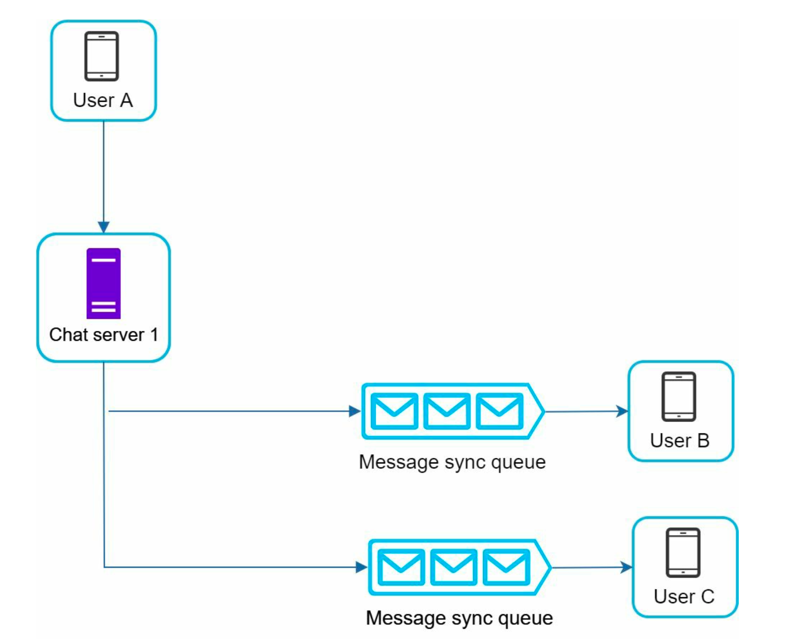

- When User A sends a message in a group chat. 
- Assume there are 3 members in the group (User A, User B and user C). 
- First, the message from User A is copied to each group member’s message sync queue: one for User B and the second for User C. 
- You can think of the message sync queue as an inbox for a recipient. 
- This design choice is good for small group chat because:
  - it simplifies message sync flow as each client only needs to check its own inbox to get
  new messages.
  - when the group number is small, storing a copy in each recipient’s inbox is not too
  expensive.
- WeChat uses a similar approach, and it limits a group to 500 members. 
> However, for groups with a lot of users, storing a message copy for each member is not acceptable.
  
- On the recipient side, a recipient can receive messages from multiple users. 
- Each recipient has an inbox (message sync queue) which contains messages from different senders.

---

### Online Presence 
- Managing online status and communicating with clients via websockets.
- Following flows trigger status change
  - User login
  - User logout
  - User disconnection

#### User Login
- After a websocket connection is built between client and real-time service, User A's online status and last_active_at timestamp are saved in KV store.

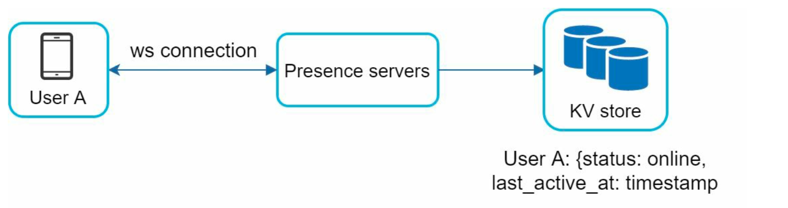

#### User Logout
- When user logs out, it goes through API servers.
- The status is changed in KV store.

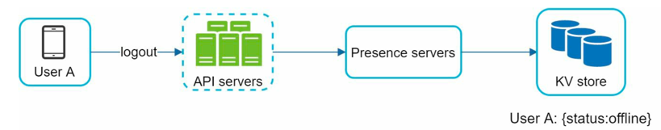

#### User Disconnection
- When user disconnects from internet, persistent connection is lost.
- We can change status in KV store, and change back when user connects.
- **Problem**: But this would lead to poor user experience, as in case of bad internet the presence indicator will change too often.
- **Solution**: Heartbeat Mechanism can be used here.
  - Periodically, an online client sends a heartbeat event to presence servers. 
  - If presence servers receive a heartbeat event within a certain time, say x seconds from the client, a user is considered as online. 
  - Otherwise, it is offline.

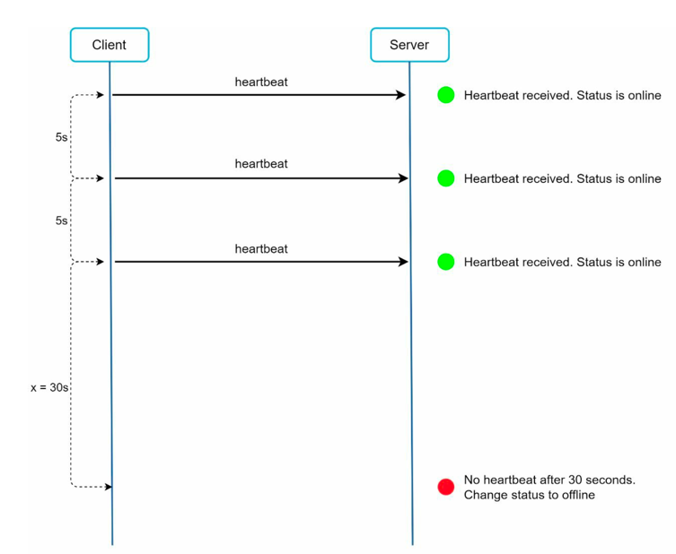


#### Online Status Fanout

- How would user A know about status change?
- Presence servers use publish-subscribe model, in which each friend pair maintains a connection.

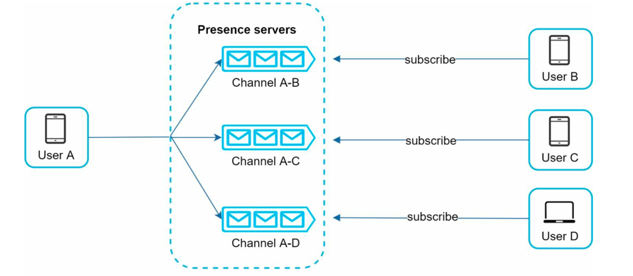

- This approach is effective for small user group.
- For larger groups, informing all members about online status is expensive and time-consuming.
- Solution: fetch online status only when user enters a group or manually checks status.


---

### Support media files

> **Problem**: 
> - Media files (images, videos, audio) are large 
> - They are immutable after upload 
> - They are read-heavy, not write-heavy
> Hence, media must be decoupled from message storage.

- Principle: Never store media blobs inside your chat database. Store media in object storage, and store only references (URLs + metadata) in the chat system.

### Architecture

#### 1. Object Storage for Media

- Use a distributed object storage system:
  - AWS S3 / GCS / Azure Blob 
  - HDFS (rare in modern systems)
  - Self-hosted object store (MinIO)
- Why object storage? 
  - Designed for large binary files 
  - Cheap per GB 
  - High durability (11 9s in S3)
  - Scales independently of chat traffic

#### 2. CDN for Fast Media Delivery
- Media is:
  - Static
  - Read-heavy
  - Accessed from multiple geographies
- So we put a CDN in front of object storage.

> `Client → CDN → Object Storage`

- Benefits
  - Low latency
  - Reduced load on storage

#### 3. Chat Database Stores Only Metadata

- Database stores only
```json
{
  "messageId": 123,
  "senderId": "A",
  "receiverId": "B",
  "type": "IMAGE",
  "mediaUrl": "https://cdn.chatapp.com/media/abc.jpg",
  "thumbnailUrl": "...",
  "size": "2.4MB",
  "mimeType": "image/jpeg"
}
```
- Database choices
  - Cassandra / DynamoDB / HBase
- Optimized for:
  - High write throughput
  - Sequential reads
  - Horizontal scaling

#### File Upload Flow

1. Client requests upload permission
   - Calls backend: POST /media/upload/init
2. Backend generates pre-signed URL 
   - Time-limited 
   - Write-only 
3. Client uploads media directly to object storage 
   - No chat server involvement 
4. Client sends message with media URL 
   - Normal chat message flow

> Note
> - Chat servers never handle large payloads 
> - Prevents server memory pressure 
> - Improves upload reliability

#### Storage Considerations

1. Deduplication
   - Hash media content
   - Avoid storing same file multiple times
   - Useful for:
     - Forwarded images
     - Viral videos
2. Lifecycle Policies
   - Old media → cold storage
   - Expired/temporary chats → auto delete
   - Reduces storage cost
3. For larger files: Chunked Uploads
   - Break large videos into chunks
   - Upload in parallel
   - Resume on failure
4. Access Scoping
   - Private media: User-authenticated requests
   - Public media: CDN cached


---
### Tradeoffs

#### Using HTTP for messaging v/s Websockets (WSS)
- HTTP can only send messages from client to server. The only way we can allow messaging is by constantly sending a request to the server to check if there is any new message (Long Polling).
- WSS is a peer-to-peer protocol that allows clients and servers to send messages to each other.

#### TCP/WebSocket v/s P2P connection
- For general chat applications, WebSocket (TCP) via a gateway/server is the preferred and industry-standard choice.
- P2P is better suited for specialized cases like video/audio streaming using WebRTC where lower latency is critical and the connection is temporary.

#### Why NOT Store Media as BLOBs in DB
| Aspect      | Database BLOB       | Object Storage |
|-------------|---------------------|----------------|
| Cost        | Expensive           | Cheap          |
| Scaling     | Hard                | Easy           |
| CDN support | Poor                | Native         |
| Performance | Bad for large files | Optimized      |
| Backups     | Heavy               | Independent    |


## Optimizations
- `Graceful degradations`: On some occasions, our system might get so many messages that systems get overloaded. In such cases, we can temporarily shut down services that are not critical to our service (like sending read receipts or last seen status, etc).
- `Rate Limiting`: In some situations, it might happen that we cannot handle any more requests. In such cases, we can rate-limit the number of requests and drop extra requests. However, this results in a bad user experience.

