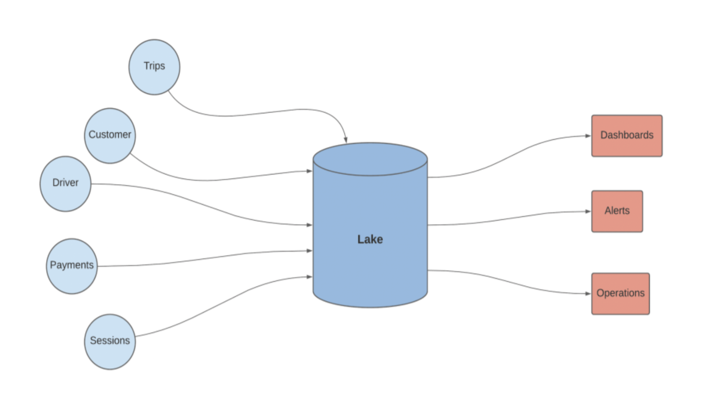
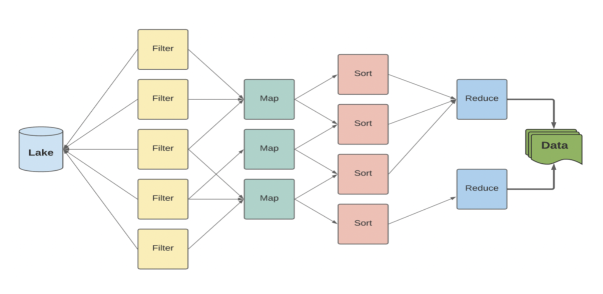
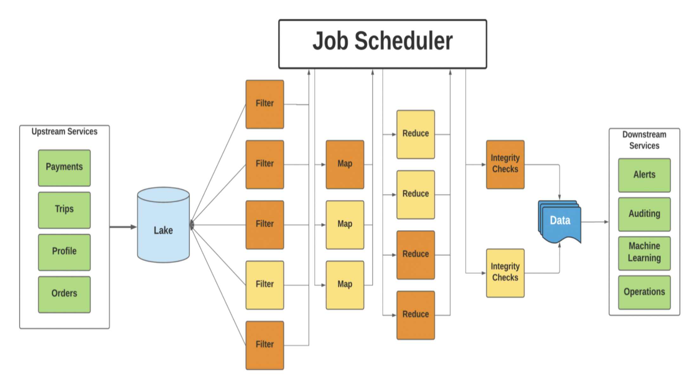

# Workflow management

## Requirements

1. Used by downstream services: Analytics, Alerts and Monitoring, on-demand query dashboards.

2. Allow both real-time and batch processing, with batch processing having high accuracy and real-time processing having 1-2 minute latency.

3. Take data from multiple sources and transform them as required by developer scripts.
The developers provide scripts, we provide the infra and fault tolerance to run it.

4. Cheap and generic so most engineers can use it for ML alerts.

## Design

- Microservices like Profile, Session, Payment service push data into their respective data sources.
- So we might have different types of databases such as cassandra, mysql, graph databases.
  
#### Q: Why can't we directly query the data from the microservice ?

- If we can derive insights from data then we would be reading from the data every time. 
- This would put load on our production systems, using I/0 operations that we could be using for our main service.
- For example, the payments database needs could use a high level of isolation. This requires taking locks on rows. Running an analytics read query in parallel would lock rows unnecessarily.
- Hence, we make a copy of these databases and pool them into something called a `data lake`. This is a heterogeneous lake (having different sources of data).

    

#### Q: How do we link the different types of data into a single record in this data lake?
- Depending on the use case, we join data on identifiers. For example, a food delivery app will have a trip, delivery, rating and payment corresponding to a single order. This order ID would help merge data across databases.
- This data can be pulled from upstream databases using cron jobs, which run periodically.
- We should use an inbuilt Change Data Capture solution when available (this is provided by popular databases like MySQL and Cassandra).
- Once pulled, the data lake is immutable. We can add data to it but we cannot update or delete records. 
- A distributed file system would be ideal here, since it's cheap.
Example: HDFS.

## Processing

We use a `Map Reduce Architecture`. Here are some of it's advantages -

1. Horizontal scaling is easy
2. Task are broken into stages and run parallel
3. No Single Point of Failure

    

## Fault Tolerance

- **Retry Mechanisms**
  - Use exponential backoff and Dead-Letter Queues (DLQs).
  - Especially for ingestion failures and transformation job crashes.

- **Checkpointing & Job Recovery**
  - Use Flink/Spark Structured Streaming for real-time stateful processing.
  - Enables recovery from last successful state.

- **Immutable Data Lake**
  - Append-only model; no updates or deletions.
  - Prevents corruption and simplifies rollback.

- **Distributed Storage**
  - Use HDFS, S3, or Delta Lake.
  - Replicated, durable, fault-resilient file systems.

- **Orchestration Failover**
  - Kubernetes, Airflow, or Argo to auto-restart failed jobs.
  - Monitor pipeline health via DAG status.

- **Monitoring and Alerts**
  - Integrate with Prometheus + Grafana or DataDog.
  - Set alerts for ingestion delays, job failures, or data quality issues.

## Real Time Analytics for Alerts and Monitoring:
- If we need alerts ->  we need it immediately, and if we query from Data Lake -> that's a time consuming task.
- 
- For handling this, we ask services to send data on an event bus like a message queue having multiple publishers and subscribers which condenses data to a single event that is then pulled by `Analytics Engine`.

- This is actually streaming data.
  
### Advantages of Data Lake over Streaming Data:
1. It can be used for Auditory process
2. It can do complex processes having the batch process
3. Perfect consistency is maintained as there is no loss of data

> The architecture that involves the combination of both Map Reduce and Streaming is `Lambda
Architecture`.

## Final Architecture Diagram 
